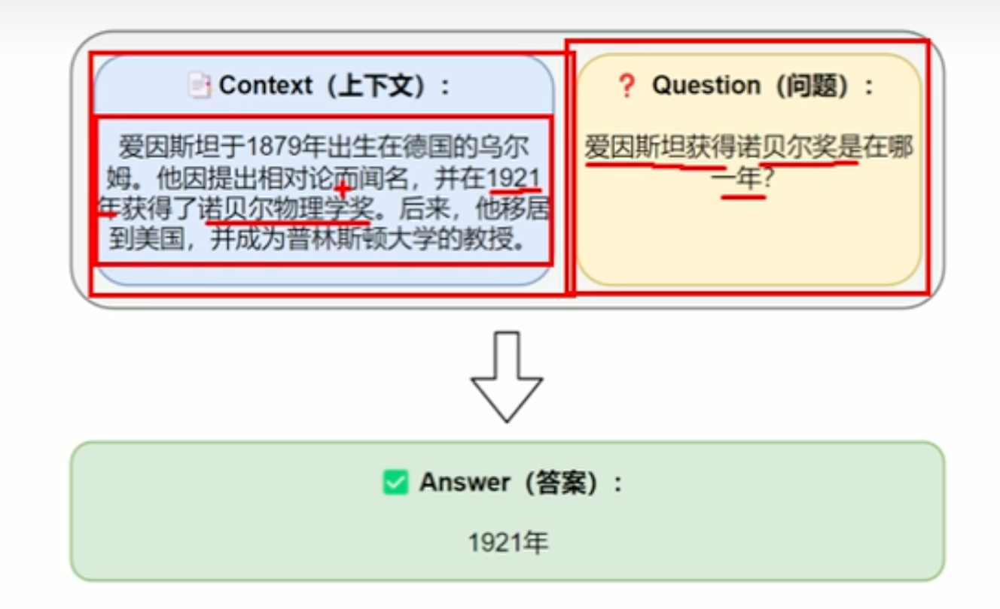
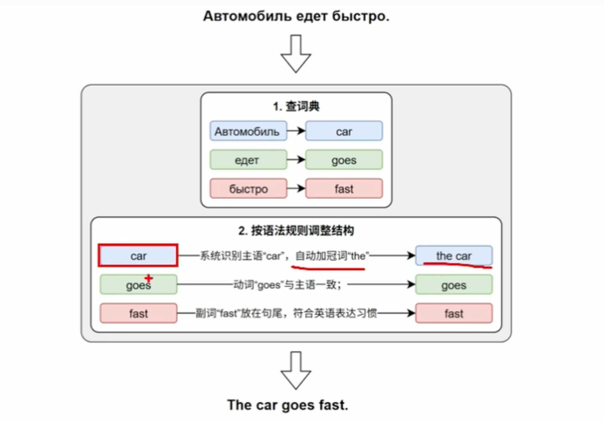
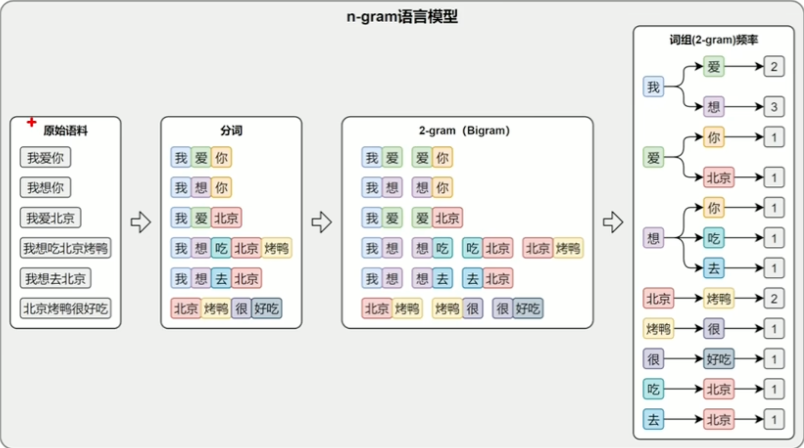
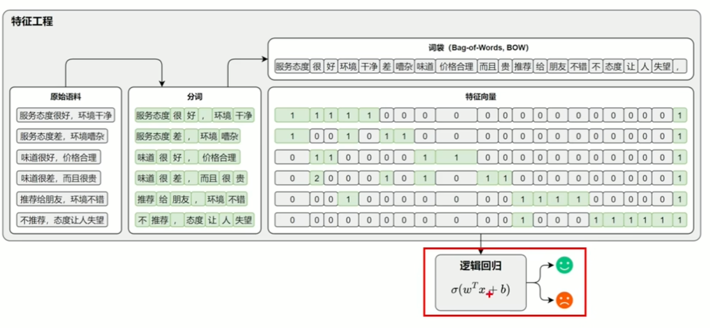

# 第一章 NLP导论

## 定义

自然语言处理（Natural Language Processing, NLP）是人工智能领域的一个重要分支，主要关注点在于:

- 如何使计算能够理解人类自然语言（包括语法、语义、语法结构等）
- 如何使计算机能够解释自然语言及其上下文含义
- 如何使计算机能够生成人类自然语言

NLP的目标是使计算机能够处理和分析自然语言文本，从而实现与人类的自然语言交互。

## 常见任务

自然语言处理如果按照任务功能可以分为以下几类：

### 1. 文本分类

功能: 对整段文本进行判然和分类
应用场景: 情感分析、垃圾邮件过滤、新闻分类等

### 2. 序列标注

功能: 对文本中的每个单词或字符进行分类然后打上标记，通常用于命名实体识别、词性标注等任务
应用场景: 命名实体识别、词性标注、语法分析等

- **命名实体识别**: 电商平台中输入完整的收货地址之后可以识别文本中的人名、地名、手机号码 后填入对应输入框
- **词性标注**: 为文本中的每个单词标注其词性（如名词、动词、形容词等）
- **语法分析**: 分析文本的语法结构，如句子结构、短语结构等

如何实现序列标注任务？

- 利用深度学习模型（如循环神经网络RNN、长短期记忆网络LSTM、Transformer等）对文本进行编码，提取文本特征
- 利用条件随机字段CRF对编码后的特征进行序列标注
- **BIO标记法**: 用于命名实体识别任务，将每个单词标记为B（Begin）、I（Inside）或O（Outside）
  表示该单词是否为命名实体的开始、内部或外部

### 3. 文本生成

功能: 根据给定的文本或条件，生成符合语法和语义规则的自然语言文本
应用场景: 自动摘要、自动写作、智能回复、对话系统
常见应用: 生成式问答系统，根据用户输入的问题，生成符合语法和语义规则的新回答

### 4. 信息抽取

功能: 从文本中提取结构化信息，如实体、关系、事件等
应用场景: 知识图谱构建、问答系统、信息检索等
常见应用: 抽取式回答系统，给出一个文本和一个问题，从给定的文本中抽取出问题的答案，实现原理就是预测问题的答案在上下文的开始位置和结束位置

### 5. 文本转换

功能: 将文本从一种形式转换为另一种形式
应用场景: 机器翻译、摘要生成

## 技术演进历史

### 3.1 规则系统阶段

- 自然语言处理主要依赖人工编写的语言规则，如语法规则、语义规则等
- 比如乔治城大学研究的基于规则的自然语言处理系统，它可以实现两种语言的翻译.

### 3.2 统计方法阶段

- 随着计算能力的提升和语料库的丰富，统计方法成为自然语言处理的主流
- 它的原理是通过对大量的文本数据进行概率建模，让系统能够学习语言中的模式和规律
  - n-gram模型: 基于统计的模型，假设当前单词的出现只依赖于前n个单词
  - 隐马尔可夫模型HMM: 用于序列标注任务，假设每个单词的标签只依赖于其本身和前一个单词的标签
  - 最大熵模型: 一种通用的统计模型，通过最大化模型的熵来学习模型参数

N-gram模型的核心思想是预测一个词在给定的前几个词之后出现的可能性，该思想认为一个词出现的概率，只取决于它前面的N-1个词。
比如:

- 在2-gram模型中，预测一个词w2出现的概率，只取决于它前面的一个词w1，即P(w2|w1) = P(w2,w1) / P(w1)
- 而在3-gram模型中，预测一个词w3出现的概率，只取决于它前面的两个词w1,w2，即P(w3|w1,w2) = P(w3,w1,w2) / P(w1,w2)

### 3.3 机器学习阶段

- NLP技术逐步引入传统机器学习方法，比如逻辑回归、支持向量机SVM、决策树等方法
- 这个阶段特征工程成为关键环节，研究者需要设计大量手工特征来提升模型性能，因为使用逻辑回归等方法的前提是将文本转化为向量表示

- 举例：基于词袋模型与逻辑回归的文本分类距离

1. 每一个Token的出现与否都当作一个特征,先将原始文本进行分词和去重
2. 去重列表得到Bag of Words词袋模型 突出的是无序的特点
3. 统计原始文本中每一个Token出现的频次，得到每个Token的频率向量
4. 最后将每个Token的频率向量作为特征输入到逻辑回归模型中进行训练和预测
5. 最终得到0-1之间的分类概率，实现文本分类的功能

但是词袋模型由于完全胡乱了词语的顺序，在不同的上下文中可能出现含义相反但是词语的特征向量完全相同的情况:

- 天气很好但是心情很差: ["天气","很好","但是","心情","很差"]
- 心情很好但是天气很差: ["心情","很好","但是","天气","很差"]

词频完全一致，含义完全相反，因此词袋模型无法区分这两个句子的情感。

为了解决语序导致特征向量完全一致的问题，因此引入了n-gram模型来解决这个问题。
既然使用单个词建模会丢失上下文信息，那么使用n个连续的词来建模就可以保留一部分的上下文信息。
因此n-gram模型的核心思想是将文本中的相邻的n个词作为一个整体(短语)进行建模，因此可以保留一部分的上下文信息。

还是上面这个例子分词之后使用2-gram来进行建模变为:

["天气很好","很好但是","但是心情","心情很差"]
["心情很好","很好但是","但是天气","天气很差"]

这样两个语句在词袋模型中的特征向量就可以区分开来了。

### 3.4 深度学习阶段

- 2010年之后，深度学习成为处理NLP任务的主流方案
- 基于神经网络的模型，如循环神经网络RNN、长短期记忆网络LSTM、门控循环单元GRU等模型取代了传统手工特征工程，可以自动从大量数据中提取语义特征向量
- 后续Transformer架构的提出大大提升了语言理解和生成的能力
- 深度学习也进一步推动了预训练模型的发展，如BERT、GPT等模型，在NLP任务中取得了显著的成果
