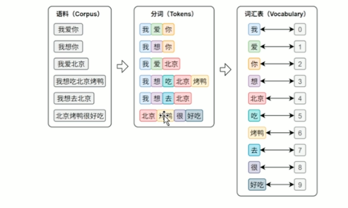
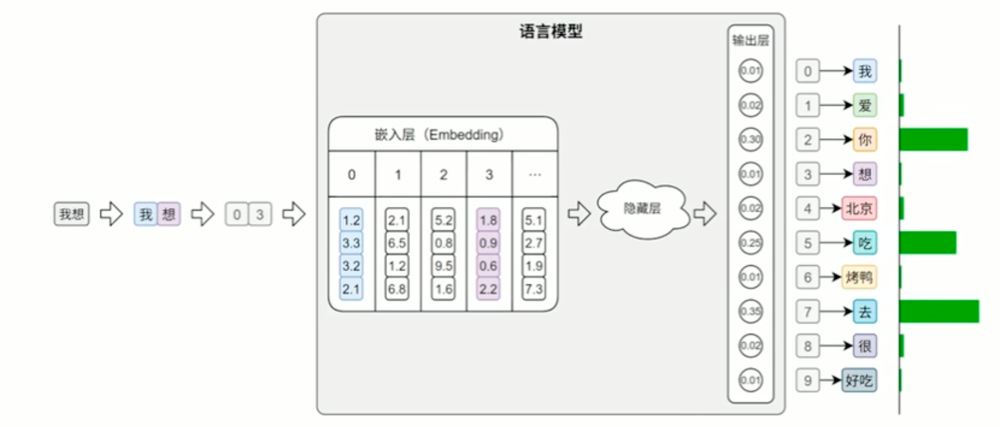

# 第三章 文本表示

## 3.1 概述

文本表示是将人类的自然语言转化为计算机能够理解的数值形式的过程。

早期的文本表示方法主要是基于词袋模型（Bag of Words, BoW）。
该模型的核心思想是将文本中的每个Token（通常是词语或字符）去重后，统计每个Token在文本中的词频。
然后根据词频将文本表示为一个向量，向量的每个维度对应一个Token，向量的值对应Token的词频。
这种方法虽然简单高效，但是在表达语序和上下文信息方面存在局限性。

因此当前的文本表示方法主要分为以下几步：

1. 分词（Tokenization）：将文本分解为基本的单位（Token），通常是词语或字符。
2. 构建词汇表（Vocabulary）：将所有出现过的Token去重后，构建一个词汇表，每个Token对应一个唯一的双向索引ID.
3. 向量化（Vectorization）：将每个Token映射为一个固定维度的向量表示。

在后续的训练或者预测过程中：

- 将输入的文本进行分词
- 通过词表将每个token映射为其对应的索引序列
- 将这些索引序列输入嵌入层(Embedding Layer)
- 嵌入层经过处理之后，将每个索引映射为低纬度稠密的向量表示也就是Token的词向量
- 模型输出层会根据每一个Token生成一个概率分布,表示下一个Token的概率
- 系统选用最大概率的Token的索引，并通过索引映射到对应的Token
- 重复以上步骤，直到生成完整的文本序列

## 3.2 分词策略

### 英文分词

#### 词级分词 Word-Level

1. 特点：将文本按照词语进行分割，英文中的空格和标点是天然的分隔符
2. 缺点: 实际应用中或许会出现OOV(Out-Of-Vocabulary)问题，即模型在训练过程中未遇到过的词语。
        比如网络热词、专有名词、特殊拼写等不存在于模型的预先词汇表中的词，由于模型无法识别这些词，
        因此会统一替换为特殊标记如`<UNK>`，导致语义的丢失.

#### 字符级分词 Character-Level

1. 特点：将文本分解为基本的单位（字符），每个字符或者标点符号都有一个唯一的索引，因此几乎不存在OOV问题。
2. 缺点
   - 建模难度高:单个字符本身的语义信息非常弱，无法捕捉到词语之间的关系，导致模型必须必须依赖更长的上下文来推断语义和结构
   - 序列长度长:由于每个字符都是一个独立的Token，因此文本序列的长度会大大增加，导致模型的计算复杂度和内存占用增加,会消耗大量的Token

#### 子词级分词 Subword-Level

1. 特点：子词级分词是介于词级分词和字符级分词之间的一种分词方法。
        它将文本分解为更小的单位（子词），每个子词都有一个唯一的索引，比如英文中的前缀、后缀、词根等。
        也就是说即使一个新的词没有出现在词表中，只要它可以被拆分为更小的词表中存在的子词单元，就可以被模型识别和表示，从而避免OOV问题。
2. 优点
   - 与词级别分词相比，子词级分词可以显著的缓解OOV问题。
   - 与字符级别分词相比，子词级分词可以有效的捕捉到词语之间的关系，因此在模型训练过程中可以获得更好的性能。

3. 常见的子词分词算法

- BPE（Byte Pair Encoding）GPT模型采用 字节对编码
BPE是一种基于统计的子词分词算法，它通过迭代合并出现频率最高的字符对来构建子词。
它的核心思想是将文本中的每个字符看作是一个子词，然后通过合并出现频率最高的字符对来构建新的子词
直到达到预设的子词数量或满足某个停止条件。
BPE算法在处理英文等语言时效果很好，但是在处理中文等基于字符的语言时效果较差。

1. 训练阶段
   - 将语料库中的词汇拆分为单个字符，构建初始的子词表。
   - 迭代 统计语料中出现频率最高的相邻字符对，将其合并为新的子词单元，并加入词表。
   - 重复执行上一步，直到词表大小达到预设上限。

2. 分词阶段
   - 将输入文本拆分为最小单位比如字符或者字节
   - 按顺序应用训练中学习到的合并规则（规则其实就是哪些字符对出现频率最高）
   - 将连续的子词单元合并为一个更长的子词单元，直到无法合并为止。
   - 重复执行以上步骤，最终得到由多个子词单元组成的分词结果。

### 深入理解BPE分词算法

[BPE分词算法详解](https://hf-mirror.com/learn/llm-course/zh-CN/chapter6/5)

### 中文分词

#### 字符级分词（Character-Level）

字符级分词是中文分词处理中最简单的一种方式，就是将文本中的每个汉字都作为一个独立的Token进行处理。
并且由于中文的汉字天生具有语义，每个汉字都有其独特的含义，因此相比英文的字符级分词可以保留文本的语义信息。

#### 词级分词（Word-Level）

词级分词是中文分词处理中最常用的一种方式，就是将文本按照完整词语进行分割。
在中文中，词语之间通常没有空格等分隔符，因此中文词级分词通常依赖人工词典、规则或者模型来识别词语的边界。
例如，基于规则的分词方法可以根据中文的语法规则，如“主谓宾”、“主谓宾补”等，来识别词语的边界。
而基于模型的分词方法则可以利用深度学习模型，如CRF（条件随机字段）模型、BiLSTM（双向循环神经网络）模型等，来学习词语的边界。

#### 子词级分词（Subword-Level）

虽然中文原则上不存在子词的概念，因为中文的偏旁部首和英文的词根词缀不一样。
后者是可以直接被当作子词处理的，但是依然不影响通过BPE子词分词算法对中文进行子词级分词。
核心原理还是先进行训练，学习语料库中出现频率最高的相邻字符对，将其合并为新的子词单元，并加入词表。
重复执行以上步骤，直到词表大小达到预设上限。

## 3.3 中文分词工具

目前关于中文分词工具按照实现方式可以分为两种：

1. 基于词典或者模型的分词工具
   主要以“词”为单位进行切分，代表工具包括jieba、HanLP等。
2. 基于子词建模算法比如BPE、Word2Vec等，从庞大的数据集中使用自动分词算法自动学习高频字组合，构建子词表。
   主要以Hugging Face的Transformers库中的分词器（Tokenizer）为代表，比如BertTokenizer、RobertaTokenizer等。
   还有tokenizers库，它提供了多种分词器实现，包括BPE、WordPiece、Unigram等。

## 3.4 jieba中文分词工具

### 精确模式

试图将文本精确地切分成词语，不存在冗余切分，适合文本分析任务。比如：
“小张毕业于北京大学计算机系” 会被切分成 “小张”、“毕业于”、“北京大学”、“计算机系”

1. jieba.cut 返回可迭代的生成器对象
2. jieba.lcut 返回列表对象

### 全模式

将文本中所有可能的词语都切分出来，包括冗余切分。
比如：“小张毕业于北京大学计算机系” 会被切分成 小 张 毕业 于 北京 大学 北京大学 计算机系 计算机 系
可以使用jieba.cut或者jieba.lcut来实现全模式分词，需要将cut_all参数设置为True。

### 搜索引擎模式

在精确模式的基础上对长词进行进一步切分，适合用于搜索场景。
比如：“小张毕业于北京大学计算机系” 会被切分成 “小张”、“毕业”、“于”、“大学”、“北京大学”、“计算机系”、算机、“计算机”、“系”。

可以使用jieba.cut_for_search或者jieba.lcut_for_search来实现搜索引擎模式分词

搜索引擎模式以及搜索引擎是如何工作的

- 搜索引擎爬取页面
- 对页面进行切词后进行倒排索引
- 用户输入查询关键词后，搜索引擎会根据关键词在倒排索引中进行匹配，返回相关的页面结果。
