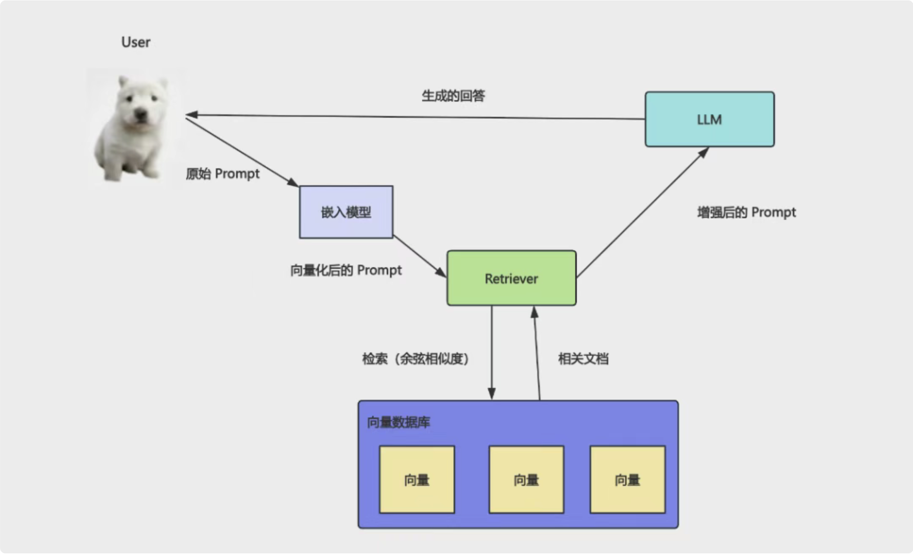
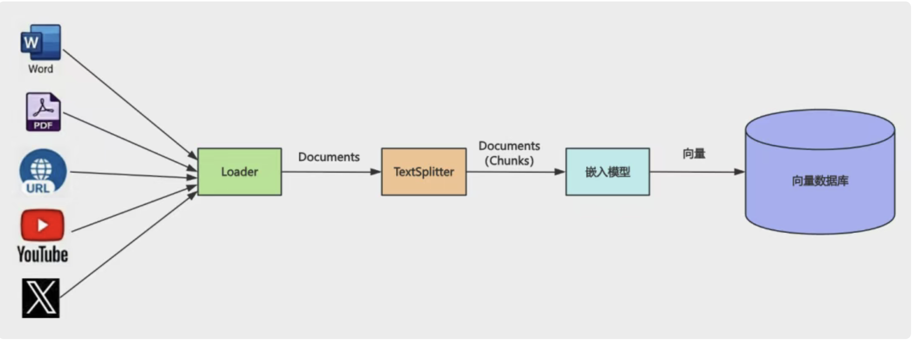

# AI Agent开发学什么？

## TODO

- [ ] Tool文档阅读

## 1. AI Agent是什么

直接调用AI大模型对话是可以解决很多问题，但是有下列这些事情是无法完成的：

1. 大模型的记忆能力总是有限的，因此需要做Memory管理
2. 大模型没办法对训练时间以后的知识进行回答，因此需要RAG技术提供查询
3. 大模型无法对内部私密知识库中的内容进行回答，因此需要RAG知识库查询能力
4. 大模型只会告诉你做事的思路，但是无法直接帮你调用工具，因此需要开发者开发好Tool工具交给它调用

因此AI Agent本质就是一个拓展了Memory记忆管理、Tools工具调用、RAG查询能力的大模型.

## 2. 如何开发简单Tool工具

比如你要用React+Vite+Typescript开发一个`TodoList`应用，大模型只能告诉你每一步怎么做：

1. 读取目录
2. 创建目录
3. 执行终端命令
4. 写入文件
5. 读取文件
6. 启动项目

因此我们需要开发对应的工具Tool，然后在对话的过程中由大模型自己分析调用。

### 2.1 Message的四种类型

1. SystemMessage
2. HumanMessage
3. AIMessage
4. ToolMessage

### 2.2 如何开发一个简单的读取文件的Tool

- 定义工具接口
   明确以filePath为输入参数，输出为读取到的文件内容

```typescript
export type ReadFileToolInput = {
  filePath: string;
};
```

- 实现工具逻辑
使用Node.js的fs模块读取文件内容，并返回结果
   工具在调用时以filePath作为参数

```typescript
import fs from "node:fs/promises";
 
async function ({ filePath }: ReadFileToolInput) {
    console.log("[readFile 工具调用]");
    console.log("filePath", filePath);
    const content = await fs.readFile(filePath, "utf-8");
    console.log("[readFile 工具调用成功]");
    return `读取到的文件内容为\n${content}`;
  }
```

- 定义工具元信息
   包括工具名称、描述和输入参数的验证规则

```typescript
{
    name: "read_file",
    description: "根据提供的文件路径（绝对路径或相对路径），读取文件内容",
    schema: z.object({
      filePath: z.string().describe("文件路径"),
    }),
}
```

- 使用langchain的tool装饰器将工具函数和元信息结合起来，创建一个可供AI Agent调用的工具

```typescript
import { tool } from "@langchain/core/tools";
const readFile = tool(
  async function ({ filePath }: ReadFileToolInput) {
    console.log("[readFile 工具调用]");
    console.log("filePath", filePath);
    const content = await fs.readFile(filePath, "utf-8");
    console.log("[readFile 工具调用成功]");
    return `读取到的文件内容为\n${content}`;
  },
  {
    name: "read_file",
    description: "根据提供的文件路径（绝对路径或相对路径），读取文件内容",
    schema: z.object({
      filePath: z.string().describe("文件路径"),
    }),
  },
);

```

## 3. 如何开发一个Mini Cursor

我们想一下，我们日常使用的Cursor这个AI Agent是如何工作的，就拿我们让它生成一个`React+Vite+Typescript`的`TodoList`应用来说：

1. 首先它会分析用户的需求，理解用户想要一个`React+Vite+Typescript`的`TodoList`应用。
2. 然后它会根据这个需求，生成一个开发计划，列出需要完成的步骤，比如：
   - 读取目录
   - 创建目录
   - 执行终端命令
   - 写入文件
   - 读取文件
   - 启动项目
3. 接下来它会根据这个计划，逐步调用对应的工具来完成每一步，比如：
   - 调用读取目录的工具，查看当前目录下有哪些文件和文件夹。
   - 调用创建目录的工具，创建一个新的目录来存放项目文件。
   - 调用执行终端命令的工具，运行`npm create vite@latest`来创建一个新的Vite项目。
   - 调用写入文件的工具，写入`App.tsx`文件的内容。
   - 调用读取文件的工具，查看`App.tsx`文件的内容是否正确。
   - 调用启动项目的工具，运行`npm run dev`来启动项目。
4. 最后它会根据每一步的结果，进行调整和优化，直到完成整个项目的开发。

因此我们需要依次实现这些工具：

1. 读取文件工具
2. 写入文件工具
3. 执行终端命令工具
4. 列出目录工具

实现好工具之后就可以着手使用大模型开启对话，并且实现在对话的过程中进行工具调用，让大模型自己分析什么时候调用哪个工具，调用什么参数。

```ts
/**
 * AI Agent调用工具
 * @param userQuery
 * @param maxIterations
 */
async function runAgentWithTools(
  humanMessage: HumanMessage,
  maxIterations = 30,
) {
  const systemMessage = new SystemMessage(`
        你是一个智能、高效的AI代码助手，可以使用工具完成任务。

        当前工作目录：${process.cwd()}

        工具列表：
        - read_file：根据提供的文件路径（绝对路径或相对路径），读取文件内容
        - write_file：将内容写入指定路径的文件中，如果文件路径不存在则先创建后写入
        - list_directory：列出指定目录下的所有文件和文件夹
        - exec_command：在指定目录下执行命令，并实时输出到控制台

        注意事项：
        - 回复简洁
        - 只需要告诉我具体做了什么事情，不要输出思考过程
    `);
  const messages: BaseMessage[] = [systemMessage, humanMessage];

  for (let i = 0; i < maxIterations; i++) {
    console.log(chalk.bgBlue(`⏳AI大模型第${i + 1}轮思考中...`));
    /**
     * 1. 什么时候循环中止？
     * AI大模型返回的结果数组中tool_calls为空的时候
     */
    let response = await modelWithTools.invoke(messages);
    messages.push(response);

    if (!response.tool_calls || response?.tool_calls?.length === 0) {
      console.log(chalk.bgMagenta(`💥AI最终输出如下：\n${response.content}`));
      return response.content;
    }

    /*
     * 2. 什么时候调用工具？
     * AI大模型返回的结果数组中tool_calls不为空的时候
     */
    for (const tool_call of response?.tool_calls) {
      const invokeTool = tools.find((item) => item.name === tool_call.name);
      if (invokeTool) {
        const { id, name, args } = tool_call;
        const toolCallResult = await invokeTool.invoke(args);
        const toolMessage = new ToolMessage({
          content: toolCallResult,
          tool_call_id: id,
        });
        messages.push(toolMessage);
      }
    }
  }

  // 当maxIterations轮对话之后 此时输出AI大模型返回的最近一次的消息
  return messages[messages.length - 1].content;
}

```

## 4. 如何开发一个简单的MCP Server

### 4.1 什么是MCP Server

在上面的AI Agent项目中，我们使用nodejs来开发了一个mini版本的cursor工具，并且提供了一系列工具为大模型拓展了能力，从而简单的实现了在和大模型的交互中，只需要用户输入提示词，大模型可以自动调用我们定义好的工具来实现我们想要的功能，但是这样的实现方式有个问题：AI Agent的开发语言和Tool工具的开发语言必须一致，否则在node环境下开发的agent无法执行其他语言的Tool工具，比如有一个其他团队使用Java语言开发的Tool工具供大模型调用时，我们就无法在node环境下的AI Agent中调用这个Java语言开发的Tool工具了。

解决这个问题有两个方案：

1. 本地使用nodejs的child_process模块来调用其他语言开发的工具，比如Java、Python等，这样就可以在node环境下的AI Agent中调用其他语言开发的Tool工具了，但是这种方式需要我们在本地环境中安装好对应语言的运行环境，并且需要处理好跨语言调用时的参数传递和结果返回，比较麻烦。

2. 远程使用HTTP协议来调用其他语言开发的工具，我们可以在远程服务器上部署一个MCP Server，MCP全称是Model-Context-Protocol模型-上下文-协议，是一个开源的协议规范，旨在为AI Agent的开发提供一个统一的通信协议。通过实现一个MCP Server，我们可以让不同的AI Agent和工具之间进行高效的通信和协作。

MCP最大的特点就是跨进程调用工具：

- 跨本地的进程调用就是用stdio，标准输入输出流来进行通信，AI Agent和工具在同一台机器上运行，通过标准输入输出流来传递消息和调用工具。
- 跨远程的进程调用就是用HTTP协议来进行通信，AI Agent和工具在不同的机器上运行，通过HTTP请求来传递消息和调用工具。

下面是几个和MCP相关的概念:

1. MCP Client
   我们实现的Mini Cursor就是一个简单的MCP Client，它可以调用当前项目中自己开发的Tool，也可以向MCP Server发送HTTP请求来调用工具。

2. MCP Server
   我们可以在远程服务器上部署一个MCP Server，其实MCP Server的本质就是一个HTTP服务器，它监听指定的端口，接收来自不同AI Agent的HTTP请求，根据请求中的参数调用对应的Tool工具，并且将工具的执行结果返回给AI Agent。

你在 tool 的函数里，调用下 MCP Client，访问下远程 Mcp Server，它本质上还是 tool，但是却集成了 MCP 工具。

### 4.2 如何实现一个简单的MCP Server

- 创建MCP服务器实例

```typescript
   import { McpServer } from "@modelcontextprotocol/sdk/server/mcp.js";

  const mcpServer = new McpServer({
  name: "artest-mcp-server",
  version: "1.0.0",
});

```

- 注册MCP Server工具-查询用户信息

```typescript

 mcpServer.registerTool(
  "query_user",
  {
    description: "根据用户名查询用户信息",
    inputSchema: queryUserInfoByIdSchema,
  },
  async function queryUserInfoById({ userId }: QueryUserInfoByIdInput) {
    console.log(
      chalk.bgRed(
        `[MCP Server 工具调用]-query_user(查询用户工具) 用户ID:${userId}`,
      ),
    );
    const user = database.users.find((item) => item.id === userId);
    if (!user) {
      console.log(
        chalk.red(`[query_user 工具调用失败] 用户ID ${userId} 不存在`),
      );
      return {
        content: [
          {
            type: "text" as const,
            text: `用户ID ${userId} 不存在`,
          },
        ],
      };
    }
    console.log(
      chalk.bgGreen(
        `[query_user 工具调用成功] 成功查询到用户信息:${JSON.stringify(user)}`,
      ),
    );
    return {
      content: [
        {
          type: "text" as const,
          text: JSON.stringify(user),
        },
      ],
    };
  },
);
```

与自定义实现的Tool不同的是，MCP server注册的tool回调函数必须返回一个符合特定格式的对象:

```typescript
{
  content: Array<{
    // 必须是以下类型之一：
    
    // 1. 文本内容
    {
      type: "text";
      text: string;
      annotations?: {
        audience?: ("user" | "assistant")[];
        priority?: number;
        lastModified?: string;
      };
      _meta?: Record<string, unknown>;
    }
    
    // 2. 图片内容
    {
      type: "image";
      data: string;  // base64编码
      mimeType: string;
      annotations?: { ... };
      _meta?: Record<string, unknown>;
    }
    
    // 3. 音频内容
    {
      type: "audio";
      data: string;  // base64编码
      mimeType: string;
      annotations?: { ... };
      _meta?: Record<string, unknown>;
    }
    
    // 4. 资源链接
    {
      type: "resource_link";
      uri: string;
      name: string;
      description?: string;
      // ...其他字段
    }
    
    // 5. 资源
    {
      type: "resource";
      resource: {
        uri: string;
        text?: string;
        blob?: string;
        mimeType?: string;
        _meta?: Record<string, unknown>;
      };
      annotations?: { ... };
    }
  }>;
}
```

- 创建MCP服务器传输通道-标准输入输出

```typescript
import { StdioServerTransport } from "@modelcontextprotocol/sdk/server/stdio.js";
const transport = new StdioServerTransport();
```

- 启动MCP服务器

```typescript
mcpServer.connect(transport);
```

MCP Server 启动后，会监听标准输入输出流，等待来自AI Agent的消息,可以通过两种方式来调用:

1. 通过Trae、cursor等AI Agent工具手动添加MCP Server后调用
2. 通过langchain提供的Mcp Client进行调用

### 4.3 如何使用Mcp Client调用MCP Server

- 初始化MCP客户端,配置MCP Server的信息

```typescript
import { MultiServerMCPClient } from "@langchain/mcp-adapters";

const mcpClient = new MultiServerMCPClient({
  mcpServers: {
    "artest-mcp-server": {
      command: "npx",
      args: [
        "-y",
        "tsx",
        "/Users/artest/Project/AI-Agent-Learning-Book/src/mcp/mcp-server-demo.ts",
      ],
    },
  },
});
```

- 获取MCP Server注册的所有工具和资源

```typescript
const tools = await mcpClient.listTools("artest-mcp-server");
const resources = await mcpClient.listResources("artest-mcp-server");
```

- 绑定MCP Server注册的工具到模型

```typescript
const modelWithTools = model.bindTools(tools);
```

- 运行AI Agent, 调用MCP Server注册的工具

## 5. 如何调用第三方MCP Server注册的工具


我们在和AI大模型对话的时候，需要调用MCP Server注册的工具，来实现和外部系统的交互。
但是不可能所有的工具都通过自定义实现，目前市场上已经有很多现成的MCP Server，我们可以直接调用它们注册的工具。
调用第三方MCP Server注册的工具，需要先初始化Mcp Client，配置好MCP Server的信息，然后就可以像调用自定义实现的工具一样，调用第三方MCP Server注册的工具了。

下面以注册高德地图MCP Server、文件系统MCP Server、Chrome DevTools MCP Server为例，展示如何初始化Mcp Client。

```typescript
const mcpClient = new MultiServerMCPClient({
  mcpServers: {
    "amap-maps-streamableHTTP": {
      url: `https://mcp.amap.com/mcp?key=${process.env.AMAP_MAPS_API_KEY}`,
    },
    Filesystem: {
      command: "npx",
      args: [
        "-y",
        "@modelcontextprotocol/server-filesystem",
        "/Users/artest/Desktop",
        "/Users/artest/Project",
      ],
      env: {},
    },
    "Chrome DevTools MCP": {
      command: "npx",
      args: ["-y", "chrome-devtools-mcp@latest", "--isolated"],
      env: {},
    }
  },
});
```

## 6. RAG（Retrieval-Augmented-Generation）

### 6.1 什么是RAG技术

我们知道一个AI大模型如果不借助于外部的知识，那么它的知识就取决于它在训练的时候给它的数据集。
因此，当我们询问大模型在训练时间之后发生的事情或者内部企业知识库的内容时，AI大模型很可能会出现胡乱作答答非所问的情况。
这就是我们常说的AI大模型的幻觉问题。

那么怎么解决这个问题呢？

当前最常见的解决方法是RAG技术。全称叫做Retrieval-Augmented-Generation，检索增强生成技术。
它的基本思想是：在生成文本时，先从互联网或者内部知识库中检索相关信息，然后将这些信息与用户输入的查询进行融合，作为增强后的prompt提示词。
最终，使用融合后的prompt提示词，调用AI大模型生成文本。

1. Retrieval 检索阶段：根据用户输入的查询，从互联网或者内部知识库中检索相关信息。
2. Augmented 增强阶段：将检索到的相关信息与用户输入的查询进行融合，作为增强后的prompt提示词。
3. Generation 生成阶段：使用融合后的prompt提示词，调用AI大模型生成文本。

### 6.2 向量检索和关键词检索

1. 向量检索（Vector Retrieval）：基于向量数据库的相似度检索，通过计算向量之间的相似度，找到与查询向量最相似的文档块。
   - 语义理解 ：能够理解文本的语义含义，捕捉上下文相关性
   - 模糊匹配 ：即使查询词与文档中的词汇不完全一致，也能找到语义相关的内容
   - 处理同义词 ：能够识别同义词和相关概念
   - 上下文理解 ：考虑整个句子或段落的含义

2. 关键词检索（Keyword Retrieval）：基于关键词匹配的检索，通过提取查询中的关键词，在文档中进行关键词匹配，找到包含关键词的文档块。
   - 精确匹配 ：基于精确的词汇匹配，确保检索结果的准确性
   - 速度快 ：通常比向量检索更快，特别是在大型文档集合中
   - 可解释性强 ：结果直接对应查询中的关键词，易于理解
   - 处理专有名词 ：对人名、地名、专业术语等专有名词的检索效果更好

3. 为什么在RAG技术中需要同时使用向量检索和关键词检索？
   - 可以弥补向量检索语义漂移的问题，也就是因为语义相似性而返回与查询主题相关但实际内容不匹配的文档
   - 对于特定的专有名词，关键词检索的准确性可能更高
   - 关键词检索可以处理复杂的查询，而向量检索只能处理简单的查询

4. 检索策略
   - 并行检索 ：同时使用向量检索和关键词检索，将两者的结果进行合并，提高检索效率
   - 级联检索 ：先使用关键词检索，将关键词检索的结果作为向量检索的查询，再使用向量检索，将向量检索的结果作为最终的检索结果
   - 权重融合 ：为两种检索结果分配不同权重，综合排序

### 6.3 如何实现一个简单的RAG Demo



- 创建嵌入模型（Embedding Model）
  - 嵌入模型（Embedding Model）负责将文本、图片、语音等转化为向量
  - 向量化之后存入向量数据库，就都可以实现语义搜索

```ts
import { ChatOpenAI, OpenAIEmbeddings } from "@langchain/openai";
import "dotenv/config";

const embeddingModel = new OpenAIEmbeddings({
  model: process.env.EMBEDDING_MODEL_NAME,
  apiKey: process.env.OPENAI_API_KEY,
  configuration: {
    baseURL: process.env.BASE_URL,
  },
});
```

- 基于Document API创建本地私有文档知识库

```ts
const documents = [
  new Document({
    pageContent: `
    光光是一个活泼开朗的小男孩，他有一双明亮的大眼睛，总是带着灿烂的笑容。
    光光最喜欢的事情就是和朋友们一起玩耍，他特别擅长踢足球，每次在球场上奔跑时，就像一道阳光一样充满活力。`,
    metadata: {
      chapter: "1",
      character: "光光",
      type: "角色介绍",
      mood: "活泼开朗",
    },
  }),
  new Document({
    pageContent: `
    东东是光光最好的朋友，他是一个安静而聪明的男孩。
    东东喜欢读书和画画，他的画总是充满了想象力。
    虽然性格不同，但东东和光光从幼儿园就认识了，他们一起度过了无数个快乐的时光。`,
    metadata: {
      chapter: "1",
      character: "东东",
      type: "角色介绍",
      mood: "安静聪明",
    },
  })
];
```

- 基于MemoryVectorStore API创建向量数据库

```ts
import { MemoryVectorStore } from "@langchain/classic/vectorstores/memory";
const vectorStore = await MemoryVectorStore.fromDocuments(
  documents,
  embeddingModel,
);
```

- 基于vectorStore实例创建检索器（Retriever）
  - 检索器（Retriever）负责从向量数据库中检索与查询相关的文档块
  - k值：指定返回的文档块数量

```ts
const retriever = vectorStore.asRetriever({ k: 3 });
```

- 可以基于retriever.invoke(question)来查询文档块
  - 检索器（Retriever）会根据查询问题，从向量数据库中检索与问题相关的文档块
  - 返回的文档块数量由 k 值指定

```ts
const question = "东东和光光是怎么成为朋友的？";
const retrievedDocs = await retriever.invoke(question);
```

- 可以基于vectorStore实例的similaritySearchWithScore方法来查询文档块
  - 检索器（Retriever）会根据查询问题，从向量数据库中检索与问题相关的文档块
  - 返回的文档块数量由 k 值指定
  - 同时返回每个文档块的相似度分数

```ts
const question = "东东和光光是怎么成为朋友的？";
const scoredResults = await vectorStore.similaritySearchWithScore(
  question,
  3,
);
```

- 基于检索的结果在向AI 大模型发送消息之前构建新的 Prompt
  - 新的 Prompt 包含了用户的查询问题和检索到的文档块
  - 新的 Prompt 会被发送给大模型，以生成基于检索结果的回答

```ts
  const context = retrievedDocs
    .map((doc, index) => {
      return `文档${index + 1}：${doc.pageContent}`;
    })
    .join("\n\n-----\n\n");

  const prompt = `
  你是一个讲友情故事的老师,要求基于以下故事片段回答问题，要求要用温暖生动的语言。
  如果故事中没有提到，就说"这个故事里还没有提到这个细节"。

  问题：${question}
  相关文档：${context}
  `;
```

- 将基于检索增强生成的 Prompt 发送给大模型，以生成基于检索结果的回答

```ts
const response = await model.invoke(prompt);
console.log(response.content);
```

综上所示，RAG 流程可以简单描述为：

1. 将本地文档私有知识库中内容基于嵌入模型向量化，存入向量数据库
2. 将用户输入问题也通过嵌入模型转成向量 retriever.invoke(question)
3. retriever 基于这个向量去向量数据库中检索，找到相似的向量（余弦相似度），返回对应的文档块
4. 文档块作为背景知识和用户的问题整合生成新的 prompt
5. prompt 发送给大模型，生成基于检索结果的回答

### 6.4 如何将各种来源的不同类型的知识整合到知识库

前面我们只介绍了如何基于本地私有文档知识库创建向量数据库，实际上，RAG 可以整合各种来源的不同类型的知识，包括但不限于：

- 文本文档（如 PDF、Word 文档等）
- 图片（如图片、截图等）
- 语音（如语音记录、语音文件等）
- 数据库记录（如 SQL 数据库、NoSQL 数据库等）
- 外部 API 调用结果（如天气 API、新闻 API 等）

因此我们可以基于嵌入模型把各种来源的不同类型的知识向量化，存入向量数据库。

但是这里有个问题，不同类型的知识来源其内容和格式不同，比如文本、图片、语音等，其向量化的方式也不同，并且有的文档太大导致不能直接向量化，因此：

1. 先需要不同的Loader来加载不同类型的知识来源
2. 然后再基于不同的Splitter来拆分文档
3. 最后将拆分后的文档对象Document对象向量化存入向量数据库



下面是一个简单的加载远程WEB网页内容为Document对象并进行拆分，后续基于向量数据库进行检索的示例：

- 加载远程WEB网页内容为Document对象

```ts
import { CheerioWebBaseLoader } from "@langchain/community/document_loaders/web/cheerio";
import "cheerio";

// 加载远程WEB网页内容为Document对象
const loader = new CheerioWebBaseLoader(
  "https://bbs.hupu.com/637781183.html",
  {
    selector: ".post-content_main-post-info__qCbZu .thread-content-detail p",
    timeout: 5000,
  },
);
// 加载远程WEB网页内容为Document对象
const documents = await loader.load();

```

- 拆分文档为文档块

```ts
import { RecursiveCharacterTextSplitter } from "@langchain/textsplitters";


/**
 * 创建RecursiveCharacterTextSplitter实例
 * 指定每个chunk的字符数、每个chunk之间的重叠字符数和分隔符
 */
const textSplitter = new RecursiveCharacterTextSplitter({
  chunkSize: 500, // 每个chunk的字符数
  chunkOverlap: 100, // 每个chunk之间的重叠字符数
  separators: ["。", ",", "\n\n", "\n", "?", "!"], // 分隔符
});

const splitDocuments = await textSplitter.splitDocuments(documents);

```

- 基于拆分后的文档块创建向量数据库
- 基于向量数据库创建检索器，指定返回的文档块数量为3
- 基于检索器从向量数据库中检索与问题相关的文档块
- 基于检索到的文档块构建新的 Prompt
- 新的 Prompt 包含了用户的查询问题和检索到的文档块
- 新的 Prompt 会被发送给大模型，以生成基于检索结果的回答

```ts
const vectorStore = await MemoryVectorStore.fromDocuments(
  splitDocuments,
  embeddingModel,
);
const retriever = vectorStore.asRetriever({ k: 3 });
const retrievedDocs = await retriever.invoke(question);
console.log("使用检索器从向量数据库中检索与问题相关的文档：");

/**
 * 使用向量数据库检索与问题相关的文档 并返回相似度分数
 */
const scoredResults = await vectorStore.similaritySearchWithScore(
  question,
  3,
);

const context = retrievedDocs
  .map((doc, index) => {
    return `文档${index + 1}：${doc.pageContent}`;
  })
  .join("\n\n-----\n\n");

const prompt = `
  你是一个擅长体育NBA的文章阅读助手，请根据文章内容进行作答。
  如果文章中没有提到，就说"文章中没有提到这个细节"。

问题：${question}
相关文档：${context}
`;

console.log("\n【AI 回答】");
const response = await model.invoke(prompt);
```
