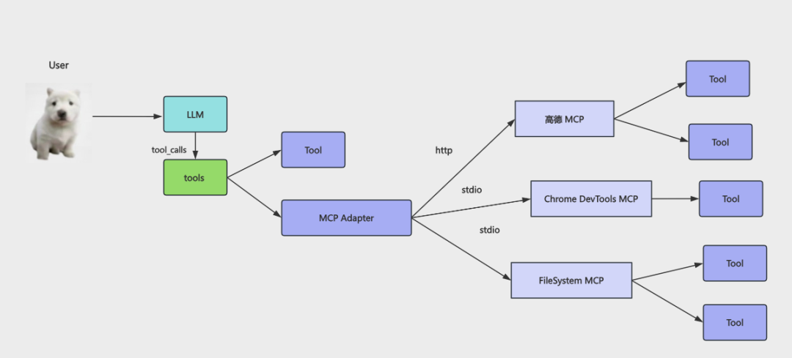

# AI Agent开发学什么？

## TODO

- Tool文档阅读
-

## 1. AI Agent是什么

直接调用AI大模型对话是可以解决很多问题，但是有下列这些事情是无法完成的：

1. 大模型的记忆能力总是有限的，因此需要做Memory管理
2. 大模型没办法对训练时间以后的知识进行回答，因此需要RAG技术提供查询
3. 大模型无法对内部私密知识库中的内容进行回答，因此需要RAG知识库查询能力
4. 大模型只会告诉你做事的思路，但是无法直接帮你调用工具，因此需要开发者开发好Tool工具交给它调用

因此AI Agent本质就是一个拓展了Memory记忆管理、Tools工具调用、RAG查询能力的大模型.

## 2. 如何开发简单Tool工具

比如你要用React+Vite+Typescript开发一个`TodoList`应用，大模型只能告诉你每一步怎么做：

1. 读取目录
2. 创建目录
3. 执行终端命令
4. 写入文件
5. 读取文件
6. 启动项目

因此我们需要开发对应的工具Tool，然后在对话的过程中由大模型自己分析调用。

### 2.1 Message的四种类型

1. SystemMessage
2. HumanMessage
3. AIMessage
4. ToolMessage

### 2.2 如何开发一个简单的读取文件的Tool

- 定义工具接口
   明确以filePath为输入参数，输出为读取到的文件内容

```typescript
export type ReadFileToolInput = {
  filePath: string;
};
```

- 实现工具逻辑
使用Node.js的fs模块读取文件内容，并返回结果
   工具在调用时以filePath作为参数

```typescript
import fs from "node:fs/promises";
 
async function ({ filePath }: ReadFileToolInput) {
    console.log("[readFile 工具调用]");
    console.log("filePath", filePath);
    const content = await fs.readFile(filePath, "utf-8");
    console.log("[readFile 工具调用成功]");
    return `读取到的文件内容为\n${content}`;
  }
```

- 定义工具元信息
   包括工具名称、描述和输入参数的验证规则

```typescript
{
    name: "read_file",
    description: "根据提供的文件路径（绝对路径或相对路径），读取文件内容",
    schema: z.object({
      filePath: z.string().describe("文件路径"),
    }),
}
```

- 使用langchain的tool装饰器将工具函数和元信息结合起来，创建一个可供AI Agent调用的工具

```typescript
import { tool } from "@langchain/core/tools";
const readFile = tool(
  async function ({ filePath }: ReadFileToolInput) {
    console.log("[readFile 工具调用]");
    console.log("filePath", filePath);
    const content = await fs.readFile(filePath, "utf-8");
    console.log("[readFile 工具调用成功]");
    return `读取到的文件内容为\n${content}`;
  },
  {
    name: "read_file",
    description: "根据提供的文件路径（绝对路径或相对路径），读取文件内容",
    schema: z.object({
      filePath: z.string().describe("文件路径"),
    }),
  },
);

```

## 3. 如何开发一个Mini Cursor

我们想一下，我们日常使用的Cursor这个AI Agent是如何工作的，就拿我们让它生成一个`React+Vite+Typescript`的`TodoList`应用来说：

1. 首先它会分析用户的需求，理解用户想要一个`React+Vite+Typescript`的`TodoList`应用。
2. 然后它会根据这个需求，生成一个开发计划，列出需要完成的步骤，比如：
   - 读取目录
   - 创建目录
   - 执行终端命令
   - 写入文件
   - 读取文件
   - 启动项目
3. 接下来它会根据这个计划，逐步调用对应的工具来完成每一步，比如：
   - 调用读取目录的工具，查看当前目录下有哪些文件和文件夹。
   - 调用创建目录的工具，创建一个新的目录来存放项目文件。
   - 调用执行终端命令的工具，运行`npm create vite@latest`来创建一个新的Vite项目。
   - 调用写入文件的工具，写入`App.tsx`文件的内容。
   - 调用读取文件的工具，查看`App.tsx`文件的内容是否正确。
   - 调用启动项目的工具，运行`npm run dev`来启动项目。
4. 最后它会根据每一步的结果，进行调整和优化，直到完成整个项目的开发。

因此我们需要依次实现这些工具：

1. 读取文件工具
2. 写入文件工具
3. 执行终端命令工具
4. 列出目录工具

实现好工具之后就可以着手使用大模型开启对话，并且实现在对话的过程中进行工具调用，让大模型自己分析什么时候调用哪个工具，调用什么参数。

```ts
/**
 * AI Agent调用工具
 * @param userQuery
 * @param maxIterations
 */
async function runAgentWithTools(
  humanMessage: HumanMessage,
  maxIterations = 30,
) {
  const systemMessage = new SystemMessage(`
        你是一个智能、高效的AI代码助手，可以使用工具完成任务。

        当前工作目录：${process.cwd()}

        工具列表：
        - read_file：根据提供的文件路径（绝对路径或相对路径），读取文件内容
        - write_file：将内容写入指定路径的文件中，如果文件路径不存在则先创建后写入
        - list_directory：列出指定目录下的所有文件和文件夹
        - exec_command：在指定目录下执行命令，并实时输出到控制台

        注意事项：
        - 回复简洁
        - 只需要告诉我具体做了什么事情，不要输出思考过程
    `);
  const messages: BaseMessage[] = [systemMessage, humanMessage];

  for (let i = 0; i < maxIterations; i++) {
    console.log(chalk.bgBlue(`⏳AI大模型第${i + 1}轮思考中...`));
    /**
     * 1. 什么时候循环中止？
     * AI大模型返回的结果数组中tool_calls为空的时候
     */
    let response = await modelWithTools.invoke(messages);
    messages.push(response);

    if (!response.tool_calls || response?.tool_calls?.length === 0) {
      console.log(chalk.bgMagenta(`💥AI最终输出如下：\n${response.content}`));
      return response.content;
    }

    /*
     * 2. 什么时候调用工具？
     * AI大模型返回的结果数组中tool_calls不为空的时候
     */
    for (const tool_call of response?.tool_calls) {
      const invokeTool = tools.find((item) => item.name === tool_call.name);
      if (invokeTool) {
        const { id, name, args } = tool_call;
        const toolCallResult = await invokeTool.invoke(args);
        const toolMessage = new ToolMessage({
          content: toolCallResult,
          tool_call_id: id,
        });
        messages.push(toolMessage);
      }
    }
  }

  // 当maxIterations轮对话之后 此时输出AI大模型返回的最近一次的消息
  return messages[messages.length - 1].content;
}

```

## 4. 如何开发一个简单的MCP Server

### 4.1 什么是MCP Server

在上面的AI Agent项目中，我们使用nodejs来开发了一个mini版本的cursor工具，并且提供了一系列工具为大模型拓展了能力，从而简单的实现了在和大模型的交互中，只需要用户输入提示词，大模型可以自动调用我们定义好的工具来实现我们想要的功能，但是这样的实现方式有个问题：AI Agent的开发语言和Tool工具的开发语言必须一致，否则在node环境下开发的agent无法执行其他语言的Tool工具，比如有一个其他团队使用Java语言开发的Tool工具供大模型调用时，我们就无法在node环境下的AI Agent中调用这个Java语言开发的Tool工具了。

解决这个问题有两个方案：

1. 本地使用nodejs的child_process模块来调用其他语言开发的工具，比如Java、Python等，这样就可以在node环境下的AI Agent中调用其他语言开发的Tool工具了，但是这种方式需要我们在本地环境中安装好对应语言的运行环境，并且需要处理好跨语言调用时的参数传递和结果返回，比较麻烦。

2. 远程使用HTTP协议来调用其他语言开发的工具，我们可以在远程服务器上部署一个MCP Server，MCP全称是Model-Context-Protocol模型-上下文-协议，是一个开源的协议规范，旨在为AI Agent的开发提供一个统一的通信协议。通过实现一个MCP Server，我们可以让不同的AI Agent和工具之间进行高效的通信和协作。

MCP最大的特点就是跨进程调用工具：

- 跨本地的进程调用就是用stdio，标准输入输出流来进行通信，AI Agent和工具在同一台机器上运行，通过标准输入输出流来传递消息和调用工具。
- 跨远程的进程调用就是用HTTP协议来进行通信，AI Agent和工具在不同的机器上运行，通过HTTP请求来传递消息和调用工具。

下面是几个和MCP相关的概念:

1. MCP Client
   我们实现的Mini Cursor就是一个简单的MCP Client，它可以调用当前项目中自己开发的Tool，也可以向MCP Server发送HTTP请求来调用工具。

2. MCP Server
   我们可以在远程服务器上部署一个MCP Server，其实MCP Server的本质就是一个HTTP服务器，它监听指定的端口，接收来自不同AI Agent的HTTP请求，根据请求中的参数调用对应的Tool工具，并且将工具的执行结果返回给AI Agent。

你在 tool 的函数里，调用下 MCP Client，访问下远程 Mcp Server，它本质上还是 tool，但是却集成了 MCP 工具。

### 4.2 如何实现一个简单的MCP Server

- 创建MCP服务器实例

```typescript
   import { McpServer } from "@modelcontextprotocol/sdk/server/mcp.js";

  const mcpServer = new McpServer({
  name: "artest-mcp-server",
  version: "1.0.0",
});

```

- 注册MCP Server工具-查询用户信息

```typescript

 mcpServer.registerTool(
  "query_user",
  {
    description: "根据用户名查询用户信息",
    inputSchema: queryUserInfoByIdSchema,
  },
  async function queryUserInfoById({ userId }: QueryUserInfoByIdInput) {
    console.log(
      chalk.bgRed(
        `[MCP Server 工具调用]-query_user(查询用户工具) 用户ID:${userId}`,
      ),
    );
    const user = database.users.find((item) => item.id === userId);
    if (!user) {
      console.log(
        chalk.red(`[query_user 工具调用失败] 用户ID ${userId} 不存在`),
      );
      return {
        content: [
          {
            type: "text" as const,
            text: `用户ID ${userId} 不存在`,
          },
        ],
      };
    }
    console.log(
      chalk.bgGreen(
        `[query_user 工具调用成功] 成功查询到用户信息:${JSON.stringify(user)}`,
      ),
    );
    return {
      content: [
        {
          type: "text" as const,
          text: JSON.stringify(user),
        },
      ],
    };
  },
);
```

与自定义实现的Tool不同的是，MCP server注册的tool回调函数必须返回一个符合特定格式的对象:

```typescript
{
  content: Array<{
    // 必须是以下类型之一：
    
    // 1. 文本内容
    {
      type: "text";
      text: string;
      annotations?: {
        audience?: ("user" | "assistant")[];
        priority?: number;
        lastModified?: string;
      };
      _meta?: Record<string, unknown>;
    }
    
    // 2. 图片内容
    {
      type: "image";
      data: string;  // base64编码
      mimeType: string;
      annotations?: { ... };
      _meta?: Record<string, unknown>;
    }
    
    // 3. 音频内容
    {
      type: "audio";
      data: string;  // base64编码
      mimeType: string;
      annotations?: { ... };
      _meta?: Record<string, unknown>;
    }
    
    // 4. 资源链接
    {
      type: "resource_link";
      uri: string;
      name: string;
      description?: string;
      // ...其他字段
    }
    
    // 5. 资源
    {
      type: "resource";
      resource: {
        uri: string;
        text?: string;
        blob?: string;
        mimeType?: string;
        _meta?: Record<string, unknown>;
      };
      annotations?: { ... };
    }
  }>;
}
```

- 创建MCP服务器传输通道-标准输入输出

```typescript
import { StdioServerTransport } from "@modelcontextprotocol/sdk/server/stdio.js";
const transport = new StdioServerTransport();
```

- 启动MCP服务器

```typescript
mcpServer.connect(transport);
```

MCP Server 启动后，会监听标准输入输出流，等待来自AI Agent的消息,可以通过两种方式来调用:

1. 通过Trae、cursor等AI Agent工具手动添加MCP Server后调用
2. 通过langchain提供的Mcp Client进行调用

### 4.3 如何使用Mcp Client调用MCP Server

- 初始化MCP客户端,配置MCP Server的信息

```typescript
import { MultiServerMCPClient } from "@langchain/mcp-adapters";

const mcpClient = new MultiServerMCPClient({
  mcpServers: {
    "artest-mcp-server": {
      command: "npx",
      args: [
        "-y",
        "tsx",
        "/Users/artest/Project/AI-Agent-Learning-Book/src/mcp/mcp-server-demo.ts",
      ],
    },
  },
});
```

- 获取MCP Server注册的所有工具和资源

```typescript
const tools = await mcpClient.listTools("artest-mcp-server");
const resources = await mcpClient.listResources("artest-mcp-server");
```

- 绑定MCP Server注册的工具到模型

```typescript
const modelWithTools = model.bindTools(tools);
```

- 运行AI Agent, 调用MCP Server注册的工具

## 5. 如何调用第三方MCP Server注册的工具


