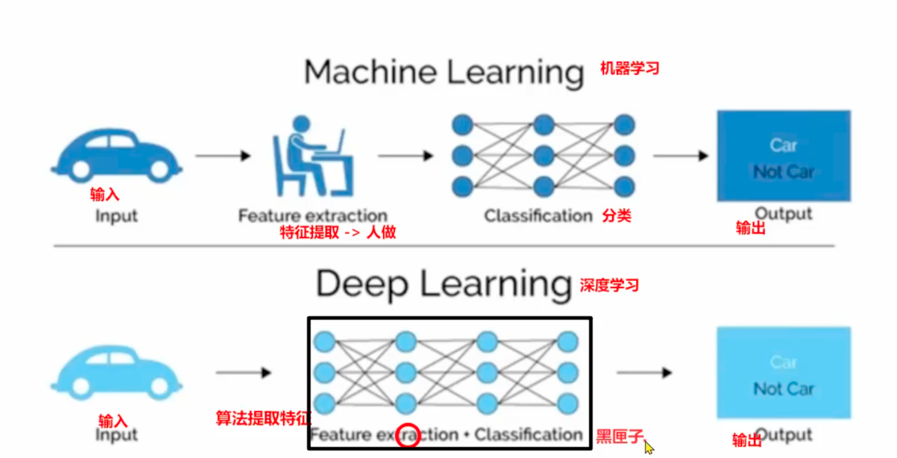

# 深度学习简介

本章节学习周期: 2026-04-12
本章节学习总时长（h）:
本章节学习目标：

- [ ] 机器学习和深度学习的区别
- [ ] 学习深度学习的基本概念和原理
- [ ] 了解深度学习的应用场景
- [ ] 学习深度学习的网络结构和训练方法
- [ ] 学习深度学习的应用场景和案例
- [ ] pytorch和tensorFlow的区别

## 深度学习总览

由于机器学习在处理文本和图像这两大领域都有局限性，因此深度学习应运而生。
深度学习是一种基于神经网络的机器学习方法，它通过模拟人类大脑的工作原理，来实现对复杂数据的处理和分析。
深度学习主要分为：

- 卷积神经网络（Convolutional Neural Network，简称CNN）
- 循环神经网络（Recurrent Neural Network，简称RNN）
- 人工神经网络（Artificial Neural Network，简称ANN）

### CNN卷积神经网络（Convolutional Neural Network，简称CNN）

CNN卷积神经网络的隐藏层分为三层：

- 卷积层：用来做图像识别和特征提取（图像层）
- 池化层：用来做特征压缩和降维
- 全连接层：用来做分类和回归

卷积神经网络进阶就是CV（计算机视觉，Computer Vision）方向，专门用于处理图像数据。

### RNN网络结构（Recurrent Neural Network，循环神经网络，简称RNN）

RNN循环神经网络的隐藏层分为三层：

- 词嵌入层：用来将文本转换为向量表示
- 循环网络层：用来处理文本序列，保留时间信息
- 全连接层：用来做分类和回归

RNN循环神经网络进阶就是NLP（自然语言 Processing）方向，专门用于处理文本数据。

### ANN网络结构（Artificial Neural Network，人工神经网络，简称ANN）

ANN人工神经网络也分为三层：

- 输入层 只能有1层
- 隐藏层 可以有N层 深度神经网络的深度就是隐藏层的数量，每个隐藏层可能有N个神经元
- 输出层 只能有1层

## 深度学习和机器学习

如上图所示，深度学习和机器学习的主要区别在于：

1. 传统机器学习算法依赖人工手动设计特征，并进行特征提取来实现对数据的分类和回归。
2. 深度学习算法则依赖神经网络自动学习和提取特征，它通过模仿人脑的神经网络在处理和分析复杂的数据，从海量数据中自动提取特征，无需人工手动设计特征。

在深度学习中，神经网络的隐藏层数量可以任意多，每个隐藏层可能有N个神经元，每一个神经元都需要：

1. 加权求和
2. 激活函数（将加权求和的结果转换为0-1之间的概率值）

因此深度学习算法既可以处理分类问题也可以处理回归问题。尤其擅长处理多维数据，比如图像、语音和文本。

## 深度学习的特点

1. 多层非线性变换
   深度学习中的多层指的是由多个隐藏层组成的神经网络，每一个神经元都需要做加权求和之后，应用非线性激活函数对输入数据进行变换。
   低层的隐藏层主要负责提取原始数据的简单特征，比如图像中的边缘、纹理等。
   高层的隐藏层主要负责提取更复杂的特征，比如图像中的对象、场景等。

2. 自动特征提取
   深度学习算法通过模仿人脑的神经网络，在处理和分析复杂的数据，从海量数据中自动提取特征，无需人工手动设计特征。
   例如，在图像识别任务中，深度学习算法可以自动提取图像中的边缘、纹理、对象等特征，而不需要人工手动设计特征。
   例如，在语音识别任务中，深度学习算法可以自动提取语音中的音素、音节等特征，而不需要人工手动设计特征。

3. 大数据和计算能力
   深度学习算法模型通常都需要处理大量的标注数据和强大的计算资源。
   因此，深度学习算法在处理复杂数据时，需要依赖GPU等高性能计算设备。
   GPU类似一个小学班级，虽然只能处理简单的矩阵运算，但是可以并行处理并且人数多到可以同时完成大量的简单计算。通常GPU的内核数量可以达到数千个。比如NVIDIA A100的CUDA核心就有6912个。

   CPU类似一个博士教授，它可以处理复杂的计算任务，但只能串行处理任务，不能并行处理。一个CPU的内核一般为16-32个。
   因此深度学习算法在处理复杂数据时，本质就是矩阵的乘法和加法，因此选择GPU来处理更加适合。

4. 可解释性差
   深度学习模型内部的运行机制相对不透明，因此被称为黑匣子模型，这意味着模型的预测结果不能被解释。
   除非是模型本身的设计者，否则很难解释模型的预测结果。
   例如，在图像识别任务中，深度学习算法可以自动提取图像中的边缘、纹理、对象等特征，但是很难解释模型为什么会将图像分类为某个类别。

## 深度学习的应用场景

1. 计算机视觉（Computer Vision，简称CV）
   - 图像识别
   - 图像分类
   - 面部识别
   - 图像生成

2. 自然语言处理（Natural Language Processing，简称NLP）
   - 文本分类
   - 情感分析
   - 文本生成
   - 语音识别
   - 机器翻译（比如英文翻译成中文，中文翻译成英文等）

3. 推荐系统（Recommendation System）
   - 商品推荐
   - 内容推荐
   - 用户行为分析

4. 多模态大模型（Multi-modalModal Large Language Model）
   - 图像-文本模型
   - 图像-语音模型
   - 语音-文本模型

多模态大模型不是深度学习的替代品，而是深度学习发展到高级阶段的产物。

- 深度学习提供了 基础模型架构 （Transformer、CNN 等）
- 深度学习提供了 训练范式 （预训练、微调、RLHF）
- 多模态大模型将这些技术 融合统一 ，实现跨模态理解与生成
