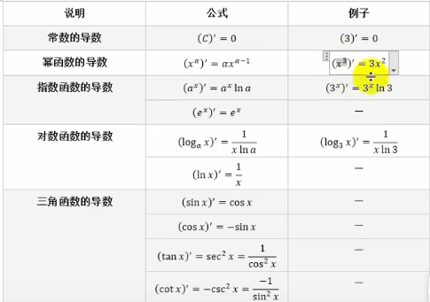
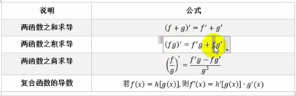

# 数据基础-导数

## 学习目标

- [ ] 理解导数就是求函数在任意一点上的切线斜率的基本概念
- [ ] 学会对基本函数进行求导得到对应导函数
- [ ] 学会导数的求导法则
- [ ] 可以利用导数求极限值
- [ ] 二阶导数
- [ ] 理解偏导数的概念
- [ ] 理解方向导数
- [ ] 学会并理解梯度的概念

## 1. 导数的基本概念

## 2. 基本函数的导数

## 3. 导数的求导法则

