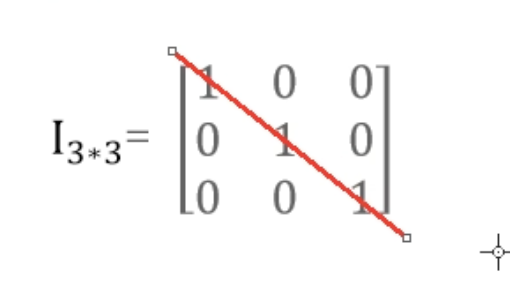
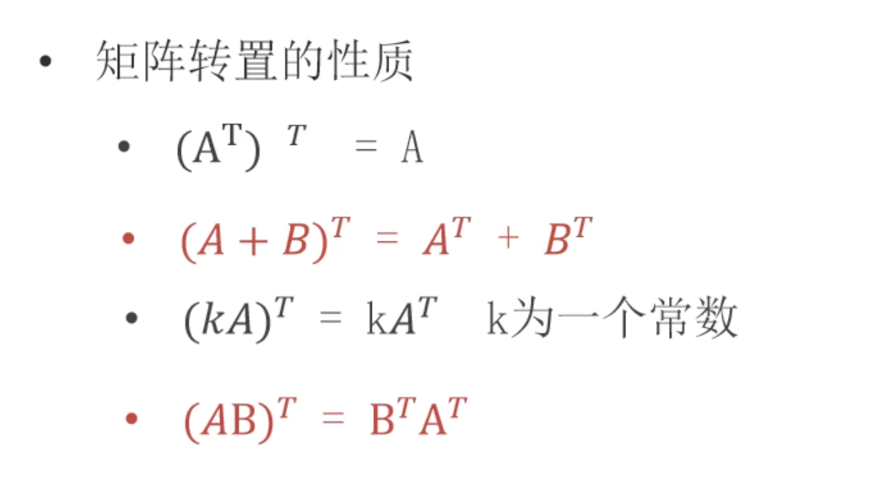

# 数据基础-矩阵

## 一、向量

### 1. 向量的定义

向量是**既有大小又有方向**的量，在数学中常用有序数组表示。

$$
\vec{v} = \begin{pmatrix} v_1 \\ v_2 \\ \vdots \\ v_n \end{pmatrix}
$$

- **标量**：只有大小，没有方向（如温度、质量）
- **向量**：既有大小，又有方向（如速度、力）

### 2. 向量的大小和方向

#### 向量的大小（模长/范数）

向量的大小叫做**模长**或**范数**，记作 $|\vec{v}|$ 或 $\|\vec{v}\|$。

**计算公式：**

$$
|\vec{v}| = \sqrt{v_1^2 + v_2^2 + \cdots + v_n^2}
$$

**示例：**

$$
\vec{v} = \begin{pmatrix} 3 \\ 4 \end{pmatrix}, \quad |\vec{v}| = \sqrt{3^2 + 4^2} = 5
$$

#### 向量的方向

向量的方向用**方向角**或**单位向量**表示。

**单位向量**：模长为 1 的向量，表示方向。

$$
\hat{v} = \frac{\vec{v}}{|\vec{v}|}
$$

**示例：**

$$
\vec{v} = \begin{pmatrix} 3 \\ 4 \end{pmatrix}, \quad \hat{v} = \frac{1}{5}\begin{pmatrix} 3 \\ 4 \end{pmatrix} = \begin{pmatrix} 0.6 \\ 0.8 \end{pmatrix}
$$

### 3. 向量的加减法

向量加减法是**对应分量相加减**。

$$
\vec{a} + \vec{b} = \begin{pmatrix} a_1 \\ a_2 \end{pmatrix} + \begin{pmatrix} b_1 \\ b_2 \end{pmatrix} = \begin{pmatrix} a_1 + b_1 \\ a_2 + b_2 \end{pmatrix}
$$

**示例：**

$$
\vec{a} = \begin{pmatrix} 1 \\ 2 \end{pmatrix}, \quad \vec{b} = \begin{pmatrix} 3 \\ 4 \end{pmatrix}
$$

$$
\vec{a} + \vec{b} = \begin{pmatrix} 1 + 3 \\ 2 + 4 \end{pmatrix} = \begin{pmatrix} 4 \\ 6 \end{pmatrix}
$$

$$
\vec{a} - \vec{b} = \begin{pmatrix} 1 - 3 \\ 2 - 4 \end{pmatrix} = \begin{pmatrix} -2 \\ -2 \end{pmatrix}
$$

**几何意义：**

- 加法：平行四边形法则 / 三角形法则
- 减法：从 $\vec{b}$ 指向 $\vec{a}$ 的向量

### 4. 向量的转置（Transpose）

将列向量变为行向量，或行向量变为列向量。

$$
\vec{v} = \begin{pmatrix} 1 \\ 2 \\ 3 \end{pmatrix} \quad \Rightarrow \quad \vec{v}^T = \begin{pmatrix} 1 & 2 & 3 \end{pmatrix}
$$

**转置的作用：**

| 操作                  | 说明                         |
| --------------------- | ---------------------------- |
| $\vec{v}^T \vec{v}$ | 向量与自身的点积，结果是标量 |
| $\vec{v} \vec{v}^T$ | 向量与自身的外积，结果是矩阵 |

**示例：**

$$
\vec{v} = \begin{pmatrix} 1 \\ 2 \\ 3 \end{pmatrix}, \quad \vec{v}^T = (1, 2, 3)
$$

$$
\vec{v}^T \vec{v} = 1^2 + 2^2 + 3^2 = 14
$$

### 向量的数学表示

在数学中，常用 $\vec{v} \in \mathbb{R}^n$ 来表示一个向量。

#### 符号含义

| 符号           | 含义           |
| -------------- | -------------- |
| $\vec{v}$    | 一个向量       |
| $\in$        | 属于           |
| $\mathbb{R}$ | 实数集合       |
| $^n$         | n 次方（n 维） |

#### 整体含义

$$
\vec{v} \in \mathbb{R}^3
$$

读作：**"向量 v 属于三维实数空间"**

意思是：$\vec{v}$ 是一个有 **3 个实数分量**的向量。

#### 具体例子

$$
\vec{v} = \begin{pmatrix} 1 \\ 2 \\ 3 \end{pmatrix} \in \mathbb{R}^3
$$

这个向量有 3 个分量（1, 2, 3），每个分量都是实数，所以它属于 $\mathbb{R}^3$。

#### 不同维度的表示

| 表达式                       | 含义          | 例子                               |
| ---------------------------- | ------------- | ---------------------------------- |
| $x \in \mathbb{R}$         | x 是一个实数  | $x = 3.14$                       |
| $\vec{v} \in \mathbb{R}^2$ | v 是二维向量  | $\vec{v} = (1, 2)$               |
| $\vec{v} \in \mathbb{R}^3$ | v 是三维向量  | $\vec{v} = (1, 2, 3)$            |
| $\vec{v} \in \mathbb{R}^n$ | v 是 n 维向量 | $\vec{v} = (v_1, v_2, ..., v_n)$ |

#### 在机器学习中的应用

在机器学习中，特征向量经常写成 $\vec{x} \in \mathbb{R}^n$，表示有 n 个特征的样本。

## 二、范数

### 1. 范数的定义

范数是衡量向量"大小"的函数，记作 $\|\vec{x}\|$。

对于向量 $\vec{x} = (x_1, x_2, \cdots, x_n)$，p-范数的定义为：

$$
\|\vec{x}\|_p = \left( \sum_{i=1}^{n} |x_i|^p \right)^{1/p}
$$

范数满足三个性质：

1. **非负性**：$\|\vec{x}\| \geq 0$，当且仅当 $\vec{x} = \vec{0}$ 时等号成立
2. **齐次性**：$\|k\vec{x}\| = |k| \cdot \|\vec{x}\|$
3. **三角不等式**：$\|\vec{x} + \vec{y}\| \leq \|\vec{x}\| + \|\vec{y}\|$

### 2. 1 范数（曼哈顿范数）

向量各元素绝对值之和：

$$
\|\vec{x}\|_1 = \sum_{i=1}^{n} |x_i| = |x_1| + |x_2| + \cdots + |x_n|
$$

**示例：**

$$
\vec{x} = \begin{pmatrix} 3 \\ -4 \end{pmatrix}, \quad \|\vec{x}\|_1 = |3| + |-4| = 7
$$

**应用：** L1 正则化、稀疏解

### 3. 2 范数（欧几里得范数）

向量各元素平方和的平方根，即向量的模长：

$$
\|\vec{x}\|_2 = \sqrt{\sum_{i=1}^{n} x_i^2} = \sqrt{x_1^2 + x_2^2 + \cdots + x_n^2}
$$

**重要性质：假设x为向量，X的转置乘以X 等于 X向量的2范数的平方**

$$
\|\vec{x}\|_2^2 = \vec{x}^T \vec{x}
$$

**示例：**

$$
\vec{x} = \begin{pmatrix} 3 \\ 4 \end{pmatrix}, \quad \|\vec{x}\|_2 = \sqrt{3^2 + 4^2} = 5
$$

**验证性质：**

$$
\|\vec{x}\|_2^2 = 25, \quad \vec{x}^T \vec{x} = 3 \times 3 + 4 \times 4 = 25
$$

**应用：** L2 正则化、欧氏距离、均方误差

### 4. p 范数

通用的范数定义：

$$
\|\vec{x}\|_p = \left( \sum_{i=1}^{n} |x_i|^p \right)^{1/p}, \quad p \geq 1
$$

**常用 p 值：**

| p 值   | 名称     | 公式                  |
| ------ | -------- | --------------------- |
| p = 1  | 1 范数   | $\sum \|x_i\|$      |
| p = 2  | 2 范数   | $\sqrt{\sum x_i^2}$ |
| p = ∞ | 无穷范数 | $\max(\|x_i\|)$     |

### 5. 无穷范数

向量各元素绝对值的最大值：

$$
\|\vec{x}\|_\infty = \max_{i} |x_i|
$$

**示例：**

$$
\vec{x} = \begin{pmatrix} 3 \\ -5 \\ 2 \end{pmatrix}, \quad \|\vec{x}\|_\infty = \max(|3|, |-5|, |2|) = 5
$$

### 范数对比图示

```
    2范数（圆）      1范数（菱形）     无穷范数（正方形）
       ○                ◇                  □
      / \              / \                / \
     /   \            /   \              /   \
    |     |          |     |            |     |
     \   /            \   /              \   /
      \ /              \ /                \ /
```

### 在机器学习中的应用

| 范数     | 应用场景                               |
| -------- | -------------------------------------- |
| 1 范数   | L1 正则化（Lasso）、特征选择、稀疏解   |
| 2 范数   | L2 正则化（Ridge）、欧氏距离、MSE 损失 |
| 无穷范数 | 对抗样本、最坏情况分析                 |

## 三、矩阵

### 1. 矩阵的定义

矩阵是**按矩形排列的数表**，用括号括起来。

$$
A = \begin{pmatrix} a_{11} & a_{12} & \cdots & a_{1n} \\ a_{21} & a_{22} & \cdots & a_{2n} \\ \vdots & \vdots & \ddots & \vdots \\ a_{m1} & a_{m2} & \cdots & a_{mn} \end{pmatrix}
$$

- **维度**：$m \times n$ 表示 m 行 n 列
- **元素**：$a_{ij}$ 表示第 i 行第 j 列的元素

**示例：**

$$
A = \begin{pmatrix} 1 & 2 & 3 \\ 4 & 5 & 6 \end{pmatrix}
$$

这是一个 $2 \times 3$ 的矩阵。

### 2. 矩阵在机器学习中的表达

| 数据结构 | 表示方式                              | 说明                        |
| -------- | ------------------------------------- | --------------------------- |
| 单个样本 | 向量$\vec{x} \in \mathbb{R}^n$      | n 个特征                    |
| 多个样本 | 矩阵$X \in \mathbb{R}^{m \times n}$ | m 个样本，每个样本 n 个特征 |
| 权重参数 | 矩阵$W \in \mathbb{R}^{n \times k}$ | n 个输入特征，k 个输出      |

**示例：**

```
样本矩阵 X（3个样本，2个特征）：
      特征1  特征2
样本1 [  1.5    2.0  ]
样本2 [  2.3    1.8  ]
样本3 [  0.9    3.1  ]
```

$$
X = \begin{pmatrix} 1.5 & 2.0 \\ 2.3 & 1.8 \\ 0.9 & 3.1 \end{pmatrix}
$$

### 3. 矩阵的加减法

矩阵加减法是**对应元素相加减**，要求两个矩阵维度相同。

$$
A + B = \begin{pmatrix} a_{11} & a_{12} \\ a_{21} & a_{22} \end{pmatrix} + \begin{pmatrix} b_{11} & b_{12} \\ b_{21} & b_{22} \end{pmatrix} = \begin{pmatrix} a_{11}+b_{11} & a_{12}+b_{12} \\ a_{21}+b_{21} & a_{22}+b_{22} \end{pmatrix}
$$

**示例：**

$$
A = \begin{pmatrix} 1 & 2 \\ 3 & 4 \end{pmatrix}, \quad B = \begin{pmatrix} 5 & 6 \\ 7 & 8 \end{pmatrix}
$$

$$
A + B = \begin{pmatrix} 1+5 & 2+6 \\ 3+7 & 4+8 \end{pmatrix} = \begin{pmatrix} 6 & 8 \\ 10 & 12 \end{pmatrix}
$$

$$
A - B = \begin{pmatrix} 1-5 & 2-6 \\ 3-7 & 4-8 \end{pmatrix} = \begin{pmatrix} -4 & -4 \\ -4 & -4 \end{pmatrix}
$$

### 4. 矩阵的乘法

#### 矩阵与标量相乘

$$
k \cdot A = k \begin{pmatrix} a_{11} & a_{12} \\ a_{21} & a_{22} \end{pmatrix} = \begin{pmatrix} k \cdot a_{11} & k \cdot a_{12} \\ k \cdot a_{21} & k \cdot a_{22} \end{pmatrix}
$$

#### 矩阵与矩阵相乘

设 $A$ 为 $m \times p$ 矩阵，$B$ 为 $p \times n$ 矩阵，则 $C = AB$ 为 $m \times n$ 矩阵：

$$
c_{ij} = \sum_{k=1}^{p} a_{ik} \cdot b_{kj}
$$

**关键规则：A 的列数 = B 的行数（前列等于后行可进行相乘 结果等于前行乘以后列）**

**示例：**

$$
A = \begin{pmatrix} 1 & 2 \\ 3 & 4 \end{pmatrix}, \quad B = \begin{pmatrix} 5 & 6 \\ 7 & 8 \end{pmatrix}
$$

$$
AB = \begin{pmatrix} 1 \times 5 + 2 \times 7 & 1 \times 6 + 2 \times 8 \\ 3 \times 5 + 4 \times 7 & 3 \times 6 + 4 \times 8 \end{pmatrix} = \begin{pmatrix} 19 & 22 \\ 43 & 50 \end{pmatrix}
$$

### 5. 矩阵的转置

将矩阵的行和列互换。

$$
A = \begin{pmatrix} 1 & 2 & 3 \\ 4 & 5 & 6 \end{pmatrix} \quad \Rightarrow \quad A^T = \begin{pmatrix} 1 & 4 \\ 2 & 5 \\ 3 & 6 \end{pmatrix}
$$

**性质：**

- $(A^T)^T = A$
- $(A + B)^T = A^T + B^T$
- $(AB)^T = B^T A^T$

## 四、方阵

1. 矩阵乘以矩阵的转置矩阵 得到的结果是方阵
2. 矩阵的转置矩阵乘以矩阵 得到的结果也是方阵
3. 对称方阵
   沿着主对角线，其元素值相等，也就是Aij = Aji。主对角线是指从左上到右下的对线。
4. 单位矩阵
   是方阵的一种特殊表现形式。对角线为1，其他元素为0的方阵。用符号I表示或者E表示。



## 五、矩阵乘法的性质

1. 矩阵的乘法不满足交换律
   A *B的结果不等于B* A的结果
2. 矩阵的乘法满足结合率
   (A *B)* C = A *(B* C)
3. 任何矩阵和单位矩阵相乘的结果等于矩阵本身
   A *I = A
   I* A = A
4. 一个A矩阵乘以B矩阵等于A自身，那么B矩阵就是单位矩阵
   A * B = A
   B = I
5. 矩阵的逆运算
   如果两个矩阵AB相乘其结果等于单位矩阵，那么这两个矩阵互为逆矩阵。
   A * B = I
   B = A^{-1}
   已知A的情况下求其逆矩阵，B就等于主对角线的值进行调换，副对角线的值符号变相反。

## 六、矩阵转置的性质



1. A矩阵的转置再转置等于A矩阵本身
   A^T^T = A
2. A矩阵加B矩阵的转置等于A矩阵的转置加B矩阵的转置
   (A + B)^T = A^T + B^T
3. A矩阵乘以B矩阵的转置等于B矩阵的转置乘以A矩阵的转置（先后转再前转）
   (A *B)^T = B^T* A^T
4. 当k为常数时，kA的转置等于k乘以A的转置
   (kA)^T = kA^T
