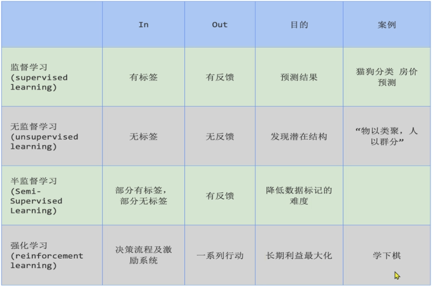
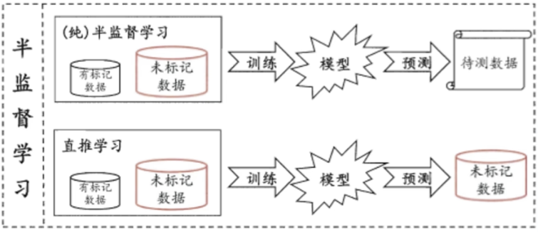
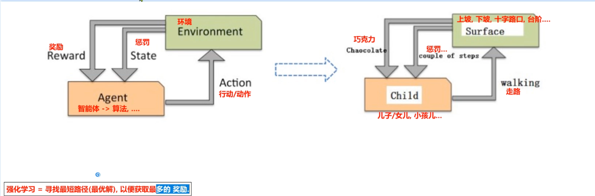
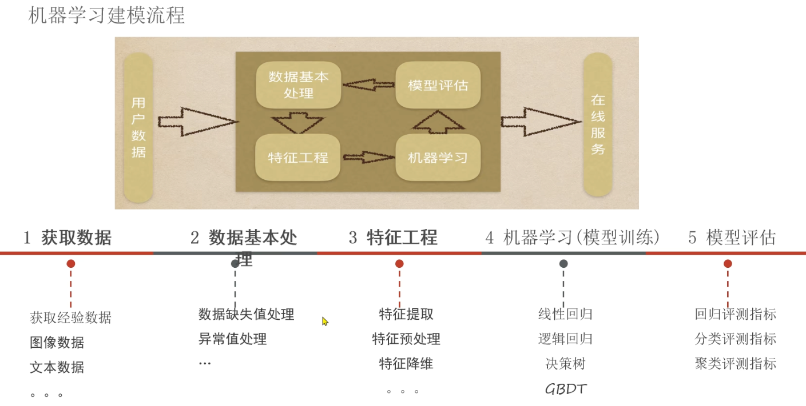
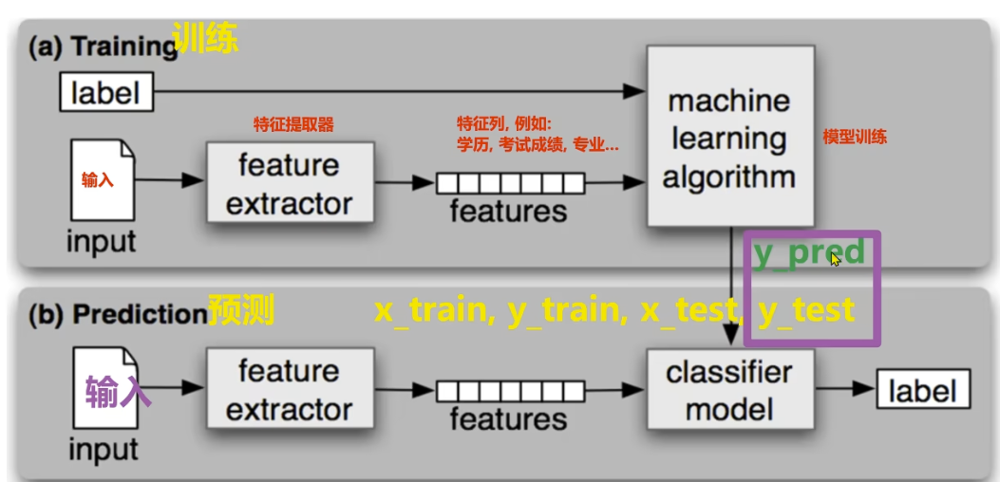
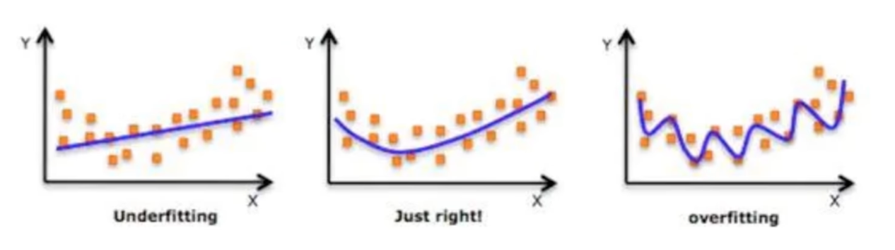

# 机器学习概述

## 学习目标

- [X] 理解AI、ML、DL的区别
- [ ] 阅读机器学习的西瓜书 书名叫做《Python for Machine Learning》
- [ ] 了解线性回归模型
- [X] 掌握机器学习专业术语
- [X] 了解机器学习算法分类
- [ ] 掌握监督学习和无监督学习数学表示
- [ ] 欧式距离：对应维度的差值平方和，开平方根
- [ ] 曼哈顿距离：对应维度的差值绝对值的和
- [ ] 切比雪夫距离：对应维度的差值绝对值的最大值
- [ ] 了解KNN算法
- [X] 明白回归和分类的区别
- [X] 明白分类和聚类的区别
- [X] 掌握机器学习建模流程
- [X] 了解特征工程是什么
- [X] 理解特征提取的作用
- [X] 理解特征预处理的作用
- [X] 理解特征降维、特征选择和特征组合
- [X] 了解模型拟合是什么
- [X] 理解过拟合和欠拟合
- [X] 了解过拟合和欠拟合的原因
- [X] 理解泛化是什么以及奥卡姆剃刀原则

## AI（人工智能）、ML（机器学习）、DL（深度学习）的区别

AI就是用计算机来模拟人脑，从而让计算机可以像人类一样可以理性思考和决策。

人工智能包括机器学习、深度学习、自然语言处理、计算机视觉等。

**机器学习是实现AI的一种途径，它是指计算机通过学习数据（文本、图片、音频、视频等）来自动改进自身系统性能的技术。**

**深度学习是机器学习的一种方法，它是指计算机通过多层神经网络来学习数据。**

自然语言处理是计算机通过理解和生成人类语言来与人类交互。

计算机视觉是计算机通过理解和生成图像来与人类交互。

## 认识机器学习

机器学习的过程中最重要的三个要素：数据、算法、算力

机器学习的本质就是首先通过大量历史数据集来进行训练，然后根据模型训练的规律来预测新的数据。

1. 数据采集
2. 数据预处理
3. 特征工程
4. 模型评估
5. 模型预测

## 机器学习学习方式

1. 基于规则的学习

   基于规则的学习其中的规则其实就是程序员写的if-else的代码，比如对于一个简单的垃圾邮件的分类问题，我们可以写出如下判断：

   - 如果邮件中包含“免费”、“优惠”、“奖励”等关键词
   - 如果邮件中包含二维码
   - 如果邮件中包含钓鱼链接

   后续当新的邮件到达时，计算机可以根据这些写好的规则来判断邮件是否为垃圾邮件。
2. 基于模型的学习

   但是现实生活中有很多问题无法通过规则来解决，比如：

   - 图像识别
   - 语音识别
   - 自然语言处理

   因此就有了基于模型的学习，基于模型的学习其实就是通过学习数据来自动找到规律和公式的过程，然后对新的数据做出预测。

## 机器学习发展历史

- 1950年 人工智能之父（约翰·麦卡锡）提出AI的概念
- 1963年 机器学习之父（亚瑟 塞缪尔）提出机器学习的第一个算法（感知器）
- 80年代 统计模型开始被广泛使用
- 21世纪初期 神经网络开始被广泛使用
- 2017年 自然语言处理NLP的transformer模型被提出
- 2018年 Bert和GPT出现
- 2022年 ChatGPT出现，标志着进入到AIGC（Artificial Intelligence Generated Content）时代

## 机器学习专业术语

1. 训练集Training Set：由多行训练样本组成，用于训练模型的参数。其中包括x_train和y_train,分别表示训练集的特征和标签
2. 测试集Test Set：由多行测试样本组成，用于评估模型的性能。其中包括x_test和y_test,分别表示测试集的特征和标签
3. 特征Feature：一列数据一个特征，也叫做属性
4. 标签Label/Target：一列数据一个标签，也叫做目标变量，训练集的标签列叫做y_train，测试集的标签列叫做y_test
5. 样本 Sample：一行数据就是一个样本 多行数据组成数据集
6. 训练集和测试集的比例一般是80%比20%或70%比30%

## 机器学习算法分类

1. 有监督学习
   特点就是“有特征有标签”。
   有监督的学习中输入数据中包含特征和标签，模型需要根据测试集特征来预测测试集标签。
   有监督学习又可以分为两类：

   - 回归问题(Regression))：如果标签是连续值，那么就是回归问题。比如预测房价、预测股票价格等。
   - 分类问题(Classification)：如果标签是离散值，那么就是分类问题。比如分类垃圾邮件、分类图片等。
2. 无监督学习
   特点就是“有特征无标签”。
   无监督的学习中输入数据中只包含特征，模型需要根据样本之间的**相似性**，对样本进行**聚类(Clustering)**，从而发现数据样本之间的内部关系。（看图分类例子），因此聚类问题属于无监督学习的范围。

   - 样本数据无标签
   - 但样本之间具有特征，因此需要找到相似性
   - 找到相似性就可以进行聚类，找到样本之间的内部关系
3. 半监督学习
   特点是"有特征，部分有标签"。其基本流程是：

   - 领域专家手动标准少量数据，这些数据就是有标签的样本
   - 训练集同时包含有标签的样本和无标签的样本，并交给模型进行训练
   - 模型根据无标签的样本，根据学习到的关系，对无标签的样本进行分类（打上标签）
   - 最后根据模型分类结果与领域专家分类结果进行对比，评估模型的性能

   

   因此半监督学习可以大幅度降低专家标注成本，同时也可以提高模型的性能。
4. 强化学习（Reinforcement Learning）
   强化学习是机器学习的一个重要分支，因为深度学习用的是强化学习的思路。

   强化学习的常见应用场景有：

   - 阿尔法狗围棋
   - 无人自动驾驶
   - 游戏智能

   强化学习的四要素是：

   - 环境（Environment）：环境是强化学习的环境，比如游戏、自动驾驶等。
   - 智能体（Agent）：强化学习的智能体或者说算法，比如游戏中的玩家、自动驾驶中的车辆等。
   - 奖励（Reward）：奖励是强化学习的奖励，比如游戏中的得分、自动驾驶中的距离等。
   - 动作（Action）：动作是强化学习的决策，比如游戏中的移动、自动驾驶中的加速等。

   

   强化学习通过构建四个要素：环境、智能体、奖励、动作体，让Agent根据不同的环境状况进行决策获得累计最多奖励的过程。其本质就是寻找最短路径也就是最优解，并通过最优解来获取更多的奖励。

## 分类和聚类

1. 分类：简单的说就是已知标准答案，因为有标签，新的数据进来按照标准进行分类
2. 聚类：简单的说就是无标准答案，因为无标签，需要自己学习找到相似性，然后进行分类

## 机器学习建模流程

1. 获取数据（数据可以是文本、图像、语音等类型）
2. 数据预处理（数据清洗、缺失值处理要么删要么填、异常值处理、数据标准化等）
3. 特征工程（特征提取、特征预处理、特征降维、特征选取、特征组合）数据在这一步转化为向量
4. 机器学习（模型训练 线性回归、逻辑回归、决策树、GBDT梯度提升树 等）
   - 选择合适的算法进行模型训练
   - 基于不同的任务来选择不同的算法，比如有监督学习、无监督学习、半监督学习、强化学习等。
   - 有监督学习的算法有：线性回归、逻辑回归、决策树、GBDT梯度提升树等。
   - 无监督学习的算法有：K-means、DBSCAN、谱聚类等。
   - 半监督学习的算法有：Q-Learning、SARSA等。
5. 模型评估回归（回归测评指标、分类测评指标、聚类测评指标等）重复上述步骤得到最优的模型。
6. 模型预测（根据测试集特征来预测测试集标签y_test，最终与y_predict进行对比）

### 有监督学习建模流程

## 特征工程（Feature Engineering）

当我们在进行机器学习任务时，通常需要对原始数据进行预处理，预处理之后得到的数据会有多个特征，但是这里面的特征不是所有的都有用，需要进行特征工程来提取出有用的特征。

因此特征工程的概念可以用一句话表示为：

- **特征工程就是利用专业背景知识和技巧处理数据，从而让机器学习的算法效果最好，这个处理数据的过程就是特征工程。**
- 数据和特征决定了机器学习的上限，而模型和算法则是尽可能的接近这个上限的手段。

特征工程的核心要素如下：（最常用还是特征提取和特征预处理）

1. **特征提取（Feature Extraction）**
   对原始数据进行特征提取，将原始数据转换为模型可以理解的特征向量。
   这个过程需要利用专业的背景知识和专业人员的经验，比如文本中的词袋模型、TF-IDF等。
   特征提取的作用是将数据转化为特征向量。
2. **特征预处理（Feature Preprocessing）**
   由于有些特征对模型影响大，有些特征对模型影响小，因此需要对特征进行预处理。
   特征预处理往往是因为量纲问题，比如特征的单位不同，或者特征的范围不同等。
   特征预处理的作用是保证不同特征对模型影响的一致性。

   举个例子：
   年龄特征和身高特征，年龄特征的单位是岁，身高特征的单位是米。
   那么一组数据中可能年龄的范围是0-100，但是身高的范围基本都在1-2米之间。
   因此，年龄特征和身高特征的量纲不同，需要进行预处理。对年龄特征进行归一化处理，将年龄特征的范围从0-100映射到0-1之间。

   预处理的方法有：

   - **归一化处理**，计算方法为：x_norm = (x - min) / (max - min) ，其中min是特征的最小值，max是特征的最大值，x是特征的原始值。
   - **标准化处理**，计算方法为：x_std = (x - mean) / std ，其中mean是特征的均值，std是特征的标准差，x是特征的原始值。
3. 特征降维（Dimensionality Reduction）：将原始数据的维度降低，保证数据的主要信息保留下来。
4. 特征选取（Feature Selection）
   由于原始数据特征很多，从这些特征中选择特征集合子集，这个过程不会改变原数据，只是减少了特征的数量。
   特征选择的主要作用是从原始特征中选择出对模型有影响的特征，从而减少特征的数量，提高模型的效率。
5. 特征组合（Feature Combination）
   把多个特征组合起来，形成一个新的特征，这个过程就是特征组合。

## 模型拟合问题

拟合（Fitting）通常被用在机器学习领域，指的是模型对样本分布点的模拟情况。
用通俗易懂的话来说拟合就指的就是模型在测试集和训练集上表现情况。

机器学习领域的拟合有以下几种：

1. 过拟合（Over-fitting）
   表示模型在训练集上的拟合度高，但是在测试集上的拟合度低。（也就是训练优秀但是测试效果差）
   一个学生平时学习成绩好，但是高考发挥不好。
2. 欠拟合（Under-fitting）
   表示模型在训练集上和测试集上的拟合度都比较低。（也就是训练和测试效果都比较差）
   一个学生平时学习成绩差，高考也差。
3. 正好拟合（Just-fitting）
   表示模型在训练集上和测试集上的拟合度都比较高。（也就是训练和测试效果都比较好）
   一个学生平时学习成绩好，高考也好。

因此我们需要了解以下模型过拟合和欠拟合的原因：

1. 过拟合
   过拟合一般是由于模型过于复杂、训练数据样本不纯含有脏数据、或者训练数据太少、模型学习到的特征越多导致的。
   因此需要通过特征降维、异常值检测、正则化等方法来防止过拟合。
   例如，通过特征降维可以减少特征的数量，从而减少模型的复杂度。
   通过异常值检测可以删除异常值，从而减少模型的复杂度。
   通过正则化可以 限制模型的复杂度，从而减少模型的复杂度。
2. 欠拟合
   欠拟合一般是由于模型过于简单，训练的时候学到的特征太少，导致在测试集上的表现差。
   因此需要增加特征，来提高模型的泛化能力。

在模型训练结束之后有一个专门衡量模型在新的测试数据集上表现好坏能力的专有名词叫做：**泛化能力（Generalization Ability）**。
泛化能力其实就是指的模型对于样本数据点的拟合情况。
根据奥卡姆剃刀原则：如果两个模型具有相同泛化误差的模型，那么选择模型越简单的模型相对更好。
特别注意奥卡姆剃刀原则是一个理论原则，不是绝对的，这里面有一个前提就是模型的泛化误差是相同的。
