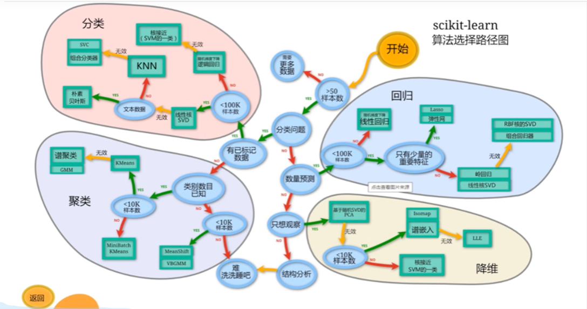

# 机器学习环境搭建

## scikit-learn 机器学习算法选择路线图



## 安装scikit-learn

```bash
pip install scikit-learn
```

## 机器学习生态系统

```bash
NumPy ──────→ 数值计算（数组、矩阵）
    │
Pandas ─────→ 数据处理（表格操作）
    │
Matplotlib ─→ 数据可视化（画图）
    │
Scikit-learn → 机器学习算法
    │
TensorFlow ─→ 深度学习
PyTorch ────→ 深度学习
```

## scikit-learn机器学习库

Scikit-learn 是 Python 最流行的机器学习库，提供了各种机器学习算法的"开箱即用"实现。

```bash
├── 分类
│   ├── KNN
│   ├── 决策树
│   ├── 随机森林
│   ├── SVM
│   └── 逻辑回归
│
├── 回归
│   ├── 线性回归
│   ├── 岭回归
│   └── Lasso回归
│
├── 聚类
│   ├── K-Means
│   └── DBSCAN
│
├── 降维
│   ├── PCA
│   └── LDA
│
├── 模型选择
│   ├── 交叉验证
│   └── 网格搜索
│
└── 预处理
    ├── 标准化
    ├── 归一化
    └── 特征编码

```
