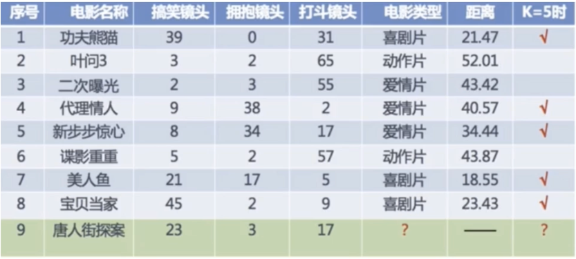
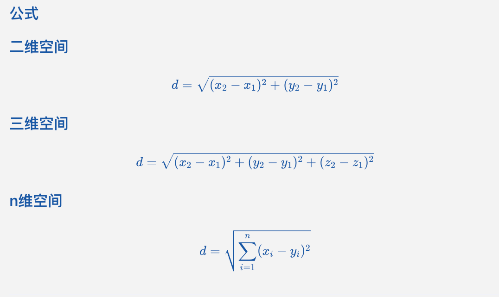
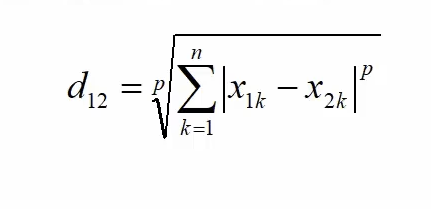
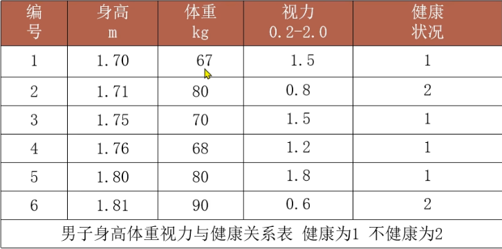
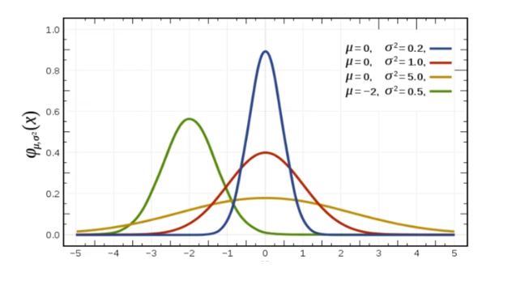

# KNN算法（K-近邻算法，K-Nearest Neighbors Algorithm）

- [X] 了解KNN算法基本思想
- [X] 了解KNN算法的分类问题处理流程
- [X] 了解KNN算法的回归问题处理流程
- [X] 掌握KNN算法API
- [X] 掌握KNN算法的分类实现
- [X] 掌握KNN算法的回归实现
- [X] 了解常用距离计算方法（曼哈顿距离、欧式距离、切比雪夫距离、闵可夫斯基距离）
- [X] 了解特征预处理在KNN算法中的应用（标准化、归一化、特征编码）
- [X] 手写鸢尾花识别案例
- [X] 了解超参数选择方法（交叉验证、网格搜索）
- [ ] 手写数字识别案例

## 常见字母速查

| 大写 | 小写 | 名称   | 常用含义     |
| ---- | ---- | ------ | ------------ |
| Σ   | σ   | 西格玛 | 求和、标准差 |
| Π   | π   | 派     | 圆周率、连乘 |
| α   | α   | 阿尔法 | 学习率、角度 |
| β   | β   | 贝塔   | 参数、角度   |
| θ   | θ   | 西塔   | 参数、角度   |
| λ   | λ   | 兰布达 | 正则化系数   |
| μ   | μ   | 缪     | 均值         |
| ω   | ω   | 欧米伽 | 权重         |

## KNN算法基本思想

KNN算法（K-近邻算法，K-Nearest Neighbors Algorithm）也叫做K近邻算法，是一种基于距离的分类和回归算法。

KNN算法认为：如果在一个样本在特征空间中有K个最相似的样本，并且这K个最相似的样本属于某一个类别，那么这个样本也属于这个类别。
用通俗易懂的话来说就是根据距离你最近的K个邻居来判断你的分类。
记住KNN算法中分类是投票，回归是均值。

## 样本相似性计算

KNN算法中确定样本之间的相似性，通常使用距离计算方法。
样本相似性计算过程中要求样本必须属于相同任务数据集，则距离越近，样本越相似。距离越远，样本越不相似。

默认KNN算法使用欧式距离来计算不同样本之间的相似性。欧式距离其实就是两点之间的直线距离。
**欧式距离 = 样本对应维度差值的平方和，取平方根。**

## K值选择和模型拟合的关系



1. **K值过小导致模型过拟合**

   模型会用较小邻域中的训练数据集来判断样本的分类。此时K值过小会导致：

   - 容易收到异常点影响
     比如当K=1，那么模型便只会对距离最近的那1个样本进行分析并总结规律，如果这个样本某个特征出现脏数据，那么模型就会学习到这个脏数据，并且以错误的分类结果进行预测。
   - K值减少意味模型变得复杂，发生模型的过拟合问题。
2. **K值过大会导致模型欠拟合**

   模型会用较大的邻域中的训练数据集来判断样本的分类。此时K值过大会导致：

   - 样本均衡问题
     比如当K=N的时候，无论最终测试集输入的样本是什么，只会按照训练集中最多的类别进行预测，受到样本均衡的影响。
   - K值增大意味着整体的模型变得简单，发生模型的欠拟合问题。
3. 那么如何选择一个合适的K值呢？

   **K值选择是一个超参数选择问题，通常使用交叉验证或网格搜索来选择。**

## KNN算法问题处理流程

KNN算法可以用来处理分类问题和回归问题。
它们都属于有监督学习的方法，也就是有训练数据和训练标签，给定新的测试数据求其分类或回归结果。

1. 分类问题

   - 计算未知样本到所有训练样本的距离（欧式距离）
   - 将计算结果按照距离大小升序排列
   - 取出距离最近的K个样本
   - 进行多数表决：**统计这K个样本中那个类别的样本个数最多（如何个数相等，按照奥卡德剃刀原则选距离最近的那一组类别）**
   - 取票数最多的类别作为未知样本的分类结果
2. 回归问题

   - 计算未知样本到所有训练样本的距离（欧式距离）
   - 将计算结果按照距离大小升序排列
   - 取出距离最近的K个样本
   - **对这K个样本的标签进行均值计算，作为未知样本的回归结果**

可以看出：
如果标签结果是连续的，那么就是回归问题。本质就是求K个最近邻的标签的均值。
如果标签结果是离散的，那么就是分类问题。本质就是K个最近邻的最相似标签的投票。

## 常见距离度量方法

### 欧式距离（Euclidean Distance）

欧式距离是最常用的距离度量方法，也是默认使用的距离度量方法。
一般计算空间中两点的之间的直线距离都用欧式距离。

因此：**欧式距离 = 样本对应维度差值的平方和，取平方根。**



### 曼哈顿距离（Manhattan Distance）

曼哈顿距离也叫做城市街区距离，曼哈顿城市特点必须横平竖直。
也就是必须是追求两点之间最短路径的过程中走水平和垂直方向，不能走斜线。

计算公式如下：
二维平面空间中曼哈顿距离 = |x₂-x₁| + |y₂-y₁|
三位空间中曼哈顿距离 = |x₂-x₁| + |y₂-y₁| + |z₂-z₁|
N维空间中曼哈顿距离 = Σ|xᵢ - yᵢ|

**曼哈顿距离 = 样本对应维度差值的绝对值的和。**

### 切比雪夫距离（俄国Chebyshev Distance）

切比雪夫距离也叫做最大距离，切比雪夫城市特点可以走水平、垂直和斜线方向都可以。
切比雪夫距离来源于国际象棋中国王的走法，每次走一格，但可以任意方向。
这是因为斜着走可以同时缩小水平和垂直方向的距离，是最优解，因此每一步都可以同时缩小距离。

计算公式如下：
二维平面空间中切比雪夫距离 = max(|x₂-x₁|, |y₂-y₁|)
三位空间中切比雪夫距离 = max(|x₂-x₁|, |y₂-y₁|, |z₂-z₁|)
N维空间中切比雪夫距离 = max(|xᵢ - yᵢ|)

**切比雪夫距离 = 样本对应维度的绝对值的最大值。**

因此：**切比雪夫距离 = 样本对应维度的绝对值的最大值**

### 闵可夫斯基距离（德国 Minkowski Distance 学生爱因斯坦）

闵可夫斯基距离不是一种计算两点之间最短路径的方法，而是对多个距离度量方法的综合。



其中x1-x2是样本a的第1个维度和样本b的第1个维度的差值。
p是闵可夫斯基距离的参数，取值范围是[1, +∞]。

- 当p=1时，闵可夫斯基距离就是曼哈顿距离。
- 当p=2时，闵可夫斯基距离就是欧式距离。
- 当p=∞时，闵可夫斯基距离就是切比雪夫距离。（因为当p无穷大的时候，最大的那个维度的差值会占主导地位，其他维度的差值会被忽略，也就是两个维度差值的绝对值的最大值。）

## 特征预处理

### 为什么需要归一化和标注化

在对原始数据进行预处理的时候，如果某些特征的单位（量纲）相差太大，导致特征列的方差值差距太大，影响模型的训练效果。
因此需要对数据做归一化或者标准化处理。

比如下面这个表：


体重特征的值明显比其他特征大出一个数量级，因此就需要对数据做归一化或者标准化来处理。

### 数据归一化API

特征预处理中的归一化指的是将特征的取值范围映射到[0, 1]之间。

其计算公式如下：

```bash
# 归一化后的值 
x' = (x - min) / (max - min)
```

进一步可以通过公式讲其映射到任意[a,b]范围之间：

```bash
# 进一步映射的值 
x" = x' * (b-a) + a
```

数据归一化的问题在于训练结果容易受到极大值和极小值的影响，导致训练结果不准确。
因此鲁棒性（Robustness）比较差，适合小数据集合训练。

### 数据标准化API

数据标准化就是将特征的值转化为均值为0，标准差为1的标准正态分布的数据。
当数据量达到一定量级可以消除数据中极值的影响，因此适合大数据集训练的场景。

其计算公式如下：

```bash
# 标准化后的值 
# mean是特征的平均值
# σ是特征的标准差
# x是当前样本的特征值
x' = (x - mean) / σ
```

#### 方差和标准差

这里需要解释下方差和标准差的差别：
方差和标准差都可以衡量一组数据的离散程度，方差是标准差的平方。
值越大说明一组数据中各个成员之间离散程度越大。
值越小说明一组数据中各个成员之间离散程度越小。

方差的计算公式为：偏差平方和的平均值

```bash
# xᵢ是样本的第i个特征值
# mean是特征的平均值
# x - mean是样本的第i个特征值与特征值的差值，也叫做偏差
# n是样本的总数
方差 = Σ(xᵢ - mean)² / n
```

已经知道方差的情况下标准差就是方差的开平方根，计算公式如下：

```bash
标准差 = √方差
```

标准差相比于方差由于单位依然是原始数据的单位，因此可以更加直观的表示数据的离散程度。

#### 正态分布

正态分布是一种概率分布，它的形状是一个钟形曲线。大自然很多数据都符合正态分布。
正态分布记作: N( μ, σ)
其中μ是特征的均值，σ是特征的标准差。

μ均值决定了正态分布的中心位置
σ标准差决定了正态分布的宽度

标准差越大，正态分布的宽度越宽，数据的离散程度越大。
标准差越小，正态分布的宽度越窄，数据的离散程度越小。



之所以对特征进行预处理的标准化操作，就是让所有数据都符合正态分布。
并且均值为0，标准差为1。因为此时数据的分布就是标准正态分布，模型的训练效果会更好。

## 超参数选择

### 交叉验证（Cross-Validation）

交叉验证是一种**对数据集的分隔方法**，目的就是为了得到更加精准的模型准确率。

交叉验证和模型的准确率没有直接关系，超参数才会直接和模型准确率有关，交叉验证只是让结果更加准确，减少单词测试的偶然性。

交叉验证的基本思路是：

1. 将数据集随机分成n份，每份数据集的大小相同。假设分为8份，此时就叫做8折交叉验证。
2. 每次将1份数据集作为测试集，剩余的n-1份数据集作为训练集进行训练，得到一个模型评分。
3. 重复以上步骤，最终训练n次，得到n个模型评估得分，取n个模型评估得分的平均值作为最终的模型准确率评分。
4. 找到n次验证中最高模型准确率得分的模型，再次将所有训练集和测试集合并起来，再次输入给模型进行训练，最终再使用测试集对模型进行最后评估。

### 网格搜索（Grid Search）

网格搜索是一种**超参数调优的方法**，目的就是为了找到最佳的超参数组合。

网格搜索的基本思路是：

1. 定义超参数的取值范围，比如K的取值范围是[1, 2，3]。
2. 对每个超参数组合进行交叉验证，得到一个模型评分。假设做5折交叉验证，则总共需要训练3*5=15次训练。
3. 最终选取模型评分最高的超参数组合作为结果。

注意超参数组合取值范围需要开发者手动输入，不同的超惨组合，可能会影响模型的最终测评结果。

### 使用交叉验证和网格搜索进行超参数调优

上述所说的网格验证+交叉验证其实就体现在GridSearchCV这个API的调用上，当然这只是一个超参数调优的解决方案，不一定是最佳的。

我们将如下若干参数传递给网格搜索对象，它会自动进行超参数K的不同组合，并基于不同参数组合的模型训练和模型评估，返回一组最优超参数

## KNN算法实现手写数字识别

从数万张手写数字图片中，训练一个模型，能够准确识别出数字。
