# 线性回归（Linear Regression）

- [X] 了解线性回归定义
- [X] 了解一元线性回归和多元线性回归的区别
- [X] 掌握线性回归的API及模型
- [X] 重点掌握损失函数
- [X] 学会使用导数和矩阵运算
- [X] 重点掌握梯度下降算法
- [X] 掌握正规方程化
- [X] 重点掌握回归模型评估方法（MAE、MSE、RMSE）
- [ ] 实现线性回归房价预测案例
- [ ] 理解线性回归欠拟合和过拟合问题的原因
- [ ] 掌握线性回归正则化方法（L1、L2正则化）

## 机器学习中的数据表述

1. 标量（scalar）
   一个数值，例如10、-3.14等。在代码中体现为一个变量，例如 `a = 10`
2. 向量（vector）
   一列顺序排列的元素，默认为列向量，向量有大小也有方向。在代码中体现为Pandas中的Series对象。
3. 矩阵（matrix）
   一个二维数组，每个元素都是一个数值量。在代码中体现为Pandas中的DataFrame对象。
4. 张量（tensor）
   一个n维数组，每个元素都是一个数值量。在代码中体现为 Numpy 中的 ndarray 对象。
   比如reshape(2,3,4)表示为2个3行4列的矩阵。

## 线性回归简介

1. 定义
   利用回归方程（函数）对一个或者多个自变量（特征值）和因变量（目标值）之间关系进行建模的一种分析方式。
   用数学上的概念来说就是用一条线来拟合特征列和标签列之间的关系，然后再对新的数据进行预测。
   线性回归属于有监督学习算法，需要提供特征数据和标签数据，并且标签目标值是连续型的。
2. 一元线性回归数学方程
   只有一个特征列，也就是只有一个自变量，比如基于体重预测身高。
   数学公式表示为： `y = w * x + b`
   w：统计学叫做回归系数coefficient，简写为 `_coef`;机器学习中叫做权重；数学上叫做斜率
   b：统计学叫做截距 `intercept`；机器学习中叫做偏置项bias
   x：自变量，也就是特征值
   y：因变量，也就是目标值
3. 多元线性回归数学方程
   多个特征列，也就是多个自变量，比如基于年龄、学历、工作年限等预测工资。
   数学公式表示为：`y = w1 * x1 + w2 * x2 + w3 * x3 + b`
   w1、w2、w3：权重系数weight（数学叫斜率）
   b：偏置项bias（数学叫截距项）
   x1、x2、x3：自变量，也就是特征值
   y：因变量，也就是目标值

   进一步可以表示为：`y = w^T * x + b`也就是w的转置矩阵乘以x矩阵，再加偏置项b
   推导过程如下：

   1. 首先得到一个1行n列的矩阵A：`w = [b, w1, w2, w3]`
   2. 将其进行转置，得到一个n行1列的矩阵A的转置：`w^T = [b, w1, w2, w3]`
   3. 与1行n列的矩阵B：`x = [1, x1, x2, x3]`进行矩阵乘法运算
   4. 矩阵的乘法结果就表示为：`y = b*1 + w1 * x1 + w2 * x2 + w3 * x3`
   5. 最终的公式为：`y = w^T * x + b`

## 线性回归中的损失函数

### 损失函数（Loss Function）

   首先我们需要了解误差（Error）的概念，一般我们将样本数据的预测值和真实值的差异叫做误差
   `误差 = 预测值 - 真实值`

   因此我们把用来衡量**每个样本真实值和其预测值之间关系的函数（Loss Function）**叫做损失函数。
   损失函数也叫做成本函数（Cost Function）、代价函数（Cost Function）、目标函数等。

   因此让损失函数越小就是让误差和越小，线性回归模型的预测能力就越强。

   但是问题是怎么找到让损失函数最小的w和b值。

### 数学公式推导求损失函数最小值

首先我们假设现在有如下的一个特征为身高，标签为体重的数据集：

| 编号 | 身高 | 体重 |
| ---- | ---- | ---- |
| 1    | 160  | 56.3 |
| 2    | 165  | 60.6 |
| 3    | 172  | 65.1 |
| 4    | 174  | 68.5 |
| 5    | 180  | 75   |
| 6    | 176  | ？   |

损失函数就可以表达为每一个样本数据的真实值和预测值的平方差和：
`Loss(k,b) = (160k+b-56.3)^2 + (165k+b-60.6)^2 + (172k+b-65.1)^2 + (174k+b-68.5)^2 + (180k+b-75)^2 + (176k+b-28.6)^2`

假设我们给定截距b的值为-100，那么损失函数为：
`Loss(k,-100) = (160k-100-56.3)^2 + (165k-100-60.6)^2 + (172k-100-65.1)^2 + (174k-100-68.5)^2 + (180k-100-75)^2 + (176k-100-28.6)^2`

简化括号内的表达式后变为：

`Loss(k,-100) = (160k-156.3)^2 + (165k-160.6)^2 + (172k-165.1)^2 + (174k-168.5)^2 + (180k-175)^2 + (176k-128.6)^2`

展开每一项平方 (a-b)² = a² - 2ab + b²合并同类项后变为：
`Loss(k,-100) = 176061k² - 326713.6k + 153031.27`

这是一个关于 k 的一元二次函数，开口向上（a = 176061 > 0），存在最小值。
因此我们可以使用求导的方法来找到一个函数的最小值，也就是先对原函数求导，然后令导数等于0，解出k的值。
对损失函数求导可得：
`Loss(k,-100)' = 2 * 176061k - 326713.6 + 0`

令导数等于0，解出k的值为：
`k = 0.9278420547423903`

因此可以得出结论：当k为0.923 b为-100时，损失函数值最小，模型的误差越小，预测能力越强。
最后将测试集中的身高x = 176代入模型中，得到预测体重y = 0.93x - b = 0.93 * 176 - 100 = 63.68

基于上面这种思路求解的损失函数，我们是运用了最小二乘法的思想。
因为最小二乘法就是一种数学上的优化技术，它就是用来找到一条曲线/直线，使每一个样本数据点到该曲线的垂直距离的平方和最小。
在这里每一个样本数据点到该曲线的垂直距离的平方和，其实就指的损失函数。

`Loss(k,b) = (160k+b-56.3)^2 + (165k+b-60.6)^2 + (172k+b-65.1)^2 + (174k+b-68.5)^2 + (180k+b-75)^2 + (176k+b-28.6)^2`

### 线性回归损失函数种类

一般来说，线性回归模型的损失函数有四种：

1. 最小二乘
   表达每个样本点的预测值和真实值误差的平方和
2. MSE（Mean Squared Error）均方误差损失函数
   用于表达每个样本点的预测值和真实值误差的平方和的均值
3. MAE（Mean Absolute Error）平均绝对误差损失函数
   用于表达每个样本点的预测值和真实值误差的绝对值之和的均值
4. RMSE（Root Mean Squared Error）均方根误差损失函数
   用于表达每个样本点的预测值和真实值误差的平方根。
   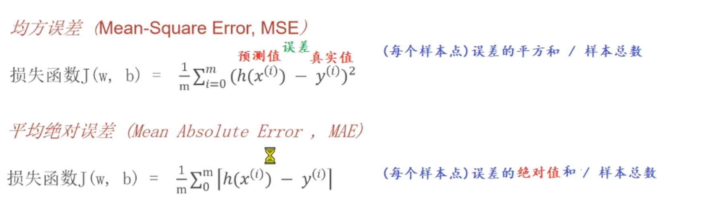

## 一元线性回归的损失函数最小化

假设有如下数据：

| 编号 | 身高 | 体重 |
| ---- | ---- | ---- |
| 1    | 160  | 56.3 |
| 2    | 165  | 60.6 |
| 3    | 172  | 65.1 |
| 4    | 174  | 68.5 |
| 5    | 180  | 75   |
| 6    | 176  | ？   |

在已知一元线性回归方程的前提下我们可以轻易的得出一个样本的数据如下：

- 样本真实值：y 每一个样本数据的真实值，y是目标值体重
- 样本预测值：kx+b 每一个样本数据的预测值，x是特征值身高

基于误差等于预测值-真实值的公式，我们可以得到第一个样本的误差为：`误差 = (y1-kx1+b)^2`

如果我们将每一个样本的误差累加，也就是对所有预测值减去真实值得到误差的平方和，最终得到的数学表达式就是损失函数：
`Loss(k,b) = (160k+b-56.3)^2 + (165k+b-60.6)^2 + (172k+b-65.1)^2 + (174k+b-68.5)^2 + (180k+b-75)^2 + (176k+b-28.6)^2`

得到损失函数之后接下来就是如何求极小值的问题。

### 1. 正规方程法

正规方程法是一种通过求解线性方程组来找到最优参数的方法。
对于上述我们得到的损失函数，我们的对其进行求导然后找到导函数为0的点就可以找到极小值，步骤如下：

1. 首先求该损失函数对k分量的偏导，得到一个kx+b-c = 0的表达式1
2. 然后求该损失函数对b分量的偏导，得到一个kx+b-c = 0的表达式2
3. 基于二元一次方程，求解得到权重k和截距b的值
4. 将测试集中的特征值带入到模型中，得到预测值

## 多元线性回归求损失函数最小值

假设有如下数据：
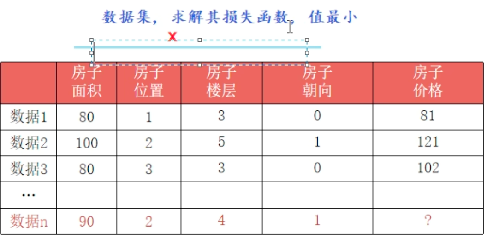

根据之前的数学公式推导我们可以得到如下信息：

- 数据集总共有d个特征列，数据集总共有n行样本数据
- 每一个特征列都有一个对应的系数w[i] - w[d]，用列向量表示为w
- 每一行表示一个样本数据，分别用 `x[i][j]`表示第i个样本数据的第j个特征值
- 每一个样本数据都有一个对应的标签值y[i]，用列向量表示为y

### 正规方程法

求解多元线性回归的损失函数的思路和一元线性回归的思路是一致的。

- 已经知道多元线性回归的方程表示为：`y = w^T * x + b`
- 第一个样本的真实值就是y1
- 第一个样本的预测值就是w1x1+w2x2+w3x3+w4x4+w5x5+w6x6+b
- 因此求出第一个样本的误差为：`误差 = (w1x1+w2x2+w3x3+w4x4+w5x5+w6x6+b - y1)^2`

将每一组样本的误差的平方和累加起来，就可以得出多元线性回归方程的损失函数为：

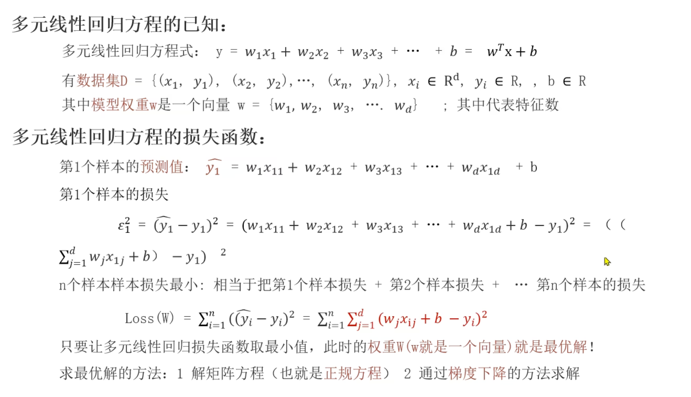

得到损失函数之后无法直接求导，我们先转化为矩阵的方式之后再求导。

基于向量二范数平方的定义可知，一个向量二范数的平方就等于其各个向量逐项求和的平方，因此可以得出如下结论：

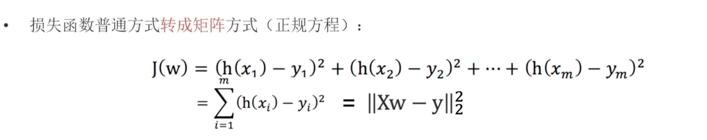

## 为什么 **Xw**−**y** **可以转化为二范数的平方？**

你的困惑点非常关键，这正是从“代数运算”过渡到“矩阵运算”时最容易卡壳的地方。

你担心的是**“矩阵”**，但实际上，**最后一步的 $ \mathbf{Xw} - \mathbf{y} $ 结果并不是矩阵，而是一个向量**。向量中的第一行的值就是截距b，后面的就是权重向量w的列向量。

我们一步步拆解，用你假设的“5行3列”这个具体例子来演示：

---

### 1. 定义维度（根据你的假设）

假设我们有 **5 个样本**，每个样本有 **3 个特征**：

- **特征矩阵 $ \mathbf{X} $**：维度是 $ 5 \times 3 $

  - 5 行：代表 5 个不同的房子（或病人、商品等）。
  - 3 列：代表每个房子的 3 个特征（比如面积、房龄、楼层）。
  - $$
    \mathbf{X} = \begin{bmatrix} x_{11} & x_{12} & x_{13} \\ x_{21} & x_{22} & x_{23} \\ \vdots & \vdots & \vdots \\ x_{51} & x_{52} & x_{53} \end{bmatrix}
    $$
- **权重向量 $ \mathbf{w} $**：维度是 $ 3 \times 1 $

  - $$
    \mathbf{w} = \begin{bmatrix} w_1 \\ w_2 \\ w_3 \end{bmatrix}
    $$
- **真实值向量 $ \mathbf{y} $**：维度是 $ 5 \times 1 $

  - 这是 5 个样本对应的真实房价（或真实值）。
  - $$
    \mathbf{y} = \begin{bmatrix} y_1 \\ y_2 \\ y_3 \\ y_4 \\ y_5 \end{bmatrix}
    $$

---

### 2. 第一步：计算 $ \mathbf{Xw} $

根据矩阵乘法的规则：$ (5 \times 3) \times (3 \times 1) = (5 \times 1) $

**结果是什么？**
结果是一个 **5行1列的列向量**。
这个向量里的每一个元素，就是模型对那 5 个样本分别的**预测值**。

$$
\mathbf{Xw} = \begin{bmatrix} \text{预测值}_1 \\ \text{预测值}_2 \\ \text{预测值}_3 \\ \text{预测值}_4 \\ \text{预测值}_5 \end{bmatrix} = \begin{bmatrix} h(x_1) \\ h(x_2) \\ h(x_3) \\ h(x_4) \\ h(x_5) \end{bmatrix}
$$

---

### 3. 第二步：计算 $ \mathbf{Xw} - \mathbf{y} $

根据矩阵减法的规则：$ (5 \times 1) - (5 \times 1) = (5 \times 1) $

**结果是什么？**
结果依然是一个 **5行1列的列向量**。
这个向量里的每一个元素，是**预测值减去真实值**的**误差**。

$$
\mathbf{Xw} - \mathbf{y} = \begin{bmatrix} h(x_1) - y_1 \\ h(x_2) - y_2 \\ h(x_3) - y_3 \\ h(x_4) - y_4 \\ h(x_5) - y_5 \end{bmatrix}
$$

---

### 4. 第三步：为什么等于二范数的平方 $ \|\dots\|_2^2 $

这里就是你最疑惑的地方。

#### 二范数的定义

对于任意一个向量 $ \mathbf{v} = \begin{bmatrix} v_1 \\ v_2 \\ \dots \\ v_m \end{bmatrix} $，它的二范数平方定义为：

$$
\|\mathbf{v}\|_2^2 = v_1^2 + v_2^2 + \dots + v_m^2 = \sum_{i=1}^{m} v_i^2
$$

#### 套用到我们的误差向量

我们现在把上面的误差向量代入二范数的定义中：

令 $ \mathbf{v} = \mathbf{Xw} - \mathbf{y} $，那么 $ \mathbf{v} $ 的第 $ i $ 个分量就是 $ v_i = h(x_i) - y_i $。

所以：

$$
\|\mathbf{Xw} - \mathbf{y}\|_2^2 = (h(x_1) - y_1)^2 + (h(x_2) - y_2)^2 + \dots + (h(x_5) - y_5)^2
$$

这正好等于最上面的求和公式。

---

### 总结

你之所以觉得困惑，是因为你把 $ \mathbf{X} $ 看作矩阵，觉得运算结果还是矩阵。

**关键点在于：**
虽然 $ \mathbf{X} $ 是矩阵，但经过 $ \mathbf{Xw} $ 运算后，它“压缩”成了一个**列向量**（预测值向量）。再减去 $ \mathbf{y} $（真实值向量），结果依然是**一个误差向量**。

**二范数**就是用来计算**向量**长度的工具。在这里，我们只是用二范数这个简洁的符号，把“误差向量中所有元素的平方和”写了出来。

**简单来说：**

1. **$ \mathbf{Xw} $** 是一个向量（预测值）。
2. **$ \mathbf{y} $** 是一个向量（真实值）。
3. **$ \mathbf{Xw} - \mathbf{y} $** 是一个向量（误差）。
4. **$ \|\mathbf{Xw} - \mathbf{y}\|_2^2 $** 就是这个误差向量的模长平方，也就是误差的平方和。

注意在Pandas里面没有行的概念，**一行数据都是通过列向量的形式来展示的，多行数据才是通过矩阵来存储的**。比如X特征列的数据如下所示：

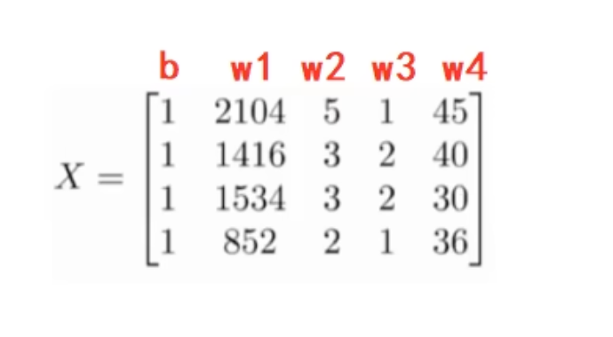

这个时候X矩阵和W向量相乘，刚好得到的就是每一个样本的真实值。

然后下面是对矩阵方程求导得到原函数损失函数最小值的过程：

- 0乘以任何数等于0
- 任何矩阵乘以自己的转置矩阵得到一个方阵
- 如果一个方阵可逆，该方阵乘以自己的逆矩阵等于单位矩阵
- 单位矩阵可以看作矩阵运算中的1，它乘以任何矩阵X都等于矩阵X自身

最后我们就求得可以让多元线性回归的损失函数最小值的w列向量的值如下：
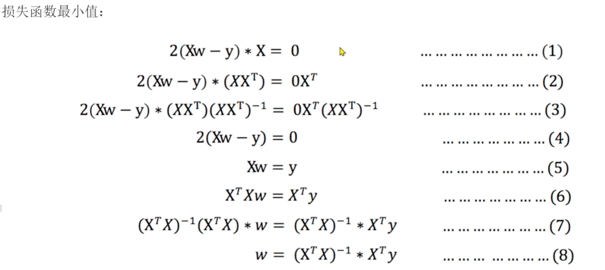

此时我们带入数据集中的特征值就可以求解出W的值如下：

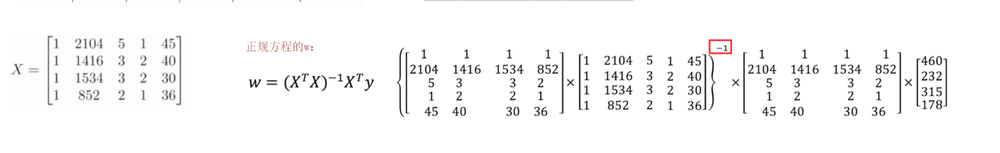

## 正规方程求解多元线性回归问题

1. 如果特征列矩阵X不可逆，那么正规方程法就不能求解。
2. 如果特征列矩阵X的值很大，那么会导致计算量过大，可能会导致内存溢出。

## 梯度下降法

### 什么是梯度下降法？

梯度下降法顾名思义就是沿着梯度下降的方向来不断求解最小值。
我们可以通过寻找坡度最陡的方向来下山的方法来理解
比如我们现在要从山上任意一点下降到山底，该怎么做呢？

1. 当前位置S处环顾四周，如果当前位置比其他位置都低，那么返回S
2. 如果当前位置比其他位置高，那么就寻找当前位置的坡度最陡的方向，沿着这个方向走一步到达新的位置S‘
3. 重复以上2步，直到到达山底

因此梯度下降和从山顶下山的思想是一致的：

1. 山 = 可微分的损失函数
2. 山底 = 损失函数的极小点

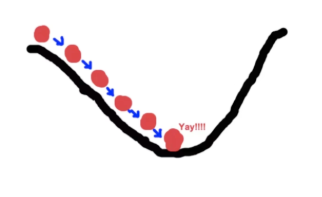

并且通过和前面的正规方程法对比我们发现：

1. 正规方程法是一次性直接找到从山顶到达山底的点，一步直接到达
2. 梯度下降法是通过微分的方法逐步到达山底的，需要重复多次。

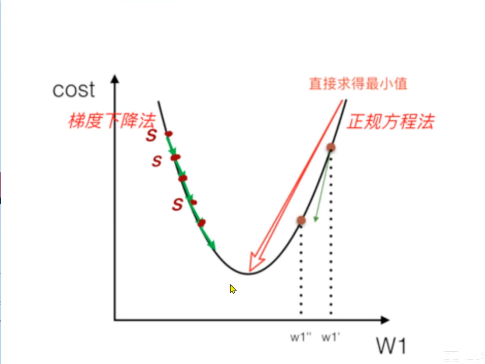

### 梯度下降法公式

1. 梯度（Gradient）
   在单变量的函数中，梯度就是某一个切线的斜率，也就是函数在该点的导数，代表函数增长最快的方向
   在多变量的函数中，梯度就是某一个点的偏导数向量，代表函数在该点的梯度方向。
2. 梯度下降公式
   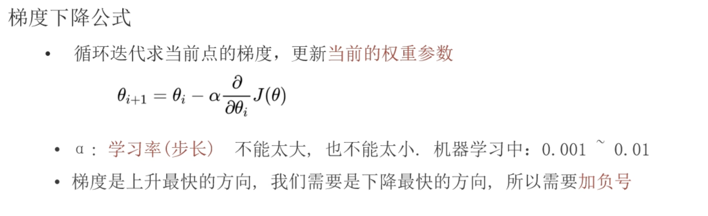

   - θi 表示第i个参数的值
   - θi+1 表示下一个参数的值
   - $\frac{\partial J(θ)}{\partial θi}$ 表示损失函数在点θi的偏导数（只对θ求导 忽略其他自变量）
3. 梯度下降法的两种思路

   - 确定固定的下降次数，当下次次数到达固定值时，停止下降
   - 设置最终的阈值，当下次下降的步长小于阈值时，停止下降
4. 学习率的选择
   学习率 \( \alpha \) 的选择很重要：

   - 学习率过大：可能导致错过最低点、产生下降过程中的震荡
   - 学习率过小：收敛速度太慢
   - 通常需要通过实验来选择合适的学习率
5. 数学原理

梯度下降法的核心思想是：

1. 计算损失函数在当前参数处的梯度（导数）其实就是损失函数对当前参数变量的偏导数（只对当前参数求导 忽略其他自变量）
2. 沿梯度的负方向更新参数，步长为学习率乘以梯度
3. 重复上述过程，直到达到最小值点

这种方法利用了函数的导数信息，能够有效地找到函数的局部最小值。对于线性回归问题，由于损失函数是凸函数，因此梯度下降法可以找到全局最小值。

## 一元线性回归通过梯度下降法求损失函数最小值

下面是一个完整的通过梯度下降法对一元损失函数求极小值的求解过程：

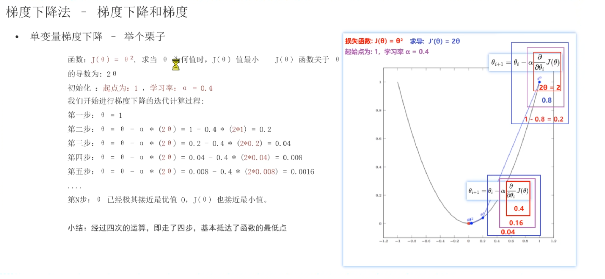

### 1. 模型定义

一元线性回归模型可以表示为：
\[ y = wx + b \]
其中：

- \( w \) 是权重参数
- \( b \) 是偏置参数
- \( x \) 是输入特征
- \( y \) 是预测值

### 2. 损失函数

我们使用均方误差（MSE）作为损失函数：
\[ J(w, b) = \frac{1}{2m} \sum_{i=1}^{m} (y_i - \hat{y}_i)^2 \]
其中：

- \( m \) 是样本数量
- \( y_i \) 是实际值
- \( \hat{y}_i = wx_i + b \) 是预测值
- 系数 \( \frac{1}{2} \) 是为了方便求导

### 3. 梯度计算

对损失函数关于 \( w \) 和 \( b \) 求偏导数：

#### 对 \( w \) 的偏导数

\[ \frac{\partial J(w, b)}{\partial w} = \frac{1}{m} \sum_{i=1}^{m} (wx_i + b - y_i) \cdot x_i \]

#### 对 \( b \) 的偏导数

\[ \frac{\partial J(w, b)}{\partial b} = \frac{1}{m} \sum_{i=1}^{m} (wx_i + b - y_i) \]

### 4. 梯度下降更新规则

使用学习率 \( \alpha \) 来控制更新步长：
\[ w = w - \alpha \cdot \frac{\partial J(w, b)}{\partial w} \]
\[ b = b - \alpha \cdot \frac{\partial J(w, b)}{\partial b} \]

### 5. 详细计算步骤

假设我们有以下数据集：

| x | y |
| - | - |
| 1 | 2 |
| 2 | 4 |
| 3 | 6 |

#### 步骤1：初始化参数

假设初始值：\( w = 0 \)，\( b = 0 \)，学习率 \( \alpha = 0.01 \)

#### 步骤2：计算预测值

对于每个样本：

- 样本1: \( \hat{y}_1 = 0 \times 1 + 0 = 0 \)
- 样本2: \( \hat{y}_2 = 0 \times 2 + 0 = 0 \)
- 样本3: \( \hat{y}_3 = 0 \times 3 + 0 = 0 \)

#### 步骤3：计算损失函数

\[ J(w, b) = \frac{1}{2 \times 3} [(0-2)^2 + (0-4)^2 + (0-6)^2] = \frac{1}{6} [4 + 16 + 36] = \frac{56}{6} \approx 9.333 \]

#### 步骤4：计算梯度

对 \( w \) 的梯度：
\[ \frac{\partial J}{\partial w} = \frac{1}{3} [(0-2) \times 1 + (0-4) \times 2 + (0-6) \times 3] = \frac{1}{3} [-2 - 8 - 18] = \frac{-28}{3} \approx -9.333 \]

对 \( b \) 的梯度：
\[ \frac{\partial J}{\partial b} = \frac{1}{3} [(0-2) + (0-4) + (0-6)] = \frac{1}{3} [-12] = -4 \]

#### 步骤5：更新参数

\[ w = 0 - 0.01 \times (-9.333) = 0.09333 \]
\[ b = 0 - 0.01 \times (-4) = 0.04 \]

#### 步骤6：迭代过程

重复步骤2-5，直到损失函数收敛（变化小于某个阈值）或达到最大迭代次数。

### 6. 收敛分析

随着迭代次数的增加：

- 损失函数值会逐渐减小
- 模型参数 \( w \) 和 \( b \) 会逐渐接近最优值
- 对于我们的示例，最终 \( w \) 会接近 2，\( b \) 会接近 0

通过以上步骤，一元线性回归模型可以使用梯度下降法找到最优的参数值，从而最小化预测误差。

## 多元线性回归通过梯度下降法求损失函数最小值

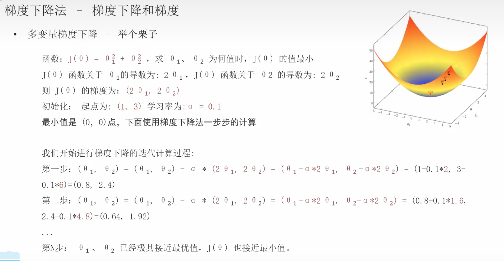

主要步骤如下：

1. 基于多元线性回归方程计算损失函数
2. 选择一种损失函数计算方法比如MSE或者最小二乘来得出损失函数
3. 将损失函数转化为XW-y的二范数的平方这种矩阵方程方便后续求导
4. 对损失函数关于W求偏导数，得到W的梯度
5. 沿梯度的负方向更新参数，步长为学习率乘以梯度
6. 重复上述过程，直到达到最小值点

通过以上详细步骤，多元线性回归模型可以使用梯度下降法找到最优的参数值，从而最小化预测误差。

## 梯度下降法与正规方程法的对比

| 特性         | 梯度下降法                         | 正规方程法                                          |
| ------------ | ---------------------------------- | --------------------------------------------------- |
| 计算复杂度   | O(kn²)                            | O(n³)                                              |
| 适用数据规模 | 大规模数据                         | 小规模数据                                          |
| 需要调参     | 需要选择学习率                     | 不需要                                              |
| 特征数量     | 适用于特征很多的情况               | 当特征数 > 10000 时计算困难                         |
| 迭代次数     | 需要多次迭代                       | 一次计算得到解                                      |
| 注意事项     | 梯度下降法在各种损失函数中大量使用 | X的转置矩阵的逆矩阵可能不存在，并且矩阵计算非常耗时 |

## 梯度下降算法分类

1. 全梯度下降算法FGD（Full Gradient Descent）
   每次迭代时，使用所有样本的梯度来计算参数更新。计算效率低。
2. 随机梯度下降算法SGD（Stochastic Gradient Descent）
   每次迭代时，随机使用一个随机样本的梯度来计算参数更新。计算效率高，但是受到异常值的影响大。
3. 小批量梯度下降算法MBD（Min-batch Gradient Descent）
   每次迭代时，随机选择使用小批量样本的梯度来计算参数更新。（样本个数介于1-m之间）
   综合了FGD和MBD的优点，运算成本低并且受到 异常值的影响小。
4. 随机平均梯度下降算法SAG（Stochastic Average Gradient Descent）
   每次迭代时，随机选择一个样本的梯度值和以往样本的梯度值的平均值来计算参数更新。
   具体步骤如下：

   - 先随机选择一个样本A，计算其梯度值并存储到列表[A],然后使用列表中的梯度均值来更新模型参数。
   - 然后随机再选择一个样本B，计算其梯度值并存储到列表[A,B],然后使用列表中的梯度均值来更新模型参数。
   - 如果随机到之前重复的样本A，则重新计算该样本梯度值并更新列表[A‘,B]。
   - 重复以上过程，直到损失函数收敛（变化小于某个阈值）或达到最大迭代次数。

## 线性回归模型评估方案

我们在训练线性回归模型之后，如果评估它的实际表现呢？
其实就是衡量预测值和真实值之间的误差到底有多大。
经常使用以下三种评估指标：

1. MAE（Mean Absolute Error）
   平均绝对误差，用于评估模型预测值与真实值之间的绝对误差的平均值。
   因为求解的是均值，所以对于异常值不敏感。

2. MSE（Mean Squared Error）
   均方误差，用于评估模型预测值与真实值之间的平方误差的平均值。
   因为对误差的平方求均值，所以对于异常值敏感，会放大异常值的影响。

3. RMSE（Root Mean Squared Error）
   均方根误差，用于评估模型预测值与真实值之间的平方误差的平均值的平方根。
   因为对误差的平方先求均值然后开平方根，所以不会放大异常值的影响。

一般情况下都是模型预测误差越小越准确，并且使用最多的是MAE和RMSE（Root Mean Squared Error）评估模型。
为什么呢？

- 首先MSE会比较大的放大异常值的影响，排除
- MAE模型反应的是真实的平均误差，反映整体情况，不关注个别异常值的影响
- RMSE相比较MAE更关注异常值的影响，但是相比于MSE又没有过大的放大对异常值的影响。

因此实际开发中会结合RMSE和MAE来综合评估模型的性能。

## 线性回归API

在sklearn中，线性回归模型提供了两个模型：

1. LinearRegression
   - 默认通过正规方程法求解参数
   - 可以通过设置fit_intercept=False来禁用截距项
   - 可以通过设置normalize=True来对特征进行归一化处理
   - 支持批量预测
2. SGDRegressor
   - 默认通过随机梯度下降法（SGD Gradient Descent）求解参数
   - 可以通过设置loss='squared_error'｜'absolute_error' 来使用MSE、MAE损失函数
   - 可以通过设置penalty='l2'｜'l1' 来使用L2正则化、L1正则化
   - 可以通过设置max_iter=1000 来设置最大迭代次数
   - 可以通过设置eta0=0.001 来设置学习率
   - 可以通过设置learning_rate='constant'｜'invscaling' 来设置学习率模式恒定或衰减
   - 可以通过设置fit_intercept=False来禁用截距项
   - 支持批量预测

上面两种模型都可以通过模型的两个参数来获取模型的系数和截距项。

- coef_：模型的系数向量
- intercept_：模型的截距项

## 线性回归模型中的欠拟合和过拟合

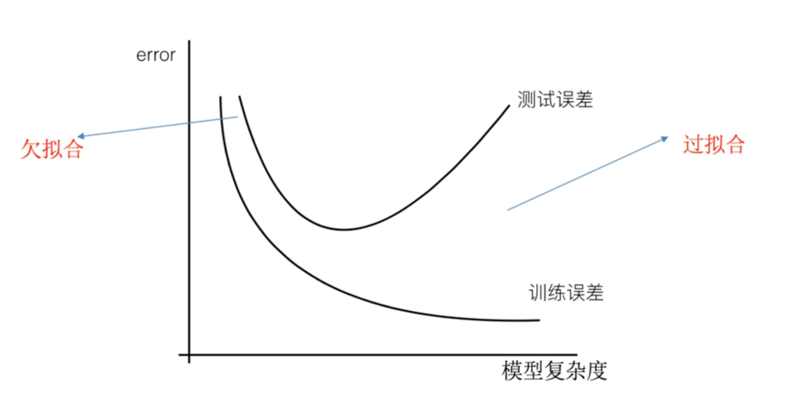

1. 欠拟合

   所谓欠拟合，就是指的模型在训练集和测试集上的误差都比较差。
   主要是由于模型过于简单，导致学习到的数据特征太少。

   解决的方法：

   添加其他特征列
   增加模型复杂度 比如将线性模型通过增加二次项或三次项来增加模型复杂度

2. 过拟合

   所谓过拟合，就是指的模型在训练集上的误差比较小，但是在测试集上的误差比较大。
   这是由于模型过于复杂，原始特征过多，存在一些嘈杂特征。导致学习到的数据特征过多。

   解决的方法：
   - 正则化：机器学习和深度学习中大量使用来解决过拟合问题
   - 特征降维：减少原始特征的数量。
   - 增加数据量：原来对数据的训练太过了，增加数据量可以减少过拟合的风险
   - 重新清洗数据：移除过多的异常值，或者对数据进行归一化处理。

## L1正则化和L2正则化

由于在模型训练的过程中，数据中有些特征列影响模型复杂度、或者某个特征的异常值过多，导致模型预测结果过拟合。
因此解决过拟合的一个手段就是正则化，也就是尽可能的降低这个异常/复杂特征列的影响，这就是正则化。

我们可以通过在损失函数中添加正则化项来降低特征列权重的影响。

1. L1正则化（Lasso模型-对某些权重进行选择，让权重稀疏化）
   L1 正则化会自动将不重要特征的权重压缩到精确的 0，相当于直接剔除了该特征！
   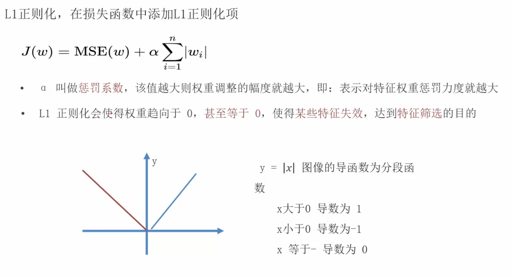
   - 惩罚系数代表对权重的惩罚力度，该值越大，代表权重的值越小，甚至权重的影响变为0
   - 对特征列的权重w进行绝对值求和
   - 会导致特征列的权重为0，从而减少模型的复杂度（也就是直接进行特性选择）
  
2. L2正则化（岭回归模型-让所有权重都缩小但不等于0）
   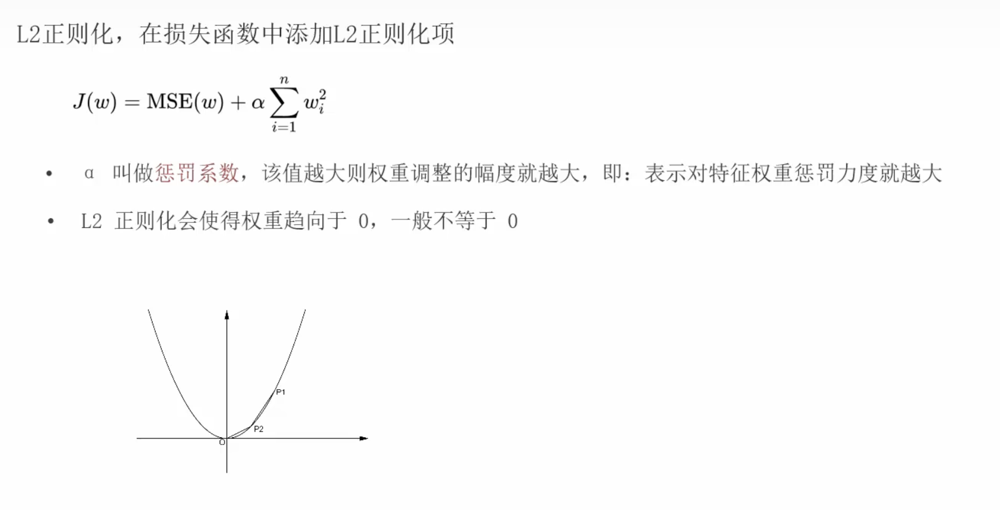
   - 实现方案是在损失函数的基础上添加一项惩罚项，对特征列的权重w进行平方求和

   L2 惩罚的是权重的平方和。优化时，为了最小化总损失，模型会倾向于让所有 |w_i| 都变小。
   但它不会让权重精确为 0，只会“收缩”（shrinkage）到接近 0 的值。
   结果：所有特征的影响都被均匀地削弱，但没有特征被完全剔除。

3. 如何选择
如果你想做特征选择（比如特征很多，怀疑很多是噪声）→ 用 L1 (Lasso)。
如果你只是想防止过拟合，且所有特征都可能有用 → 用 L2 (Ridge)。
