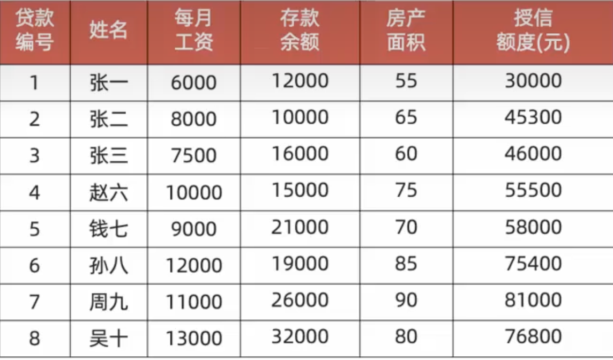
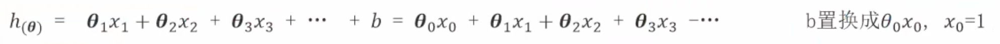
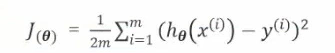

# 梯度下降法案例-银行信贷

## 1. 项目背景

已知银行信贷数据集，其中银行对客户的信贷授权额度只和三个特征相关：

1. 客户的每月收入
2. 客户的存款余额
3. 客户的房产面积

需要使用梯度下降法来求解多元线性回归模型的参数，以预测客户的信贷授权额度。
我们的目标是找到最佳的模型参数w向量的值，也就是找到损失函数的最小值。

## 2. 选择损失函数计算方式

为了求解多元线性回归模型的参数，需要选择一个损失函数。

这里选择有：

1. 均方误差（Mean Squared Error，MSE）
2. 绝对值误差（Mean Absolute Error，MAE）
3. 均方根误差（Root Mean Squared Error，RMSE）

最终我们选择使用均方误差（MSE）作为损失函数的计算方式。

## 3. 求解损失函数

根据前面所学我们知道这问题属于多元线性回归模型，因此每一个样本的预测值可以表示为：

- 注意这里将b置换为w0x0，x0在特征列中恒为1
- 这样做的目的是方便后续计算

然后我们就可以基于预测值-真实值的平方求均值，也就是MSE方法来得到损失函数为：  

- m 是样本数量
- y_i 是第 i 个样本的信贷授权额度
- h(x_i) 是第 i 个样本的预测信贷授权额度
- w 是模型参数向量
- 这里将b置换为w0x0，x0列值都为1
- 1/2为系数 为了方便求导后简化计算公式

## 4. 求损失函数在每一个权重分量上的梯度下降公式

当前的模型参数w向量中有4个分量：

- w0 表示截距
- w1 表示客户收入的系数
- w2 表示客户存款余额的系数
- w3 表示客户房产面积的系数

因此我们需要：

1. 对上一步的损失函数进行偏导数计算
2. 分别对w0、w1、w2、w3求偏导数，得到每一个分量的梯度计算公式。（对那个分量求偏导，就对其他分量都视为常数）
3. 然后将已知的样本数据和模型参数w初始向量（w0=0, w1=0, w2=0, w3=0）代入梯度计算公式
4. 得到每一个分量的梯度值

### 第一步：建立数学模型

假设我们的线性回归模型为：
$$h_\theta(x) = \theta_0 + \theta_1 x_1 + \theta_2 x_2 + \theta_3 x_3$$

其中：

- $x_1$：每月工资
- $x_2$：存款余额
- $x_3$：房产面积
- $\theta_0$：截距
- $\theta_1, \theta_2, \theta_3$：权重（即你提到的 $w$）

---

### 第二步：定义损失函数（均方误差）

对于 $m=8$ 个样本，均方误差 $J(\theta)$ 的定义为：
$$J(\theta_0, \theta_1, \theta_2, \theta_3) = \frac{1}{2m} \sum_{i=1}^{m} (h_\theta(x^{(i)}) - y^{(i)})^2$$

我们将预测值 $h_\theta(x^{(i)})$ 展开代入：
$$J = \frac{1}{2 \times 8} \sum_{i=1}^{8} (\theta_0 + \theta_1 x_1^{(i)} + \theta_2 x_2^{(i)} + \theta_3 x_3^{(i)} - y^{(i)})^2$$

---

### 第三步：求梯度（偏导数）

梯度是一个向量，包含损失函数对 $\theta_0, \theta_1, \theta_2, \theta_3$ 的偏导数。我们需要分别计算这 4 个偏导数。

**通用链式法则推导：**
令 $err^{(i)} = h_\theta(x^{(i)}) - y^{(i)}$，则 $\frac{\partial J}{\partial \theta_j} = \frac{1}{m} \sum_{i=1}^{m} err^{(i)} \cdot \frac{\partial}{\partial \theta_j} (h_\theta(x^{(i)}))$

#### 1. 对截距 $\theta_0$ 的偏导数

因为 $\frac{\partial}{\partial \theta_0} h_\theta = 1$：
$$\frac{\partial J}{\partial \theta_0} = \frac{1}{8} \sum_{i=1}^{8} (\theta_0 + \theta_1 x_1^{(i)} + \theta_2 x_2^{(i)} + \theta_3 x_3^{(i)} - y^{(i)}) \cdot 1$$

**展开求和式（代入表格数据）：**
$$\frac{\partial J}{\partial \theta_0} = \frac{1}{8} [ (\theta_0 + 6000\theta_1 + 12000\theta_2 + 55\theta_3 - 30000) +$$
$$(\theta_0 + 8000\theta_1 + 10000\theta_2 + 65\theta_3 - 45300) +$$
$$(\theta_0 + 7500\theta_1 + 16000\theta_2 + 60\theta_3 - 46000) +$$
$$(\theta_0 + 10000\theta_1 + 15000\theta_2 + 75\theta_3 - 55500) +$$
$$(\theta_0 + 9000\theta_1 + 21000\theta_2 + 70\theta_3 - 58000) +$$
$$(\theta_0 + 12000\theta_1 + 19000\theta_2 + 85\theta_3 - 75400) +$$
$$(\theta_0 + 11000\theta_1 + 26000\theta_2 + 90\theta_3 - 81000) +$$
$$(\theta_0 + 13000\theta_1 + 32000\theta_2 + 80\theta_3 - 76800) ]$$

**合并同类项：**
$$\frac{\partial J}{\partial \theta_0} = \frac{1}{8} [ 8\theta_0 + 76500\theta_1 + 151000\theta_2 + 580\theta_3 - 468000 ]$$
$$\frac{\partial J}{\partial \theta_0} = \theta_0 + 9562.5\theta_1 + 18875\theta_2 + 72.5\theta_3 - 58500$$

#### 2. 对工资权重 $\theta_1$ 的偏导数

因为 $\frac{\partial}{\partial \theta_1} h_\theta = x_1^{(i)}$：
$$\frac{\partial J}{\partial \theta_1} = \frac{1}{8} \sum_{i=1}^{8} (\dots - y^{(i)}) \cdot x_1^{(i)}$$

**展开求和式：**
$$\frac{\partial J}{\partial \theta_1} = \frac{1}{8} [ ( \dots - 30000) \cdot 6000 + (\dots - 45300) \cdot 8000 + \dots + (\dots - 76800) \cdot 13000 ]$$

代入具体的 $x_1$ 值：
$$\frac{\partial J}{\partial \theta_1} = \frac{1}{8} [ 6000(\theta_0 + 6000\theta_1 + 12000\theta_2 + 55\theta_3 - 30000) +$$
$$8000(\theta_0 + 8000\theta_1 + 10000\theta_2 + 65\theta_3 - 45300) +$$
$$7500(\theta_0 + 7500\theta_1 + 16000\theta_2 + 60\theta_3 - 46000) +$$
$$10000(\theta_0 + 10000\theta_1 + 15000\theta_2 + 75\theta_3 - 55500) +$$
$$9000(\theta_0 + 9000\theta_1 + 21000\theta_2 + 70\theta_3 - 58000) +$$
$$12000(\theta_0 + 12000\theta_1 + 19000\theta_2 + 85\theta_3 - 75400) +$$
$$11000(\theta_0 + 11000\theta_1 + 26000\theta_2 + 90\theta_3 - 81000) +$$
$$13000(\theta_0 + 13000\theta_1 + 32000\theta_2 + 80\theta_3 - 76800) ]$$

**合并同类项：**

- $\theta_0$ 项：$\frac{1}{8}(6000+8000+7500+10000+9000+12000+11000+13000) = \frac{76500}{8} = 9562.5$
- $\theta_1$ 项：$\frac{1}{8}(6000^2 + 8000^2 + \dots + 13000^2) = \frac{769250000}{8} = 96156250$
- $\theta_2$ 项：$\frac{1}{8}(6000 \cdot 12000 + 8000 \cdot 10000 + \dots + 13000 \cdot 32000) = \frac{1465000000}{8} = 183125000$
- $\theta_3$ 项：$\frac{1}{8}(6000 \cdot 55 + 8000 \cdot 65 + \dots + 13000 \cdot 80) = \frac{5840000}{8} = 730000$
- 常数项：$\frac{1}{8}(-30000 \cdot 6000 - 45300 \cdot 8000 - \dots - 76800 \cdot 13000) = \frac{-4548800000}{8} = -568600000$

**最终结果：**
$$\frac{\partial J}{\partial \theta_1} = 9562.5\theta_0 + 96156250\theta_1 + 183125000\theta_2 + 730000\theta_3 - 568600000$$

#### 3. 对存款权重 $\theta_2$ 的偏导数

同理，$\frac{\partial}{\partial \theta_2} h_\theta = x_2^{(i)}$：

**合并同类项后的结果：**
$$\frac{\partial J}{\partial \theta_2} = 18875\theta_0 + 183125000\theta_1 + 3150500000\theta_2 + 14300000\theta_3 - 9117900000$$

#### 4. 对面积权重 $\theta_3$ 的偏导数

同理，$\frac{\partial}{\partial \theta_3} h_\theta = x_3^{(i)}$：

**合并同类项后的结果：**
$$\frac{\partial J}{\partial \theta_3} = 72.5\theta_0 + 730000\theta_1 + 14300000\theta_2 + 43000\theta_3 - 33986500$$

---

## 5. 梯度下降更新参数

设学习率为 $\alpha$
初始权重参数为 $(0, 0, 0, 0)$
梯度下降的核心思想是**沿着梯度的反方向更新参数**。

更新规则如下：

1. **更新 $\theta_0$**:
    $$ \theta_0 := \theta_0 - \alpha \cdot (\theta_0 + 9562.5\theta_1 + 18875\theta_2 + 72.5\theta_3 - 58500)$$

2. **更新 $\theta_1$**:
    $$ \theta_1 := \theta_1 - \alpha \cdot (9562.5\theta_0 + 96156250\theta_1 + 183125000\theta_2 + 730000\theta_3 - 568600000)$$

3. **更新 $\theta_2$**:
    $$ \theta_2 := \theta_2 - \alpha \cdot (18875\theta_0 + 183125000\theta_1 + 3150500000\theta_2 + 14300000\theta_3 - 9117900000)$$

4. **更新 $\theta_3$**:
    $$ \theta_3 := \theta_3 - \alpha \cdot (72.5\theta_0 + 730000\theta_1 + 14300000\theta_2 + 43000\theta_3 - 33986500)$$

重复上述步骤，最终得到最优的权重参数w的值，也就是一个m行1列的列向量。
在计算出最优的权重参数w后，我们可以将权重的值带入到多元线性回归模型中，得到预测值。
