# 逻辑回归（Logistic Regression）

## 逻辑回归简介

1. 简介

- 逻辑回归是一种二分类分类模型，用于预测一个事件发生或不发生的概率。
- 逻辑回归属于有监督学习，有特征有标签，并且标签是离散的。

1. 应用场景
   - 预测新冠肺炎 阳性还是阴性
   - 预测银行信任贷款 放贷还是不放贷
   - 预测广告点击 点击还是不点击

## S型函数（Sigmoid函数）

### 什么是S型函数

S型函数，也称为**Sigmoid函数**，是一种将任意实数映射到(0, 1)区间的连续函数。因其图像呈"S"形而得名。

### 数学表达式

$$
\sigma(x) = \frac{1}{1 + e^{-x}}
$$

其中：

- $x$ 是输入值（可以是任意实数）
- $e$ 是自然常数（约等于2.71828）
- $\sigma(x) = \frac{1}{1 + e^{-z}}$

### 函数图像特征

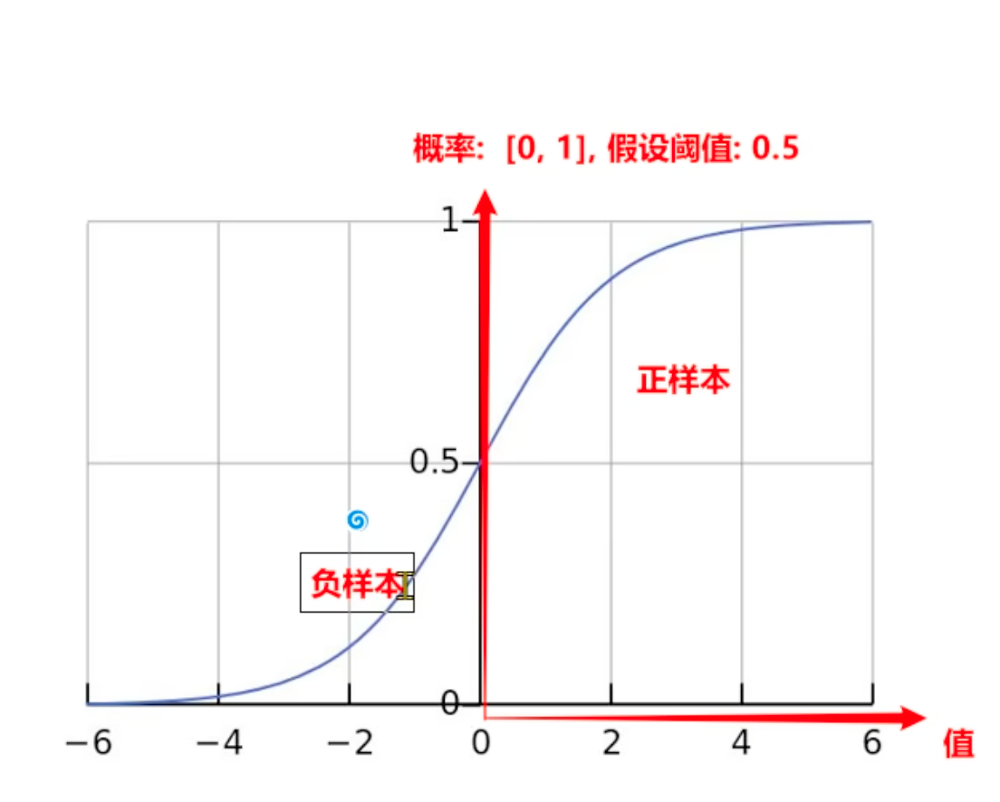

### 核心特性

| 特性                 | 说明                                      |
| -------------------- | ----------------------------------------- |
| **输出范围**   | 会将正∞到负∞映射到(0, 1)，适合表示概率  |
| **单调递增**   | $x$ 越大，输出越接近1，具有单调递增特性 |
| **中心对称**   | $\sigma(-x) = 1 - \sigma(x)$            |
| **平滑可导**   | 便于梯度下降优化                          |
| **函数拐点**   | 函数拐点在$x=0$，y = 1/2的地方          |
| **导函数公式** | $\sigma'(x) = \sigma(x)(1 - \sigma(x))$ |

### 在逻辑回归中的作用

S型函数是逻辑回归的核心组件：

1. **线性组合**：$z = w_1x_1 + w_2x_2 + ... + w_nx_n + b$
2. **概率转换**：$P(y=1|x) = \sigma(z) = \frac{1}{1 + e^{-z}}$

### 决策规则

- 当 $\sigma(z) \geq 0.5$ 时，预测为**正类**（y=1）
- 当 $\sigma(z) < 0.5$ 时，预测为**负类**（y=0）

### 直观理解

| z值      | σ(z)值 | 含义             |
| -------- | ------- | ---------------- |
| z → +∞ | ≈ 1    | 非常确定是正类   |
| z = 0    | 0.5     | 不确定，边界情况 |
| z → -∞ | ≈ 0    | 非常确定是负类   |

### 为什么使用S型函数

1. **概率解释**：输出可以直接解释为概率
2. **平滑过渡**：避免了硬分类的突变
3. **可微性**：便于使用梯度下降进行优化
4. **逻辑一致性**：符合贝叶斯决策理论

S型函数将线性模型的输出转换为概率，使得逻辑回归能够处理二分类问题，并给出每个类别的置信度。

## 概率知识

1. 联合概率
   联合概率是指两个事件同时发生的概率。
   例如，如果A和B是两个事件，P(A∩B)表示A和B同时发生的概率，是两个事件的交集的概率。
   假设A事件发生的概率是$P(A)$，B事件发生的概率是$P(B)$，则$P(A∩B) = P(A) * P(B)$。
2. 条件概率
   条件概率是指在已知事件发生的情况下，另一个事件发生的概率。
   例如，如果A是事件，B是事件，P(B|A)表示在A事件发生的情况下，B事件发生的概率。
   假设A事件发生的概率是$P(A)$，B事件发生的概率是$P(B)$，则$P(B|A) = \frac{P(A∩B)}{P(A)}$。
3. 极大似然估计
   极大似然估计是指在给定样本数据的情况下，找出一个参数值，使得样本数据出现的概率最大。
   例如，如果样本数据是独立的，那么样本数据出现的概率就是每个样本出现的概率的乘积。
   假设样本数据是独立的，那么样本数据出现的概率就是$\prod_{i=1}^{n} P(y_i|x_i)$。
   极大似然估计的目标是找到参数值，使得样本数据出现的概率最大。

   举个例子：假设一个硬币出现正面的概率是A，经过6次抛掷，出现正面次数为4次，出现反面次数为2次。
   那么样本数据（4正2反）再次出现的概率就是每个样本出现的概率的乘积。
   也就是 `P(4正2反) = P(正) *P(正)* P(正) *P(正)* P(反) *P(反)  = A^4* (1-A)^2`
   因为极大似然估计的目的就是找到一个参数值，让这个样本数据出现的概率最大，因此就转化成了对该函数求导，
   并且找到导函数等于0的点，这个点就是参数值A的极大似然估计值。
   注意：

   **P(正面 | θ)** **= 在参数为 θ 的条件下，出现“正面”的概率**，题目中已知正面概率为θ

   **P(反面 | θ)** **= 在参数为 θ 的条件下，出现“反面”的概率**，题目中已知反面概率为1-θ

   ｜在这里读作在....的条件下

   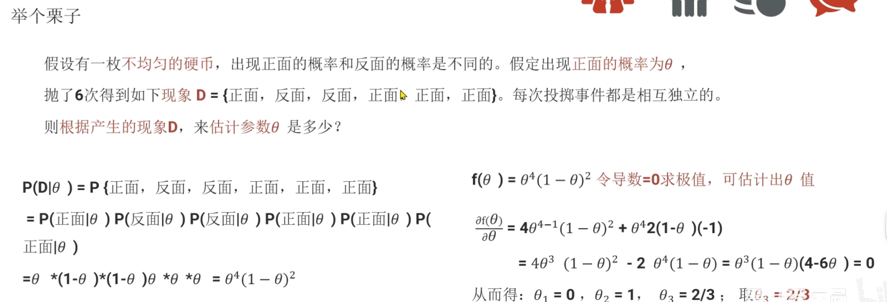
4. 对数函数

   - 对数函数加法
   - 对数函数减法
   - 对数函数阶乘
     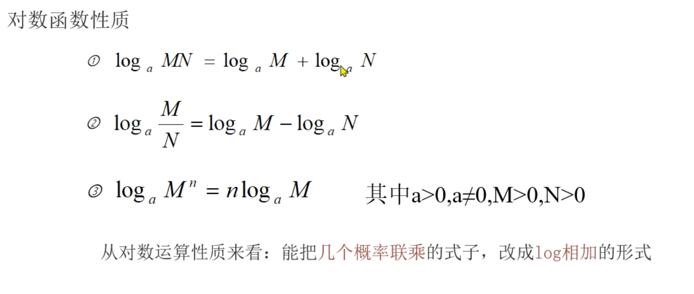
5. 综合练习

   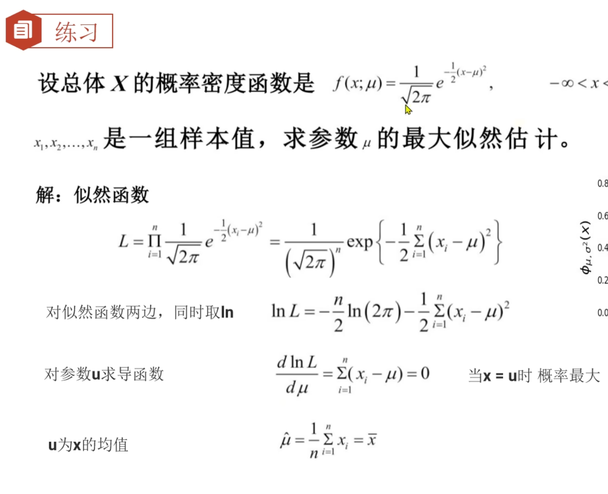

   需要用到的知识点有：

   - 联合概率等于各个概率的乘积
   - 如果一个函数是单调递增的，那么ln函数也是单调递增的，因此求出ln函数导数中极大值就可以得到极大似然估计值。
   - log e为底的MN = log e为底的M + log e为底的N
   - log a为底的X = lnx / ln a

## 逻辑回归原理

   逻辑回归分类模型的输入是线性回归模型的输出的预测值，其输出是一个介于0和1之间的概率值。

1. 数据经过线性回归模型计算，得到预测值
2. 将预测值通过Sigmoid函数，得到概率值
3. 根据概率值和预设的阈值，将样本分为正类和负类

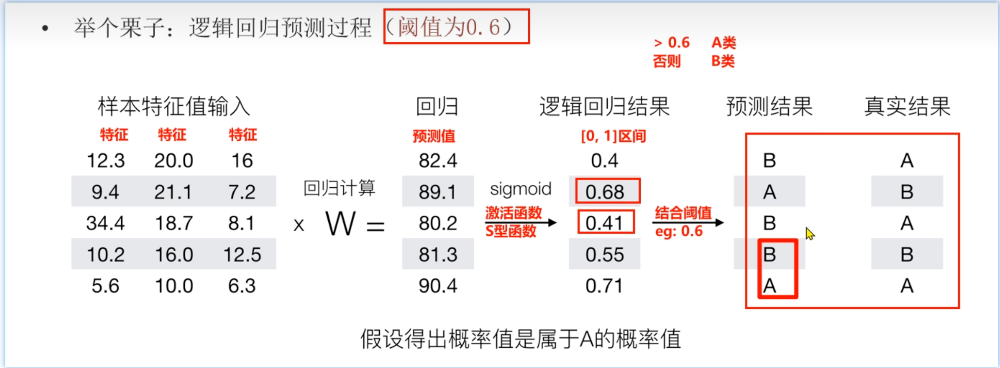

## 逻辑回归的损失函数

逻辑回归的损失函数是交叉熵损失函数，也称为对数损失函数。
计算单个样本的损失函数的公式如下：

$$
L(y, \sigma(z)) = -y \log(\sigma(z)) - (1 - y) \log(1 - \sigma(z))
$$

   其中：

- $y$是真实标签
- $\sigma(z)$是预测概率 也就是线性模型预测值经过Sigmoid函数输出的概率（0-1之间）

因此多个样本的损失函数就是：
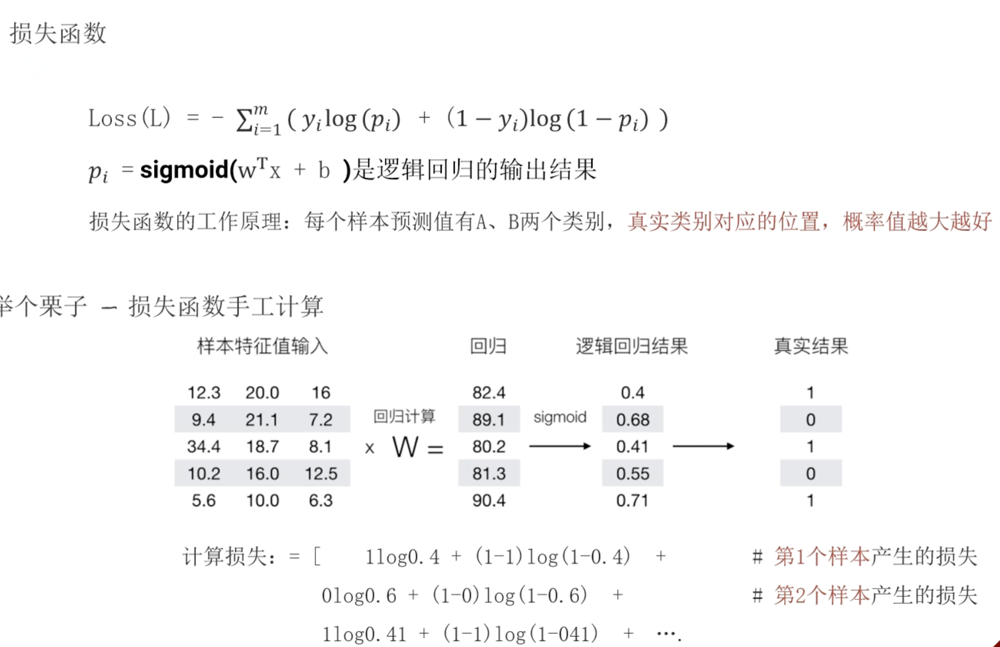

那么现在问题来了，这个损失函数到底是怎么得来的？
其实，逻辑回归模型的损失函数就是从极大似然估计中得出的，下面说明步骤：

1. 假设一个样本为真（样本为真也就是真实值y为1）的概率是P，那么样本为假（样本为假也就是真实值y为0）的概率就是1-P。
2. 然后我们得出计算单个样本出现的概率再次出现的概率为：
   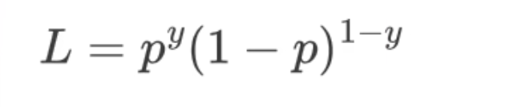

   因此我们就可以得出逻辑回归的损失函数就是：

   - 当y=1的时候，也就是样本为真的时候，这个时候我们希望出现真的概率P越大越好
   - 当y=0的时候，也就是样本为假的时候，这个时候我们希望出现假的概率1-P越大越好
     为什么这么说呢？
     因为如果满足上述的条件，那么说明模型的预测成功率很高，那么模型的预测误差就会越低，这就是我们希望模型达到的目标。
3. 当我们有n个样本的时候，我们想让所有的样本都预测正确的概率怎么计算呢？其实这就是极大似然估计的思想，它本来就是用来解决这类问题的，极大似然估计的目标就是得到一个最佳的模型参数，从而让样本出现的概率最大。那么根据极大似然思路，所有样本出现的概率就是各个独立样本出现概率的乘积，所以得到下面这个公式：
   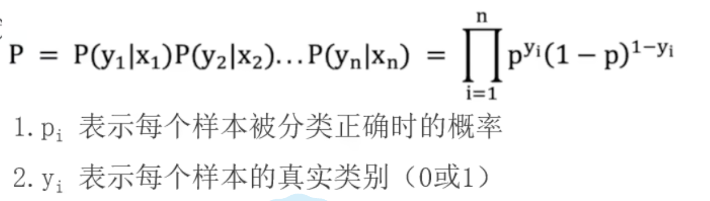
4. 由于连乘可以转化为多个加法，因此我们可以进一步转化为：
   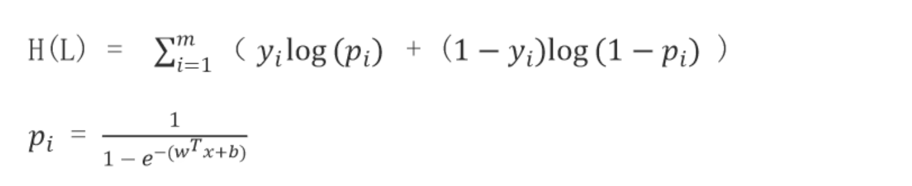

   注意这里完整的推导过程中应该：
   - 首选对两边都取对数 因为ln函数是单调递增的 它不影响最大值的位置
   - 然后基于log a*b = log a 加 log b的思路
   - 然后基于log a为底的b的n次方就等于n乘以log a为底的b

5. 前面四步求出来的就是给定的n个样本经过模型训练之后，我们可以求出一个模型的参数w和b，也就是我们希望模型参数为w和b的时候在预测新的样本的时候类似训练样本出现的概率最大。
   但是损失函数一般是求极小值，因此我们需要在上面的公式上面加一个负号，得到下面这个公式：
   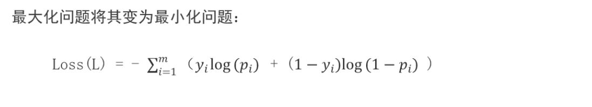
   其实原理很简单：
   假设模型预测是正确的，此时y=1，p=1，那么损失函数就是0。也就是误差为0；
   假设模型预测是错误的，此时y=1但是p=0，那么损失函数就是负无穷大。也就是误差为负无穷大；

总结一句话：极大似然估计总是求一个最佳的参数让模型预测成功的概率最大，此时损失必然是最小的，那么如何让它最小呢，就是在一个很大的数加上负号让它最小，无限趋向于0.同时也确保预测正确时损失小，预测错误时损失大这一性质，也有利于后续梯度下降算法来不算优化模型参数。

## 逻辑回归API（默认类别少的当作正例）

```python
# 默认参数
estimator = LogisticRegression()

# 常用参数示例
estimator = LogisticRegression(
    penalty='l2',           # 正则化类型，可选 'l1', 'l2', 'elasticnet', 'none'
    C=1.0,                  # 正则化强度的倒数，值越小正则化越强
    solver='lbfgs',         # 优化算法，可选 'newton-cg', 'lbfgs', 'liblinear', 'sag', 'saga'
    max_iter=100,           # 最大迭代次数
    random_state=None       # 随机种子，用于可重复性
)
```

## 核心参数详解

| 参数 | 说明 | 可选值 | 默认值 |
|------|------|--------|--------|
| `penalty` | 正则化类型 | 'l1', 'l2', 'elasticnet', 'none' | 'l2' |
| `C` | 正则化强度的倒数 | 正浮点数 | 1.0 |
| `solver` | 优化算法 | 'newton-cg', 'lbfgs', 'liblinear', 'sag', 'saga' | 'lbfgs' |
| `max_iter` | 最大迭代次数 | 正整数 | 100 |
| `random_state` | 随机种子 | 整数或 None | None |
| `class_weight` | 类别权重 | 'balanced' 或字典 | None |
| `multi_class` | 多分类策略 | 'auto', 'ovr', 'multinomial' | 'auto' |
| `verbose` | 详细程度 | 0, 1, 2 | 0 |

## 常用属性

| 属性 | 说明 |
|------|------|
| `coef_` | 模型系数（权重） |
| `intercept_` | 模型截距（偏置） |
| `classes_` | 分类器已知的类别 |
| `n_iter_` | 实际迭代次数 |

## 注意事项

1. **数据标准化**：逻辑回归对特征的尺度敏感，建议使用 `StandardScaler` 进行特征标准化
2. **参数选择**：
   - 小数据集：使用 `liblinear`  solver
   - 大数据集：使用 `sag` 或 `saga`  solver
   - L1正则化：使用 `liblinear` 或 `saga`  solver
3. **类别不平衡**：当类别不平衡时，可使用 `class_weight='balanced'` 或自定义权重
4. **多分类问题**：默认情况下，逻辑回归会自动处理多分类问题（使用 'ovr' 或 'multinomial' 策略）

## 逻辑回归分类评估指标

### 混淆矩阵

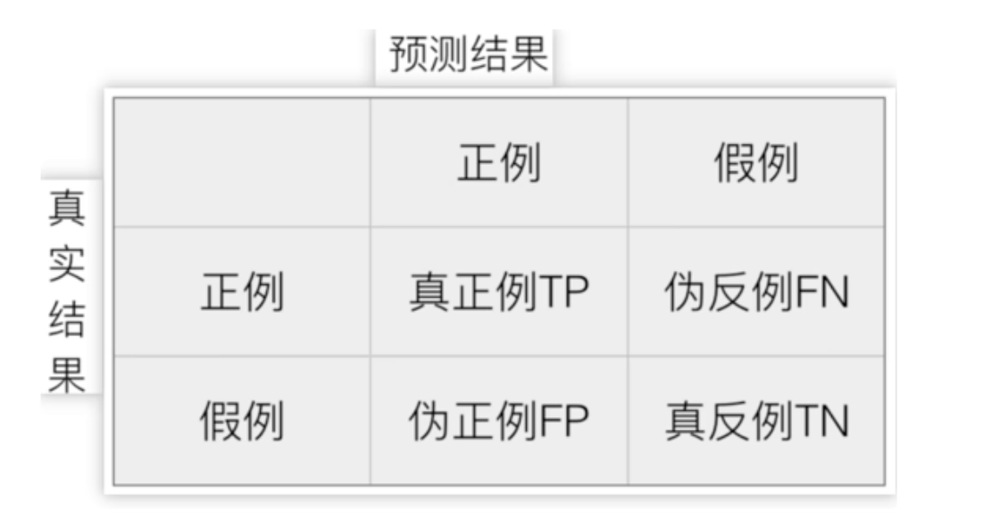

如上图所示：

1. 真实值为正例（y=1），预测值也为正例（y_pred=1）的样本数为真正例（TP True Positive）。
2. 真实值为正例（y=1），预测值为假例（y_pred=0）的样本数为伪反例（FP False Negative）。
3. 真实值为假例（y=0），预测值也为假例（y_pred=0）的样本数为真反例（TN True Negative）。
4. 真实值为假例（y=0），预测值为正例（y_pred=1）的样本数为伪正例（FP False Positive）。

### 精确率（Precision）

精确率（Precision）是真正例占所有预测结果为正例的比例，也称为正例的精确率。
精确率的计算公式为：TP/(TP+FP)

### 召回率（Recall）

召回率（Recall）是真正例占真实数据中所有正例的比例，也称为正例的召回率。
召回率的计算公式为：TP/(TP+FN)

### F1-Score（F1值）

F1-Score（F1-Score）是精确率和召回率的调和平均值，也称为F1值。
F1-Score的计算公式为： `2 * Precision * Recall/(Precision+Recall)`

### AUC

### ROC曲线

## 电信客户流失预测案例
