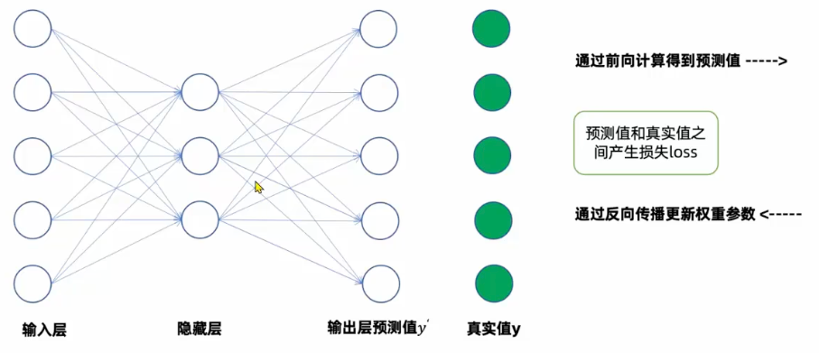

# NLP-文本预处理

## 学习目标

- [ ] 了解文本预处理及其作用
- [ ] 掌握文本预处理的主要环节
  - [ ] 文本处理基本方法
    - [ ] 分词
    - [ ] 词性标注
    - [ ] 命名实体识别
  - [ ] 文本张量表示方法
    - [ ] one-hot编码
    - [ ] Word Embedding
    - [ ] Word2Vec
  - [ ] 文本语料的数据分析
    - [ ] 标签数量分布
    - [ ] 句子长度分布
    - [ ] 词频统计
    - [ ] 关键词词云
  - [ ] 文本特征处理
    - [ ] 添加n-gram特征
    - [ ] 文本长度规范
  - [ ] 数据增强方法
    - [ ] 回译数据增强法
  - [ ] 文本张量tensorboard可视化

## 一、文本预处理的作用

文本语料在输送给模型前一般需要进行文本预处理的工作，才能复合模型输入的要求，比如：

- 文本转换为模型所需要的张量
- 规范张量的尺寸
- 科学文本预处理有效指导模型超参数的选择
- 提高模型的评估指标

## 二、文本处理基本方法

### 1. 分词

1. 什么是分词呢？
   分词就是将连续的文本序列按照一定的规范重新组合成为词序列的过程。
   由于英文文本序列中单词天然存在空格作为分界符，所以英文文本序列的分词过程就是将文本序列按照空格进行切分。
   而中文文本序列中词语没有分隔符，而分词就是找到这样的分界符的过程。
2. 分词的作用
   分词是文本预处理的第一步，一切AI模型活动都需要先进行分词，之后才是向量化和模型训练的过程。
   分词的结果就是Token序列。

3. 中文分词工具jieba使用

```bash
1. 支持精确模式lcut: 默认模式，将文本序列按照词语进行切分，不考虑词语的子词。不会冗余。
2. 支持全模式cut_all: 将文本序列按照所有可能的子词进行切分，考虑词语的子词。会导致冗余。
3. 支持搜索引擎模式lcut_for_search：将精确模式得到的分词结果再进行一次切分，将子词也作为词进行切分。目的是为了保证搜索引擎的召回率。
4. 支持繁体中文
5. 支持自定义词典
```

### 2. 命名实体识别（NER）- 找专有名词

在语言中，通常我们将人名、地名、机构名称等专有名词称为命名实体。（Named Entity Recognition）
命名实体识别（NER）是指将文本序列中的命名实体(专有名词)识别出来，将其标记为不同的类别。
比如下面这个文本序列中的命名实体有：

```bash
“张学友，中国香港歌手，是一位著名的歌手，他的音乐被广泛应用于中国的音乐行业。”
```

- 人名：张学友
- 地名：中国香港
- 机构名称：中国音乐行业

那么，命名实体识别（NER）有什么用呢？命名实体识别可以将自然语言中的命名实体识别出来，将其标记为不同的类别。
这可以帮助模型更好地理解文本序列中的信息。也是高阶智能图谱的基础。

### 3. 词性标注（POS） - 划分词性

词性标注是指将文本序列中的每个词标记为它的词性（Part of Speech Tagging）。
词性标注以分词为基础，是对文本语言的另外一个角度的理解，因此成为AI解决NLP领域高阶任务的基础环节。
jieba分词工具不仅可以进行分词，还可以基于jieba提供的pseg.lcut函数进行词性标注。

## 三、文本张量表示方法

- 为什么要进行文本张量表示
- 掌握One-Hot编码的实现原理
- 掌握word2Vec的的CBOW方式词向量训练原理
- 掌握word2Vec的的Skip-gram方式词向量训练原理
- 掌握fasttext的词向量训练流程
- 了解word embedding的概念

### 1. 什么是文本张量表示?

其实就是将一段文本使用张量进行表示，一个词表示成向量就是词向量，一句话由多个词组成因此构成的是词向量的矩阵。
目的是为了将序列文本转化为张量形式，能够让计算机处理文本序列这种输入，并进行接下来一系列解析工作。

具体的做法是：

- 先将文本序列进行分词
- 将每一个词汇表示为向量，称为词向量
- 再将所有词向量按照顺序组成词向量的矩阵

```js
原文：
"你今天真好看"

分词：
["你", "今天", "真", "好看"]

词向量矩阵：
[
  [1.32, 0.45, 0.67, 0.89], // 这是“你”的词向量表示
  [0.12, 0.34, 0.56, 0.78], // 这是“今天”的词向量表示
  [0.23, 0.45, 0.67, 0.89], // 这是“真”的词向量表示
  [0.34, 0.56, 0.78, 0.90] // 这是“好看”的词向量表示
]
```

常见的将文本转化为词张量表示的方法有：

1. One-Hot编码
2. Word Embedding
3. Word2Vec

### 2. 稀疏向量表示法：One-Hot编码

One-Hot 编码（独热编码）是一种将分词转换为二进制向量的方法。通常同于处理分类标签Y数据。
在One-Hot编码中，对于一个具有N个不同类别的分类变量，将其表示为一个n维的向量。
在该n维向量中，只有一个维度的值为1，其他维度的值均为0。

示例 ：假设有 3 个词表 ["猫", "狗", "鸟"]

```bash
"猫" → [1, 0, 0]
"狗" → [0, 1, 0]
"鸟" → [0, 0, 1]
```

在示例代码 `create_one_hot_encode`中，我们可以使用Tokenizer来创建一个分词器然后训练得到词表中每一个词的索引，然后基于这个索引就可以得到每一个词的one-hot编码。

One-Hot编码的优点在于操作简单，但是缺点非常明显：

1. 任意两个词向量的内积都是0，这表示任意两个词库中的词都是无关的，割裂了词与词之间的联系，但其实词与词之间一定是有关联的。
2. 当词库的大小比较大的时候，每个词向量占据的向量长度过大，占据大量内存。
3. 这种只有一个位置为1其余位置都为0的表示我们称之为稀疏矩阵。

### 3. 稠密向量表示方法word2Vec

word2Vec是一种将单词转化为词向量的自然语言处理技术。
它利用了深度学习网络来探索单词和单词之间的语义关系，最终转化的词向量是用深度学习的网络权重参数来进行表示。

word2Vec主要两种方式：CBOW和Skip-gram。

1. CBOW方式：Continuous Bag of Words Model 词袋模型训练词向量
   它的原理是基于两侧来预测中间的单词，主要做法是将周围单词的词向量求和或取平均作为上下文的表示，然后通过一个神经网络进行预测。

2. Skip-gram方式：Skip-gram Model 跳词模型训练词向量
   它的原理是基于中间来预测两边的单词，主要做法将当前单词的词向量作为输入，然后通过一个神经网络来预测周围的单词。

#### CBOW方式的词向量训练

我们通过构建神经网络然后通过CBOW方式来训练词向量，具体的做法是：

1. 首先拿到原始数据比如由5个字母构成的文本序列："add baa dee dba cba aabbdde"
2. 对文本序列进行分词然后去重
3. 构建神经网络，输入层的维度就是5个特征，隐藏层的神经元数量是n就代表这个词向量用n个数字表示，输出层的维度和输入层一致都是5个。
4. 训练神经网络
5. 用隐藏层的权重参数充当这5个单词的词向量表示

问题：已知道文本序列："add baa dee dba cba aabbdde"，如何构建深度神经网络来训练词向量从而得到abcde这五个单词之间的语义关系？
问题：探索abcde这五个单词之间的语义关系，又如何保持到神经网络中？

通过前向计算得倒输出层的预测值
输出层的预测值和真实值产生损失
通过反向传播更新隐藏层的权重参数（也就是权重矩阵）
最终训练得倒的隐藏层的权重参数就是这5个单词的词向量表示


有几个词就有几行
有几个维度就有几列
最后权重参数的每一个列就是一个词的词向量表示

答案：根据CBOW方式的训练流程，我们可以得到这5个单词的词向量表示。具体的做法是：

1. 对文本序列进行分词然后去重
2. 构建神经网络，输入层的维度就是5个特征，隐藏层的神经元数量是n就代表这个词向量用n个数字表示，输出层的维度和输入层一致都是5个。
3. 训练神经网络
4. 用隐藏层的权重参数充当这5个单词的词向量表示

### Word2Vec模型（连续词袋模型）完整流程展示

1. 预料库准备 Hope can set you free
2. One Hot编码结果

求和或者加权平均

#### Skip-gram方式的词向量训练

隐藏层是几个就是几个维度 几个数字来表示 是超参
隐藏层的权重参数 每一列就是一个词的词向量

### 4. word embedding词嵌入模型

广义的word embedding指的所有稠密的向量表示方法
狭义的表示就是RNN循环神经网络中的词嵌入层

高频词用CBOW Skip-gram用低频词

## 可视化 tensorboard 词向量的方法
