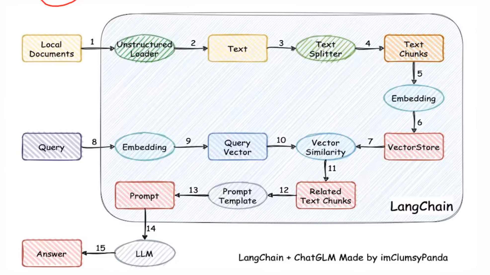

# RAG技术栈核心难点及其落地场景

## 核心难点

数据工程：将原始数据转化为有价值的知识，决定项目质量和知识库准确率。
效果评估：开源的效果评估框架往往效果不佳，需要自研效果评估框架来进行评估。通过自定义指标和框架持续迭代，提升知识库准确率。
模型管理：为保证数据安全，需高效维护和管理大模型。
开发挑战：RAG项目开发中面临数据工程、效果评估和模型管理三大核心难点。

## 落地场景

基础问答场景:直接通过大模型进行问题回答，相对简单。
限制范围问答:为大模型提供知识库，基于限定内容进行解答。
联网问答:当大模型无法回答时，通过网络搜索、爬取、解析并整合信息。
问答推荐:根据用户画像和行为习惯，在对话中推荐相关产品或服务。
复杂问题处理:采用agent架构+RAG架构，先拆解任务再逐个解决。

## 核心目标

- [ ] RAG全栈技术体系
  - [ ] 掌握RAG的基础知识
  - [ ] 掌握RAG的高级知识
  - [ ] 掌握RAG优化方案
- [ ] RAG系统设计
  - [ ] 设计复杂高效的商业级RAG系统能力
  - [ ] 处理海量文本数据的问答需求
- [ ] RAG开发框架
  - [ ] 掌握RAG的开发框架
  - [ ] 掌握RAG的开发工具

## RAG架构原理

RAG（Retrieval-Augmented Generation）检索增强生成架构主要分为两个流程：

1. 知识更新流程

   - 从非结构化数据源获取新数据
   - 基于Unstructured Loader将非结构化数据转换为文档对象
   - 基于TextSplitter将文档对象切分为多个文本片段Text Chunk
   - 基于嵌入模型Embedding将文本片段转换为向量表示
   - 将向量表示存储到向量数据库中VectorStore
2. 知识检索流程

   - 从用户输入中提取问题
   - 将用户自然语言问题通过嵌入模型转换为向量表示QueryVector
   - 基于向量数据库VectorStore进行余弦相似度检索
   - 检索到与问题最相关的文本片段Text Chunk
   - 将文本片段和用户输入重新组合为新的Prompt Template发送给大模型
   - 大模型根据Prompt Template生成回答

## 大模型应用落地痛点

企业应用大模型时面临两大主要挑战，直接影响落地效果，典型表现在两个方面:

- 回答内容偏离实际需求（幻觉问题）
  -知识更新滞后导致回答失效（知识局限）

1. 大模型幻觉问题

大模型幻觉指的是大模型生成内容与问题无关或逻辑混乱，典型如虚构事实、偏离问题核心等表现。

    解决方案主要有：

    - 提示词工程: 通过精确设计提问语句（包括few-shot示例）约束输出
    - RAG流程: 将回答范围限定在特定知识库内，降低随机生成概率

2. 大模型知识有限

由于大模型训练数据时效性限制（如仅包含2025年前数据）那么无论如何大模型是回答不了2025年之后的问题。或者由于大模型缺乏企业私有数据（仅使用公开网络数据训练），因此在针对企业私有知识库的问题进行回答的时候，大模型表现往往不如人意。

应对方案主要有两个思路：

- 微调(Fine-tuning):
  需准备数万至数十万条高质量数据
  面临数据收集成本高、周期长等实施难点
- RAG方案:
  通过动态更新知识库扩展模型认知
  实施成本显著低于微调方案

一般情况下，可以综合微调和RAG方案来实现，比如90%场景优先采用RAG方案，仅核心业务场景考虑微调方案。

## RAG架构演进之路

当前RAG项目主要采用两种主流架构方案，后者是前者的演进版本。

- 朴素RAG(Naive RAG)
- 高级RAG(Advanced RAG)两种架构方案

### 1. Naive RAG

基本流程：用户提问→向量化→向量数据库检索→检索结果增强→LLM生成→返回答案
特点：采用最基础的检索增强生成流程，结构简单但存在明显缺陷

1）检索质量方面

准确率问题：可能导致检索结果与问题不匹配，产生"幻觉"现象
召回率问题：信息检索不完整，影响最终答案的完整性
信息时效性：可能检索到过时或冗余信息，降低结果准确性

2）结果生成质量方面
幻觉延续：当检索结果错误时，LLM仍会基于错误信息生成看似合理但实际错误的答案
匹配问题：可能出现答非所问的情况，问题与答案无法正确对应
伦理风险：可能生成包含有害内容或偏见的答案

3）内容增强过程的挑战

内容连贯性：检索到的chunk之间可能存在逻辑脱节或不连贯
信息冗余：检索结果中可能包含大量重复内容
过度依赖：LLM过度依赖检索信息而缺乏自身推理能力，导致无法产生额外价值

### 2. Advanced RAG

1）检索前的优化

1. 增强数据粒度

   - 核心操作：修订和简化数据内容，确保正确性和可读性；删除不相关信息，消除歧义，确认事实准确性，维护上下文连贯性。
   - 实施要点：需要保证知识库或数据本身内容的正确性，这是后续所有优化的基础。例如会议纪要场景中需确保日期、参会人员等关键信息准确无误。
2. 优化索引结构

   - chunk大小调整：根据数据特点和场景需求合理切割文本，过大文本会增加噪声，过小则可能丢失上下文关联。例如技术文档通常需要比新闻稿更大的chunk size。
   - 图数据索引应用：通过知识图谱的节点关系实现跨索引查询。例如感冒药查询场景中，即使药品名不含"感冒"关键词，也能通过症状关联找到正确药物。
   - 实现路径：先构建知识图谱子图，将子图节点中信息转换为文档后再进行二次向量检索，最后融合结果进行增强生成。
3. 层级索引

   - 多层索引构建：首层存储文档摘要（如1000字压缩为20字），第二层存储完整chunk。查询时先匹配摘要层快速定位，再精确定位具体chunk。
   - 效率优势：当数据量特别大时（如百万级文档），可显著降低检索延迟。例如电商场景中先按商品类目筛选，再具体查询商品详情。
   - 加入元数据信息
   - 时间标签应用：为时间敏感数据添加日期元数据，确保检索最新信息。例如会议纪要存储时需保留会议日期字段。
   - 实施方法：将文档属性（如创建日期、作者、版本）与内容分开存储，检索时先匹配元数据字段缩小范围。
   - 混合检索与对齐优化
   - 假设性问题创建：为每个chunk预生成可能被问及的问题集合，用户查询时先匹配这些问题，再定位关联文档。
   - 实施案例：技术文档库可为每个API文档预生成"如何使用XX接口"、"XX参数作用"等典型问题，提升检索准确率。

2）检索当中的优化

    - 模型微调：利用特定场景语料微调embedding模型，使其更适应领域特点。例如医疗场景可使用医学文献微调模型。
    - 实施建议：虽然实际应用较少，但对于专业性强、术语特殊的领域（如法律、医学）值得尝试。

3）检索之后的优化

    - ReRank技术：设计复杂模块对召回结果精细排序。例如从10个结果中筛选出最相关的3个，减少噪声。
    - Prompt压缩：使用小模型（如LLMLingua）计算即时互信息，压缩无关上下文。典型场景包括去除文档中的版权声明等冗余信息。
    - 选择性上下文：通过困惑度估计元素重要性，保留关键段落。例如技术文档中重点保留参数说明和示例代码。

4）Advanced RAG架构优化
    - 架构延续性：高级RAG保持基础架构不变，主要在细节优化上深入。核心流程仍是检索-增强-生成的三阶段。
    - 技术融合趋势：复杂问题需结合Agent技术进行任务拆解。例如团队产出对比问题可拆解为多个子问题的RAG流程。
    - 实践建议：根据实际场景选择合适优化手段，不必全盘采用。知识图谱适合关联查询场景，层级索引适合海量数据场景。

## 微调和RAG技术方案选型

1. RAG和微调的区别

   RAG工作原理：依靠外部准备好的知识库，结合大模型的生成能力来回答问题。流程是：用户问题→检索相关知识→结合大模型生成答案。
   微调工作原理：通过调整大模型参数让其学会特定知识，最终生成新模型。流程是：用户问题→直接由微调后的模型生成答案。
   本质区别：RAG需要实时结合外部知识库，微调则是将知识内化到模型参数中。

2. 知识库相关场景

    1）模型能力定制
    适用场景：需要模型以固定或特殊口吻回答问题
    方案选择：微调更合适，因为可以调整模型参数使其符合特定风格要求

    2）智能设备微调
    适用场景：智能设备等空间受限环境
    原因分析：设备只能部署小模型，通过微调可以增强特定领域能力
    方案选择：微调更适合提升小模型在特定场景的表现

    3）响应有要求
    适用场景：对响应速度要求高的场景
    性能对比：微调模型直接响应更快，RAG需要检索过程
    方案选择：微调更适合快速响应需求

    4）动态数据微调
    适用场景：知识库数据频繁更新(如每天/每周更新)
    原因分析：微调成本高且风险大，不适合频繁调整
    方案选择：RAG只需更新知识库，更适合动态数据场景

    5）幻觉问题

    适用场景：对幻觉问题敏感或需要解决幻觉问题的场景
    原因分析：微调可能削弱模型其他能力，反而增加幻觉风险
    方案选择：RAG更适合控制幻觉问题

    6）可解释性
    适用场景：需要答案可溯源、可解释的场景(如金融项目)
    方案对比：RAG可展示依据文档，微调是黑盒无法解释
    方案选择：RAG更适合需要可解释性的场景

    7）成本
    成本构成：
    微调：GPU成本+数据工程成本(数据准备时间长)
    RAG：主要知识库维护成本
    方案选择：RAG成本更可控，适合预算有限项目

    8）依赖生成能力

    适用场景：对模型原始生成能力依赖强的场景
    风险提示：微调可能导致灾难性遗忘，影响生成能力
    方案选择：RAG能保留模型原始生成能力

## RAG的应用落地场景
