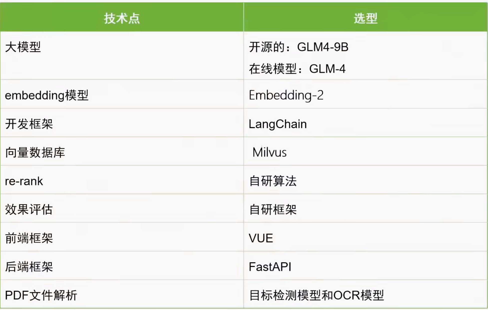

# 高性能RAG知识库需求

## 1. 知识管理平台

### 数据工程

- **核心组件**：知识管理平台（后台）
- **数据工程功能**：数据添加与知识转化流程
- **知识转化**：将原始数据转变为结构化知识
- **平台作用**：完成从数据到知识的处理过程

### 知识的更新管理

- **知识更新操作**：增加新知识内容
- **知识维护方式**：修改现有知识条目
- **知识淘汰机制**：删除过时失效知识
- **知识库定位**：作为整体知识体系组成部分

## 2. 知识查询平台

### 基于知识库的问答功能

- **知识查询平台**：基于知识库的问答功能子项目
- **实现线路1**：用户问题直接通过大模型进行问答
- **实现线路2**：用户问题基于知识库进行回答

### 基于联网功能的问答功能

- **联网搜索流程**：用户提问后先进行搜索引擎联网搜索
- **增强生成方法**：结合大模型对搜索结果进行增强处理
- **问答链路步骤**：问题输入 → 联网搜索 → 模型增强生成

### 基于知识库的推荐功能

- **知识库推荐功能定义**：基于知识库与用户交互时推荐相关产品
- **推荐触发条件**：用户与智能机器人聊天过程中的场景识别
- **场景推荐**：
  - 教育场景：课程类产品
  - 医疗场景：药品类产品
  - 电商场景：商品类产品
- **推荐逻辑**：领域场景与产品类型的匹配关系

### 基于Agent的知识库检索功能

- **复杂任务处理**：Agent拆解复杂问题为子任务并整合回答
- **外部工具调用**：Agent设计用于调用外部工具完成特定功能
- **知识库检索限制**：复杂问题直接检索知识库可能效果不佳
- **任务分解策略**：将复杂问题拆解为可处理的子任务序列
- **Agent功能扩展**：通过设计增强Agent的外部工具调用能力

## 3. 效果评估平台

### 知识库效果评估

- **效果评估平台**：独立于其他项目的子项目，用于评估项目效果
- **实现方式**：可选择开源工具或自研框架进行效果评估平台的开发
- **实践方案**：课程中将提供两组实践方案，包括使用开源工具和自研框架的方法
- **项目需求**：整个项目包含三个子项目，共八大需求，需逐步拆解实现
- **评估独立性**：效果评估平台需独立于其他平台存在，确保评估的客观性

## 架构设计

根据需求分析结果，项目架构设计需分模块展示。架构设计需基于子需求分解，通过模块化方式呈现整体框架，便于理解各组件功能与交互逻辑。

### 1.知识管理平台

功能定位：实现数据工程全流程管理，包括数据添加、修改、删除等操作，将原始数据转化为结构化知识。
数据类型：支持私有数据（如复杂PDF文件，含文字与图片）与公共数据（一级别公开数据）的差异化处理。
处理流程：
非结构化数据解析：针对PDF等文件进行内容提取。
数据切割与向量化：分割处理后通过向量化技术转换。
存储方案：采用向量数据库作为核心知识库存储引擎。

### 2.基于大模型智能对话

流程逻辑：用户输入问题后，系统根据前端选择的大模型类型（如模型一或模型二）生成对应答案。
模型无关性：模型部署方式（在线/离线）对用户透明，仅需关注输出结果。

### 3.基于知识库问答

核心流程：
问题向量化：将用户查询转换为向量表示。
知识库检索：匹配相似内容并返回检索结果。
提示词构建：结合原始问题与检索内容生成增强提示。
答案生成：大模型基于提示返回最终答案。
技术要点：需优化检索排序（Rerank）与提示模板设计以提升生成质量。

### 4.在线联网查询问答

步骤操作可选性问题输入用户提交查询请求必选搜索引擎调用通过谷歌API获取网页URL、摘要及标题必选相关性排序根据标题/摘要匹配度筛选Top3网址必选内容爬取与解析提取网页正文并切割为片段必选向量化存储将解析内容存入存储引擎（可选直接生成答案或持久化存储）可选答案生成大模型整合检索内容生成响应必选5.基于知识库问答推荐
标签化处理：通过机器学习算法为数据打标签，构建用户画像与知识关联。
对话触发机制：
5条以内对话：视为普通交互，直接由大模型响应。
超过5条对话：提取近期内容分析用户意图，结合标签库实现个性化推荐。

### 6.基于Agent的RAG架构

Agent核心功能：
复杂问题拆解：将多维度查询（如技术团队对比）分解为子问题链。
工具调用：支持外部API集成（如天气查询、数学计算），弥补大模型局限性。
架构优势：通过动态任务规划与工具协作提升复杂场景解决能力。

### 7.效果评估

评估方案：
开源工具测试：对比现有工具优缺点及适用场景。
自研框架开发：设计多指标评估体系（需覆盖答案准确性、上下文相关性等），通过算法量化得分。
数据准备：需构建标准问题集与参考答案库，确保评估结果可复现。

## 技术选型

